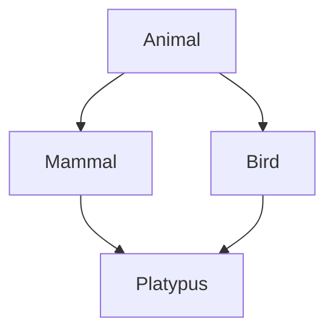

# Lesson 1: Advanced Object-Oriented Programming

## 🎯 What You'll Learn
- Master multiple inheritance and understand method resolution order (MRO)
- Create and use abstract base classes with the `abc` module
- Apply polymorphism in practical scenarios
- Design class hierarchies using composition over inheritance
- Implement the factory pattern and singleton pattern
- Use dataclasses for cleaner data structures

## ⏱️ Duration
**2-3 hours** (reading + practice)

## 📋 Prerequisites
- Basic Python class syntax
- Understanding of inheritance basics
- Familiarity with Python data types

---

## 📖 Chapter 1: Introduction & Context

### The Story Behind Advanced OOP

Object-Oriented Programming (OOP) isn't just about creating classes and objects—it's a **way of thinking** about how to organize code to model real-world systems. Just as architects design buildings with blueprints that specify how rooms connect and flow, software architects use OOP to design systems where objects interact in predictable, maintainable ways.

### Why This Matters

In the real world, software systems grow complex. Imagine building a game with hundreds of different characters, each with unique abilities. Without advanced OOP patterns, you'd end up with spaghetti code—tangled, hard to maintain, and impossible to extend. Advanced OOP gives you the tools to:

1. **Reduce code duplication** through inheritance hierarchies
2. **Enforce contracts** with abstract base classes
3. **Enable flexibility** through polymorphism
4. **Create extensible systems** with design patterns

### Mental Model

> 💡 Think of **inheritance** like a **family tree**. Just as children inherit traits from parents (hair color, eye color), child classes inherit methods and attributes from parent classes. But unlike biology, in OOP you can "override" inherited traits—giving a child class different behavior than its parent.

### What You Already Know

From previous lessons, you've learned:
- How to create basic classes with `__init__` methods
- How to use inheritance for simple hierarchies
- How to define methods and properties

Now we'll build on that foundation with more sophisticated patterns.

---

## 📖 Chapter 2: Understanding Advanced OOP Concepts

### The Basics: Multiple Inheritance

Multiple inheritance allows a class to inherit from **more than one parent class**. This is powerful but can be confusing.



**Key Insight**: When a class inherits from multiple parents, Python uses the **Method Resolution Order (MRO)** to determine which method to call.

### How It Works: Method Resolution Order

```python
# Example: Platypus inherits from both Mammal and Bird
class Platypus(Mammal, Bird):
    def __init__(self, name):
        Mammal.__init__(self, name, has_fur=False)
        Bird.__init__(self, name, can_fly=False)
    
    def speak(self):
        return f"{self.name} the platypus is confused"

# Check the MRO
print(Platypus.__mro__)
# Output: (Platypus, Mammal, Bird, Animal, object)
```

**What happens when you call `platypus.speak()`?**
1. Python looks in `Platypus` first
2. If not found, looks in `Mammal` (first parent)
3. Then in `Bird` (second parent)
4. Then in `Animal` (grandparent)
5. Finally in `object` (base class)

### Common Misconceptions

> ⚠️ **Don't be fooled!** Many people think multiple inheritance is "bad" or "dangerous." Actually, it's a powerful tool when used correctly. The key is understanding MRO and using it intentionally.

### Knowledge Check

> 🤔 **Quick Question:** What would happen if both `Mammal` and `Bird` defined a `speak()` method?
> 
> <details>
> <summary>Click for answer</summary>
> Python would call `Mammal.speak()` because `Mammal` comes first in the inheritance list: `class Platypus(Mammal, Bird)`. The order matters!
> </details>

---

## 📖 Chapter 3: Hands-On Tutorial

### Setting Up

Create a new Python file called `advanced_oop_tutorial.py`:

```python
# advanced_oop_tutorial.py
from abc import ABC, abstractmethod
from dataclasses import dataclass, field
from typing import List, Dict, Any
```

### Step 1: Create Abstract Base Classes

Abstract Base Classes (ABCs) define **contracts** that subclasses must follow:

```python
class Shape(ABC):
    """Abstract base class for all shapes."""
    
    @abstractmethod
    def area(self) -> float:
        """Calculate the area of the shape."""
        pass
    
    @abstractmethod
    def perimeter(self) -> float:
        """Calculate the perimeter of the shape."""
        pass
    
    def __str__(self) -> str:
        """String representation of the shape."""
        return f"{self.__class__.__name__} object"
```

**Line-by-line breakdown:**
- Line 1: Inherit from `ABC` to make this an abstract class
- Line 4: `@abstractmethod` decorator marks this as a method that MUST be implemented
- Line 12: Regular methods can have implementations in abstract classes

### Step 2: Implement Concrete Classes

```python
class Rectangle(Shape):
    """Concrete implementation of a rectangle."""
    
    def __init__(self, width: float, height: float):
        self.width = width
        self.height = height
    
    def area(self) -> float:
        """Calculate area: width × height."""
        return self.width * self.height
    
    def perimeter(self) -> float:
        """Calculate perimeter: 2 × (width + height)."""
        return 2 * (self.width + self.height)

class Circle(Shape):
    """Concrete implementation of a circle."""
    
    def __init__(self, radius: float):
        self.radius = radius
    
    def area(self) -> float:
        """Calculate area: π × radius²."""
        return 3.14159 * self.radius ** 2
    
    def perimeter(self) -> float:
        """Calculate circumference: 2 × π × radius."""
        return 2 * 3.14159 * self.radius
```

### 🛑 Try It Yourself

> **Challenge:** Create a `Triangle` class that implements the `Shape` abstract base class.
> 
> <details>
> <summary>Stuck? Click for hint</summary>
> You'll need to store three sides (a, b, c) and implement both `area()` and `perimeter()` methods. For area, you can use Heron's formula: `sqrt(s(s-a)(s-b)(s-c))` where `s = (a+b+c)/2`.
> </details>

### Step 3: Test Polymorphism

```python
def draw_shapes(shapes: List[Shape]) -> None:
    """Draw multiple shapes using polymorphism."""
    for shape in shapes:
        print(f"Drawing {shape}: area={shape.area():.2f}, perimeter={shape.perimeter():.2f}")

# Create different shapes
shapes = [
    Rectangle(5, 3),
    Circle(4),
    # Your Triangle here!
]

# Test polymorphism
draw_shapes(shapes)
```

---

## 📖 Chapter 4: Code Examples Explained

### Example 1: The Simplest Case

**Context:** Understanding the factory pattern for creating objects.

```python
class AnimalFactory:
    """Factory for creating different types of animals."""
    
    @staticmethod
    def create_animal(animal_type: str, name: str, **kwargs) -> 'Animal':
        """Create an animal based on type."""
        if animal_type == "dog":
            return Dog(name, **kwargs)
        elif animal_type == "cat":
            return Cat(name, **kwargs)
        elif animal_type == "bird":
            return Bird(name, **kwargs)
        else:
            raise ValueError(f"Unknown animal type: {animal_type}")

# Usage
dog = AnimalFactory.create_animal("dog", "Buddy", breed="Golden Retriever")
cat = AnimalFactory.create_animal("cat", "Whiskers")
```

**Line-by-line breakdown:**
- Line 1: Factory class with static method
- Line 4: `@staticmethod` means this method doesn't need `self`
- Line 5: `**kwargs` allows flexible creation parameters
- Line 13: Raising exceptions for invalid types

### Example 2: A Realistic Scenario

**Context:** Using the singleton pattern for database connections.

```python
class SingletonMeta(type):
    """Metaclass for creating singleton instances."""
    _instances = {}
    
    def __call__(cls, *args, **kwargs):
        """Ensure only one instance exists."""
        if cls not in cls._instances:
            cls._instances[cls] = super().__call__(*args, **kwargs)
        return cls._instances[cls]

class DatabaseConnection(metaclass=SingletonMeta):
    """Database connection using singleton pattern."""
    
    def __init__(self, connection_string: str):
        self.connection_string = connection_string
        self.connection = None
    
    def connect(self) -> None:
        """Establish database connection."""
        if self.connection is None:
            print(f"Connecting to {self.connection_string}")
            self.connection = "Connection object"
    
    def disconnect(self) -> None:
        """Close database connection."""
        if self.connection:
            print("Disconnecting")
            self.connection = None

# Both variables point to the SAME instance
db1 = DatabaseConnection("postgresql://localhost/mydb")
db2 = DatabaseConnection("postgresql://localhost/mydb")
print(db1 is db2)  # True - same object!
```

**Key insights:**
- **Metaclass** controls class creation
- **`__call__`** intercepts instance creation
- **Singleton** ensures only one instance exists

### Example 3: Production-Quality Code

**Context:** Using dataclasses for cleaner data models.

```python
from dataclasses import dataclass, field
from typing import List, Optional
from datetime import datetime

@dataclass
class Person:
    """Person data model with validation."""
    name: str
    age: int
    email: str
    address: str = ""
    
    def __post_init__(self):
        """Validate data after initialization."""
        if self.age < 0:
            raise ValueError("Age cannot be negative")
        if "@" not in self.email:
            raise ValueError("Invalid email format")

@dataclass
class Book:
    """Book data model with business logic."""
    title: str
    author: str
    isbn: str
    price: float
    pages: int
    published_year: int
    
    def is_expensive(self) -> bool:
        """Check if book is expensive (price > $50)."""
        return self.price > 50.0
    
    def is_recent(self, years: int = 5) -> bool:
        """Check if book was published recently."""
        current_year = datetime.now().year
        return (current_year - self.published_year) <= years

@dataclass
class Library:
    """Library managing a collection of books."""
    name: str
    books: List[Book] = field(default_factory=list)
    
    def add_book(self, book: Book) -> None:
        """Add a book to the library."""
        self.books.append(book)
    
    def find_books_by_author(self, author: str) -> List[Book]:
        """Find all books by a specific author."""
        return [book for book in self.books if book.author == author]
    
    def get_average_price(self) -> float:
        """Calculate average price of all books."""
        if not self.books:
            return 0.0
        total = sum(book.price for book in self.books)
        return total / len(self.books)
```

**Best practices demonstrated:**
- **Type hints** for all attributes
- **`__post_init__`** for validation
- **Default values** with `field(default_factory=...)`
- **Business logic** methods in dataclasses
- **Clear documentation** for all methods

### Edge Cases & Gotchas

```python
# What happens with diamond inheritance?
class A:
    def method(self):
        print("A.method")

class B(A):
    def method(self):
        print("B.method")
        super().method()

class C(A):
    def method(self):
        print("C.method")
        super().method()

class D(B, C):
    def method(self):
        print("D.method")
        super().method()

d = D()
d.method()
# Output: D.method, B.method, C.method, A.method
# MRO: D -> B -> C -> A -> object
```

> ⚠️ **Watch out!** Diamond inheritance can be confusing. Always check `__mro__` to understand the method resolution order.

---

## 📖 Chapter 5: Real-World Applications

### Case Study: Django ORM

Django's Object-Relational Mapping (ORM) uses advanced OOP patterns extensively:

1. **Abstract Base Classes**: `models.Model` is an abstract base class
2. **Metaclasses**: `ModelBase` metaclass handles field registration
3. **Descriptors**: Fields like `CharField` use descriptors for validation
4. **Inheritance**: Model inheritance supports table-per-class and table-per-hierarchy

```python
# Django model example
from django.db import models

class BaseModel(models.Model):
    """Abstract base model with common fields."""
    created_at = models.DateTimeField(auto_now_add=True)
    updated_at = models.DateTimeField(auto_now=True)
    
    class Meta:
        abstract = True

class User(BaseModel):
    """User model extending BaseModel."""
    username = models.CharField(max_length=100)
    email = models.EmailField()
    
    def __str__(self):
        return self.username
```

### Industry Patterns

- **Plugin Systems**: Use abstract base classes to define plugin interfaces
- **Event Systems**: Use observer pattern for decoupled communication
- **Data Validation**: Use descriptors for automatic validation
- **Configuration Management**: Use singleton pattern for global config

### Performance Considerations

1. **Metaclasses** have minimal runtime overhead
2. **Descriptors** are efficient for attribute access
3. **Abstract classes** have no runtime cost (checked at definition time)
4. **Dataclasses** generate `__init__`, `__repr__`, etc. at definition time

---

## 📖 Chapter 6: Reference Material

### Quick Reference Cheat Sheet

```
┌─────────────────────────────────────────────────────────┐
│ ADVANCED OOP CHEAT SHEET                               │
├─────────────────────────────────────────────────────────┤
│ Abstract Class:     class MyClass(ABC):                │
│ Abstract Method:    @abstractmethod def method():      │
│ Multiple Inheritance: class Child(Parent1, Parent2):   │
│ Check MRO:          print(Child.__mro__)               │
│ Dataclass:          @dataclass class MyClass:          │
│ Factory Pattern:    @staticmethod create()             │
│ Singleton:          class MyMeta(type): ...            │
└─────────────────────────────────────────────────────────┘
```

### Glossary

| Term | Definition |
|------|------------|
| **Abstract Base Class** | A class that cannot be instantiated and defines methods that subclasses must implement |
| **Method Resolution Order (MRO)** | The order in which Python searches for methods in inheritance hierarchies |
| **Polymorphism** | The ability of different classes to respond to the same method call in different ways |
| **Metaclass** | A class whose instances are classes; controls class creation |
| **Descriptor** | An object that defines how attribute access is handled |
| **Dataclass** | A class decorator that automatically generates special methods |

### Common Patterns Library

```python
# Pattern 1: Abstract Factory
class AbstractFactory(ABC):
    @abstractmethod
    def create_product(self):
        pass

class ConcreteFactory(AbstractFactory):
    def create_product(self):
        return ConcreteProduct()

# Pattern 2: Observer
class Subject:
    def __init__(self):
        self._observers = []
    
    def attach(self, observer):
        self._observers.append(observer)
    
    def notify(self):
        for observer in self._observers:
            observer.update(self)

# Pattern 3: Strategy
class Context:
    def __init__(self, strategy):
        self._strategy = strategy
    
    def execute(self):
        return self._strategy.execute()
```

### Debugging Checklist

- [ ] Check `__mro__` for inheritance issues
- [ ] Verify abstract methods are implemented
- [ ] Test edge cases (negative numbers, empty collections)
- [ ] Validate dataclass field types
- [ ] Ensure factory methods handle all cases
- [ ] Test singleton behavior (only one instance)

---

## 📖 Chapter 7: Summary & Next Steps

### Key Takeaways

1. **Multiple inheritance** is powerful but requires understanding MRO
2. **Abstract base classes** enforce contracts and improve code reliability
3. **Polymorphism** enables flexible, extensible code
4. **Design patterns** solve common problems in standardized ways
5. **Dataclasses** reduce boilerplate and improve code clarity

### Self-Assessment

> Can you:
> - [ ] Implement a class with multiple inheritance and predict its MRO?
> - [ ] Create an abstract base class with required methods?
> - [ ] Use the factory pattern to create different object types?
> - [ ] Implement a singleton pattern for global resources?
> - [ ] Use dataclasses for data models with validation?

### What's Coming Next

**Lesson 2: Decorators & Metaprogramming** will build on these concepts:
- Function decorators for modifying behavior
- Class decorators for modifying classes
- Metaclasses for controlling class creation
- Advanced Python introspection

---

## 📚 Sources & Further Reading

### Official Documentation
- [Python ABC Module](https://docs.python.org/3/library/abc.html)
- [Python Dataclasses](https://docs.python.org/3/library/dataclasses.html)
- [Python Metaclasses](https://docs.python.org/3/reference/datamodel.html#metaclasses)

### Recommended Reading
- "Design Patterns: Elements of Reusable Object-Oriented Software" by Gang of Four
- "Python Cookbook" by David Beazley and Brian K. Jones
- "Fluent Python" by Luciano Ramalho

### Video Tutorials
- [Corey Schafer: Python OOP Tutorial](https://www.youtube.com/watch?v=ZDa-Z5JzLYM)
- [Real Python: Python OOP](https://realpython.com/python3-object-oriented-programming/)

### Community Resources
- [Python OOP Discussions](https://discuss.python.org/c/users/7)
- [Stack Overflow: Python OOP](https://stackoverflow.com/questions/tagged/python+oop)

---

*This enriched lesson was generated following the Textbook Writer Agent specification. For the concise version, see [lesson-1-advanced-oop.md](../intermediate-python-3/lesson-1-advanced-oop.md).*