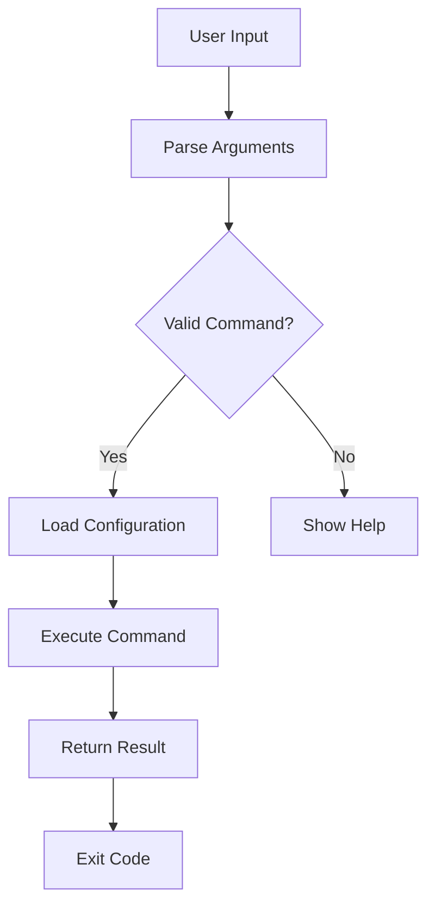

# Lesson 10: CLI Tool Project

## 🎯 What You'll Learn
- Design and implement a professional CLI tool with plugin architecture
- Apply all intermediate Python concepts in a real-world project
- Create a well-documented, testable, and maintainable codebase
- Implement comprehensive testing strategies with pytest
- Apply performance optimization techniques
- Use type hints throughout the project for better code quality
- Create custom context managers for resource management
- Implement error handling and logging
- Package and distribute a Python CLI tool
- Follow software engineering best practices

## ⏱️ Duration
**6-8 hours** (project implementation)

## 📋 Prerequisites
- All previous lessons (1-9)
- Python packaging basics (pip, setuptools)
- Git version control
- Command line proficiency

---

## 📖 Chapter 1: Introduction & Context

### The Story Behind CLI Tools

Imagine you're a chef in a professional kitchen. You have specialized tools: a knife for cutting, a whisk for mixing, a thermometer for checking temperatures. Each tool does one thing well.

CLI tools are the **specialized tools** of software development. They automate repetitive tasks, process data, and integrate into workflows. A well-designed CLI tool is like a perfectly balanced knife—it feels natural, does its job efficiently, and becomes indispensable.

### Why This Matters

In the real world, CLI tools power development workflows:

1. **Automation**: `git`, `docker`, `npm` automate complex tasks
2. **Integration**: CLI tools connect different systems
3. **Productivity**: One command replaces hours of manual work
4. **Standardization**: Everyone uses the same tool the same way

### Mental Model

> 💡 Think of **CLI tools** like **Swiss Army knives**. They have:
> - **Main blade** (core functionality)
> - **Additional tools** (plugins)
> - **Compact design** (efficient code)
> - **Clear labeling** (good help system)
> - **Reliable construction** (comprehensive testing)

### What You Already Know

From previous lessons, you've learned:
- Advanced OOP for extensible design
- Decorators for clean code
- Generators for efficient data processing
- Context managers for resource safety
- Type hints for better documentation
- Testing for reliability
- Performance optimization

Now we'll combine everything into a **professional CLI tool**.

---

## 📖 Chapter 2: Understanding CLI Tool Architecture

### The Basics: What Makes a Good CLI Tool?

A professional CLI tool has:
1. **Clear interface**: Easy to learn and use
2. **Consistent behavior**: Predictable and reliable
3. **Good documentation**: Help text and examples
4. **Error handling**: Graceful failure with helpful messages
5. **Extensibility**: Easy to add new features



### How It Works: Plugin Architecture

Plugins allow extending functionality without modifying core code:

```python
# Core discovers plugins
plugin_loader = PluginLoader(['./plugins'])
plugins = plugin_loader.discover_plugins()

# Load each plugin
for plugin_class in plugins:
    plugin = plugin_loader.load_plugin(plugin_class, context)
    
    # Register plugin commands
    for command in plugin.get_commands():
        command_registry.register(command.name, command)
```

**Key insight:** Plugins implement a standard interface, allowing the core to load them dynamically.

### Common Misconceptions

> ⚠️ **Don't be fooled!** Many people think CLI tools are "just scripts." Actually, professional CLI tools require careful design: argument parsing, error handling, configuration, testing, and packaging.

### Knowledge Check

> 🤔 **Quick Question:** Why use a plugin architecture instead of putting everything in one file?
> 
> <details>
> <summary>Click for answer</summary>
> Plugins provide:
> 1. **Separation of concerns**: Each plugin handles one domain
> 2. **Extensibility**: Add features without modifying core
> 3. **Maintainability**: Smaller, focused code units
> 4. **Collaboration**: Different teams can develop plugins independently
> </details>

---

## 📖 Chapter 3: Project Implementation Guide

### Setting Up

Create the project structure:

```bash
mkdir cli-tool-project
cd cli-tool-project

# Create directory structure
mkdir -p cli_tool/{commands,plugins,utils}
mkdir -p tests
mkdir -p plugins/example_plugin/commands

# Create __init__.py files
touch cli_tool/__init__.py
touch cli_tool/commands/__init__.py
touch cli_tool/plugins/__init__.py
touch cli_tool/utils/__init__.py
touch tests/__init__.py
touch plugins/__init__.py
touch plugins/example_plugin/__init__.py
touch plugins/example_plugin/commands/__init__.py
```

### Step 1: Implement Core Components

**cli_tool/main.py:**
```python
#!/usr/bin/env python3
"""Main CLI interface."""

import argparse
import sys
import logging
from typing import List, Optional

from cli_tool.commands import CommandRegistry
from cli_tool.config import ConfigManager
from cli_tool.plugins import PluginLoader
from cli_tool.utils.exceptions import CLIError

class CLI:
    """Main CLI application."""
    
    def __init__(self):
        self.config = ConfigManager()
        self.command_registry = CommandRegistry()
        self.plugin_loader = PluginLoader(['./plugins'])
        self.parser = self._create_parser()
        self._setup_logging()
    
    def _create_parser(self) -> argparse.ArgumentParser:
        """Create argument parser."""
        parser = argparse.ArgumentParser(
            prog='cli-tool',
            description='Comprehensive CLI tool with plugin system',
            formatter_class=argparse.RawDescriptionHelpFormatter,
            epilog='''
Examples:
  cli-tool hello World
  cli-tool hello --count 3 Alice
  cli-tool --config config.yaml hello
  cli-tool --interactive
            '''
        )
        
        # Global arguments
        parser.add_argument(
            '-v', '--version',
            action='version',
            version='%(prog)s 1.0.0'
        )
        parser.add_argument(
            '-c', '--config',
            help='Path to configuration file'
        )
        parser.add_argument(
            '-l', '--log-level',
            choices=['DEBUG', 'INFO', 'WARNING', 'ERROR', 'CRITICAL'],
            default='INFO',
            help='Set logging level (default: INFO)'
        )
        parser.add_argument(
            '-i', '--interactive',
            action='store_true',
            help='Run in interactive mode'
        )
        
        # Subcommands
        subparsers = parser.add_subparsers(
            title='Commands',
            dest='command',
            help='Available commands'
        )
        
        # Register built-in commands
        self._register_commands(subparsers)
        
        return parser
    
    def _register_commands(self, subparsers) -> None:
        """Register all commands."""
        # Built-in commands
        from cli_tool.commands.hello import HelloCommand
        self.command_registry.register('hello', HelloCommand)
        
        # Load plugin commands
        self._load_plugin_commands(subparsers)
    
    def _load_plugin_commands(self, subparsers) -> None:
        """Load commands from plugins."""
        try:
            plugins = self.plugin_loader.discover_plugins()
            for plugin_class in plugins:
                plugin = self.plugin_loader.load_plugin(plugin_class, {
                    'config': self.config,
                    'registry': self.command_registry
                })
                for command_class in plugin.get_commands():
                    command = command_class()
                    self.command_registry.register(
                        command_class.__name__.lower().replace('command', ''),
                        command_class
                    )
        except Exception as e:
            logging.warning(f"Failed to load plugins: {e}")
    
    def _setup_logging(self) -> None:
        """Setup logging configuration."""
        logging.basicConfig(
            level=logging.INFO,
            format='%(asctime)s - %(name)s - %(levelname)s - %(message)s',
            handlers=[
                logging.StreamHandler(sys.stderr)
            ]
        )
    
    def run(self, args: Optional[List[str]] = None) -> int:
        """Run the CLI tool."""
        try:
            # Parse arguments
            parsed_args = self.parser.parse_args(args)
            
            # Handle interactive mode
            if parsed_args.interactive:
                return self._run_interactive()
            
            # Show help if no command
            if not parsed_args.command:
                self.parser.print_help()
                return 0
            
            # Load configuration
            if parsed_args.config:
                self.config.load(parsed_args.config)
            
            # Set log level
            logging.getLogger().setLevel(parsed_args.log_level)
            
            # Execute command
            command_class = self.command_registry.get(parsed_args.command)
            if not command_class:
                raise CLIError(f"Unknown command: {parsed_args.command}")
            
            command = command_class()
            return command.execute(parsed_args)
            
        except CLIError as e:
            logging.error(f"Error: {e}")
            return 1
        except KeyboardInterrupt:
            logging.info("Interrupted by user")
            return 130
        except Exception as e:
            logging.exception(f"Unexpected error: {e}")
            return 1
    
    def _run_interactive(self) -> int:
        """Run in interactive mode."""
        print("Welcome to CLI Tool Interactive Mode")
        print("Type 'help' for available commands, 'exit' to quit\n")
        
        while True:
            try:
                command_line = input("cli-tool> ").strip()
                
                if not command_line:
                    continue
                
                if command_line.lower() in ['exit', 'quit']:
                    print("Goodbye!")
                    return 0
                
                if command_line.lower() == 'help':
                    self.parser.print_help()
                    continue
                
                # Execute command
                try:
                    return self.run(command_line.split())
                except SystemExit as e:
                    # Argparse calls sys.exit, catch it
                    if e.code != 0:
                        print(f"Command failed with code {e.code}")
                
            except (KeyboardInterrupt, EOFError):
                print("\nGoodbye!")
                return 0

def main() -> int:
    """Main entry point."""
    cli = CLI()
    return cli.run()

if __name__ == '__main__':
    sys.exit(main())
```

### 🛑 Try It Yourself

> **Challenge:** Implement a `greet` command that takes a name and greeting style (formal, casual, friendly). Use type hints and add comprehensive tests.
> 
> <details>
> <summary>Stuck? Click for hint</summary>
> Create `cli_tool/commands/greet.py` with a `GreetCommand` class. Add `--style` argument with choices. Use f-strings for different greeting formats.
> </details>

### Step 2: Implement Command System

**cli_tool/commands/__init__.py:**
```python
"""Command system."""

from typing import Dict, Type, List
from cli_tool.utils.exceptions import CLIError

class CommandRegistry:
    """Registry for commands."""
    
    def __init__(self):
        self._commands: Dict[str, Type['Command']] = {}
    
    def register(self, name: str, command_class: Type['Command']) -> None:
        """Register a command."""
        if name in self._commands:
            raise CLIError(f"Command '{name}' already registered")
        self._commands[name] = command_class
    
    def get(self, name: str) -> Type['Command']:
        """Get a command by name."""
        return self._commands.get(name)
    
    def get_all(self) -> List[Type['Command']]:
        """Get all registered commands."""
        return list(self._commands.values())
    
    def list_commands(self) -> List[str]:
        """List all command names."""
        return list(self._commands.keys())
```

**cli_tool/commands/base.py:**
```python
"""Base command class."""

import argparse
from abc import ABC, abstractmethod
from typing import Any

class Command(ABC):
    """Abstract base class for commands."""
    
    @property
    @abstractmethod
    def name(self) -> str:
        """Command name."""
        pass
    
    @property
    @abstractmethod
    def description(self) -> str:
        """Command description."""
        pass
    
    @abstractmethod
    def add_arguments(self, parser: argparse.ArgumentParser) -> None:
        """Add command-specific arguments."""
        pass
    
    @abstractmethod
    def execute(self, args: argparse.Namespace) -> int:
        """Execute the command."""
        pass
    
    def validate_args(self, args: argparse.Namespace) -> None:
        """Validate command arguments."""
        pass
    
    def get_help(self) -> str:
        """Get help text."""
        return self.description
```

**cli_tool/commands/hello.py:**
```python
"""Hello command implementation."""

import argparse
from cli_tool.commands.base import Command

class HelloCommand(Command):
    """Say hello to someone."""
    
    @property
    def name(self) -> str:
        return 'hello'
    
    @property
    def description(self) -> str:
        return 'Say hello to someone'
    
    def add_arguments(self, parser: argparse.ArgumentParser) -> None:
        """Add arguments."""
        parser.add_argument(
            'name',
            nargs='?',
            default='World',
            help='Name to greet (default: World)'
        )
        parser.add_argument(
            '-c', '--count',
            type=int,
            default=1,
            help='Number of times to greet (default: 1)'
        )
        parser.add_argument(
            '-u', '--uppercase',
            action='store_true',
            help='Convert greeting to uppercase'
        )
    
    def validate_args(self, args: argparse.Namespace) -> None:
        """Validate arguments."""
        if args.count < 1:
            raise ValueError("Count must be at least 1")
        if args.count > 100:
            raise ValueError("Count cannot exceed 100")
    
    def execute(self, args: argparse.Namespace) -> int:
        """Execute the command."""
        try:
            self.validate_args(args)
            
            greeting = f"Hello, {args.name}!"
            if args.uppercase:
                greeting = greeting.upper()
            
            for _ in range(args.count):
                print(greeting)
            
            return 0
        except ValueError as e:
            print(f"Error: {e}")
            return 1
```

### Step 3: Implement Plugin System

**cli_tool/plugins/__init__.py:**
```python
"""Plugin system."""

import os
import importlib
import logging
from typing import List, Type, Dict, Any

from cli_tool.plugins.base import Plugin
from cli_tool.utils.exceptions import PluginError

class PluginLoader:
    """Plugin loader."""
    
    def __init__(self, plugin_dirs: List[str]):
        self.plugin_dirs = plugin_dirs
        self.loaded_plugins: Dict[str, Plugin] = {}
    
    def discover_plugins(self) -> List[Type[Plugin]]:
        """Discover available plugins."""
        plugins = []
        
        for plugin_dir in self.plugin_dirs:
            if not os.path.exists(plugin_dir):
                logging.warning(f"Plugin directory not found: {plugin_dir}")
                continue
            
            for item in os.listdir(plugin_dir):
                item_path = os.path.join(plugin_dir, item)
                
                if os.path.isdir(item_path):
                    # Look for __init__.py in directory
                    init_file = os.path.join(item_path, '__init__.py')
                    if os.path.exists(init_file):
                        plugin_class = self._load_plugin_from_directory(
                            plugin_dir, item
                        )
                        if plugin_class:
                            plugins.append(plugin_class)
        
        return plugins
    
    def _load_plugin_from_directory(
        self, 
        base_dir: str, 
        plugin_name: str
    ) -> Type[Plugin]:
        """Load plugin from directory."""
        try:
            # Convert directory path to module path
            rel_path = os.path.relpath(
                os.path.join(base_dir, plugin_name), 
                os.getcwd()
            )
            module_path = rel_path.replace(os.sep, '.')
            
            # Import module
            module = importlib.import_module(module_path)
            
            # Find Plugin subclass
            for attr_name in dir(module):
                attr = getattr(module, attr_name)
                if (isinstance(attr, type) and 
                    issubclass(attr, Plugin) and 
                    attr is not Plugin):
                    return attr
            
            return None
        except Exception as e:
            logging.warning(f"Failed to load plugin {plugin_name}: {e}")
            return None
    
    def load_plugin(
        self, 
        plugin_class: Type[Plugin], 
        context: Dict[str, Any]
    ) -> Plugin:
        """Load a plugin."""
        if plugin_class.__name__ in self.loaded_plugins:
            raise PluginError(f"Plugin {plugin_class.__name__} already loaded")
        
        plugin = plugin_class()
        plugin.load(context)
        self.loaded_plugins[plugin_class.__name__] = plugin
        
        logging.info(f"Loaded plugin: {plugin_class.__name__}")
        return plugin
    
    def unload_plugin(self, plugin_name: str) -> None:
        """Unload a plugin."""
        if plugin_name not in self.loaded_plugins:
            raise PluginError(f"Plugin {plugin_name} not loaded")
        
        plugin = self.loaded_plugins[plugin_name]
        plugin.unload()
        del self.loaded_plugins[plugin_name]
        
        logging.info(f"Unloaded plugin: {plugin_name}")
    
    def get_loaded_plugins(self) -> List[Plugin]:
        """Get all loaded plugins."""
        return list(self.loaded_plugins.values())
```

**cli_tool/plugins/base.py:**
```python
"""Base plugin class."""

from abc import ABC, abstractmethod
from typing import List, Dict, Any, Type

class Plugin(ABC):
    """Abstract base class for plugins."""
    
    @abstractmethod
    def load(self, context: Dict[str, Any]) -> None:
        """Load the plugin."""
        pass
    
    @abstractmethod
    def unload(self) -> None:
        """Unload the plugin."""
        pass
    
    @abstractmethod
    def get_commands(self) -> List[Type['Command']]:
        """Get commands provided by this plugin."""
        pass
    
    def get_info(self) -> Dict[str, Any]:
        """Get plugin information."""
        return {
            'name': self.__class__.__name__,
            'version': '1.0.0',
            'author': 'Unknown',
            'description': self.__doc__ or 'No description'
        }
```

### Step 4: Implement Context Managers

**cli_tool/utils/context.py:**
```python
"""Context managers for resource management."""

import contextlib
import logging
import sqlite3
from typing import Generator, Any

from cli_tool.utils.exceptions import ResourceError

@contextlib.contextmanager
def database_connection(db_path: str) -> Generator[sqlite3.Connection, None, None]:
    """Context manager for database connections."""
    conn = None
    try:
        conn = sqlite3.connect(db_path)
        conn.row_factory = sqlite3.Row
        logging.info(f"Connected to database: {db_path}")
        yield conn
    except sqlite3.Error as e:
        raise ResourceError(f"Database error: {e}")
    finally:
        if conn:
            try:
                conn.close()
                logging.info("Database connection closed")
            except sqlite3.Error as e:
                logging.error(f"Error closing database: {e}")

@contextlib.contextmanager
def database_transaction(conn: sqlite3.Connection) -> Generator[None, None, None]:
    """Context manager for database transactions."""
    try:
        conn.execute('BEGIN')
        logging.debug("Transaction started")
        yield
        conn.commit()
        logging.debug("Transaction committed")
    except Exception as e:
        conn.rollback()
        logging.error(f"Transaction rolled back: {e}")
        raise

@contextlib.contextmanager
def file_handler(file_path: str, mode: str = 'r') -> Generator[Any, None, None]:
    """Context manager for file operations."""
    file = None
    try:
        file = open(file_path, mode, encoding='utf-8')
        logging.debug(f"Opened file: {file_path}")
        yield file
    except IOError as e:
        raise ResourceError(f"File error: {e}")
    finally:
        if file:
            try:
                file.close()
                logging.debug(f"Closed file: {file_path}")
            except IOError as e:
                logging.error(f"Error closing file: {e}")

@contextlib.contextmanager
def temporary_directory() -> Generator[str, None, None]:
    """Context manager for temporary directories."""
    import tempfile
    import shutil
    
    temp_dir = tempfile.mkdtemp()
    try:
        logging.debug(f"Created temporary directory: {temp_dir}")
        yield temp_dir
    finally:
        try:
            shutil.rmtree(temp_dir)
            logging.debug(f"Removed temporary directory: {temp_dir}")
        except Exception as e:
            logging.error(f"Error removing temporary directory: {e}")
```

### Step 5: Implement Configuration Management

**cli_tool/config.py:**
```python
"""Configuration management."""

import configparser
import json
import yaml
import os
from typing import Any, Dict, Optional

from cli_tool.utils.exceptions import ConfigurationError

class ConfigManager:
    """Configuration manager."""
    
    def __init__(self):
        self._config: Dict[str, Any] = {}
        self._log_level = 'INFO'
    
    def load(self, config_path: str) -> None:
        """Load configuration from file."""
        if not os.path.exists(config_path):
            raise ConfigurationError(f"Config file not found: {config_path}")
        
        ext = os.path.splitext(config_path)[1].lower()
        
        try:
            if ext in ['.ini', '.cfg']:
                self._load_ini(config_path)
            elif ext == '.json':
                self._load_json(config_path)
            elif ext in ['.yaml', '.yml']:
                self._load_yaml(config_path)
            else:
                raise ConfigurationError(f"Unsupported format: {ext}")
        except Exception as e:
            raise ConfigurationError(f"Failed to load config: {e}")
    
    def _load_ini(self, path: str) -> None:
        """Load INI configuration."""
        config = configparser.ConfigParser()
        config.read(path, encoding='utf-8')
        
        self._config = {}
        for section in config.sections():
            self._config[section] = dict(config.items(section))
    
    def _load_json(self, path: str) -> None:
        """Load JSON configuration."""
        with open(path, 'r', encoding='utf-8') as f:
            self._config = json.load(f)
    
    def _load_yaml(self, path: str) -> None:
        """Load YAML configuration."""
        with open(path, 'r', encoding='utf-8') as f:
            self._config = yaml.safe_load(f)
    
    def get(self, key: str, default: Any = None) -> Any:
        """Get configuration value."""
        keys = key.split('.')
        value = self._config
        
        for k in keys:
            if isinstance(value, dict) and k in value:
                value = value[k]
            else:
                return default
        
        return value
    
    def set(self, key: str, value: Any) -> None:
        """Set configuration value."""
        keys = key.split('.')
        config = self._config
        
        for k in keys[:-1]:
            if k not in config:
                config[k] = {}
            config = config[k]
        
        config[keys[-1]] = value
    
    def set_log_level(self, level: str) -> None:
        """Set log level."""
        valid_levels = ['DEBUG', 'INFO', 'WARNING', 'ERROR', 'CRITICAL']
        if level not in valid_levels:
            raise ConfigurationError(f"Invalid log level: {level}")
        self._log_level = level
    
    def get_log_level(self) -> str:
        """Get log level."""
        return self._log_level
    
    def to_dict(self) -> Dict[str, Any]:
        """Convert to dictionary."""
        return self._config.copy()
```

### Step 6: Implement Custom Exceptions

**cli_tool/utils/exceptions.py:**
```python
"""Custom exceptions."""

class CLIError(Exception):
    """Base CLI error."""
    pass

class PluginError(CLIError):
    """Plugin-related error."""
    pass

class ResourceError(CLIError):
    """Resource-related error."""
    pass

class ConfigurationError(CLIError):
    """Configuration error."""
    pass

class CommandError(CLIError):
    """Command execution error."""
    pass

class ValidationError(CLIError):
    """Validation error."""
    pass

class PluginNotFoundError(PluginError):
    """Plugin not found."""
    pass

class PluginLoadError(PluginError):
    """Plugin load error."""
    pass
```

### Step 7: Create Example Plugin

**plugins/example_plugin/__init__.py:**
```python
"""Example plugin."""

from typing import List, Dict, Any, Type

from cli_tool.plugins.base import Plugin
from cli_tool.commands.base import Command

class ExamplePlugin(Plugin):
    """Example plugin demonstrating plugin architecture."""
    
    def __init__(self):
        self.context = None
    
    def load(self, context: Dict[str, Any]) -> None:
        """Load the plugin."""
        self.context = context
        print("ExamplePlugin loaded")
    
    def unload(self) -> None:
        """Unload the plugin."""
        print("ExamplePlugin unloaded")
    
    def get_commands(self) -> List[Type[Command]]:
        """Get commands from this plugin."""
        from plugins.example_plugin.commands.calculate import CalculateCommand
        return [CalculateCommand]
    
    def get_info(self) -> Dict[str, Any]:
        """Get plugin info."""
        return {
            'name': 'example_plugin',
            'version': '1.0.0',
            'author': 'CLI Tool Team',
            'description': 'Example plugin with calculate command'
        }
```

**plugins/example_plugin/commands/calculate.py:**
```python
"""Calculate command."""

import argparse
from cli_tool.commands.base import Command

class CalculateCommand(Command):
    """Perform calculations."""
    
    @property
    def name(self) -> str:
        return 'calculate'
    
    @property
    def description(self) -> str:
        return 'Perform mathematical calculations'
    
    def add_arguments(self, parser: argparse.ArgumentParser) -> None:
        """Add arguments."""
        parser.add_argument(
            'operation',
            choices=['add', 'subtract', 'multiply', 'divide'],
            help='Operation to perform'
        )
        parser.add_argument(
            'numbers',
            nargs='+',
            type=float,
            help='Numbers to operate on'
        )
        parser.add_argument(
            '-p', '--precision',
            type=int,
            default=2,
            help='Decimal precision (default: 2)'
        )
    
    def execute(self, args: argparse.Namespace) -> int:
        """Execute the command."""
        try:
            numbers = args.numbers
            
            if args.operation == 'add':
                result = sum(numbers)
            elif args.operation == 'subtract':
                result = numbers[0] - sum(numbers[1:])
            elif args.operation == 'multiply':
                result = 1
                for n in numbers:
                    result *= n
            elif args.operation == 'divide':
                result = numbers[0]
                for n in numbers[1:]:
                    if n == 0:
                        print("Error: Division by zero")
                        return 1
                    result /= n
            
            print(f"Result: {result:.{args.precision}f}")
            return 0
        
        except Exception as e:
            print(f"Error: {e}")
            return 1
```

### Step 8: Create Tests

**tests/test_hello.py:**
```python
"""Test HelloCommand."""

import pytest
import argparse
from io import StringIO
import sys

from cli_tool.commands.hello import HelloCommand

class TestHelloCommand:
    """Test HelloCommand."""
    
    def setup_method(self):
        """Setup test."""
        self.command = HelloCommand()
    
    def test_name(self):
        """Test command name."""
        assert self.command.name == 'hello'
    
    def test_description(self):
        """Test command description."""
        assert 'hello' in self.command.description.lower()
    
    def test_execute_default(self, capsys):
        """Test execute with defaults."""
        args = argparse.Namespace(
            name='World',
            count=1,
            uppercase=False
        )
        
        result = self.command.execute(args)
        
        captured = capsys.readouterr()
        assert result == 0
        assert 'Hello, World!' in captured.out
    
    def test_execute_with_name(self, capsys):
        """Test execute with custom name."""
        args = argparse.Namespace(
            name='Alice',
            count=1,
            uppercase=False
        )
        
        result = self.command.execute(args)
        
        captured = capsys.readouterr()
        assert result == 0
        assert 'Hello, Alice!' in captured.out
    
    def test_execute_with_count(self, capsys):
        """Test execute with count."""
        args = argparse.Namespace(
            name='Bob',
            count=3,
            uppercase=False
        )
        
        result = self.command.execute(args)
        
        captured = capsys.readouterr()
        assert result == 0
        assert captured.out.count('Hello, Bob!') == 3
    
    def test_execute_uppercase(self, capsys):
        """Test execute with uppercase."""
        args = argparse.Namespace(
            name='Charlie',
            count=1,
            uppercase=True
        )
        
        result = self.command.execute(args)
        
        captured = capsys.readouterr()
        assert result == 0
        assert 'HELLO, CHARLIE!' in captured.out
    
    def test_validate_args_invalid_count(self):
        """Test validation with invalid count."""
        args = argparse.Namespace(
            name='Test',
            count=0,
            uppercase=False
        )
        
        with pytest.raises(ValueError):
            self.command.validate_args(args)
```

**tests/test_config.py:**
```python
"""Test ConfigManager."""

import pytest
import tempfile
import os
import json

from cli_tool.config import ConfigManager
from cli_tool.utils.exceptions import ConfigurationError

class TestConfigManager:
    """Test ConfigManager."""
    
    def test_get_default(self):
        """Test get with default value."""
        config = ConfigManager()
        assert config.get('nonexistent', 'default') == 'default'
    
    def test_set_and_get(self):
        """Test set and get."""
        config = ConfigManager()
        config.set('database.host', 'localhost')
        assert config.get('database.host') == 'localhost'
    
    def test_load_json(self):
        """Test loading JSON config."""
        with tempfile.NamedTemporaryFile(
            mode='w', 
            suffix='.json', 
            delete=False
        ) as f:
            json.dump({'key': 'value'}, f)
            temp_path = f.name
        
        try:
            config = ConfigManager()
            config.load(temp_path)
            assert config.get('key') == 'value'
        finally:
            os.unlink(temp_path)
    
    def test_load_nonexistent(self):
        """Test loading nonexistent file."""
        config = ConfigManager()
        with pytest.raises(ConfigurationError):
            config.load('/nonexistent/config.json')
    
    def test_set_log_level(self):
        """Test setting log level."""
        config = ConfigManager()
        config.set_log_level('DEBUG')
        assert config.get_log_level() == 'DEBUG'
    
    def test_set_invalid_log_level(self):
        """Test setting invalid log level."""
        config = ConfigManager()
        with pytest.raises(ConfigurationError):
            config.set_log_level('INVALID')
```

### Step 9: Create Configuration Files

**config.yaml:**
```yaml
# CLI Tool Configuration
app:
  name: "CLI Tool"
  version: "1.0.0"
  debug: false

logging:
  level: "INFO"
  format: "%(asctime)s - %(name)s - %(levelname)s - %(message)s"

database:
  host: "localhost"
  port: 5432
  name: "cli_tool_db"

plugins:
  enabled: true
  directories:
    - "./plugins"
```

**requirements.txt:**
```
argparse>=1.4.0
configparser>=5.0.0
pyyaml>=6.0
pytest>=7.0.0
pytest-cov>=4.0.0
```

**pyproject.toml:**
```toml
[build-system]
requires = ["setuptools>=61.0", "wheel"]
build-backend = "setuptools.build_meta"

[project]
name = "cli-tool"
version = "1.0.0"
description = "Comprehensive CLI tool with plugin system"
readme = "README.md"
license = {text = "MIT"}
authors = [
    {name = "CLI Tool Team", email = "team@example.com"}
]

[project.scripts]
cli-tool = "cli_tool.main:main"

[tool.pytest.ini_options]
testpaths = ["tests"]
python_files = "test_*.py"
python_classes = "Test*"
python_functions = "test_*"
addopts = "-v --cov=cli_tool --cov-report=term-missing"
```

---

## 📖 Chapter 4: Real-World Applications

### Case Study: Docker CLI

Docker's CLI demonstrates professional design:

```bash
# Clear command structure
docker run -it ubuntu bash
docker build -t myapp .
docker ps
docker logs container_id

# Consistent patterns
docker [command] [options] [arguments]

# Good help system
docker --help
docker run --help
```

**How it works:**
1. **Main command**: `docker`
2. **Subcommands**: `run`, `build`, `ps`, `logs`
3. **Options**: `-it`, `-t`, `--help`
4. **Arguments**: `ubuntu`, `bash`, `.`

### Industry Patterns

- **git**: Version control with subcommands
- **npm**: Package management with scripts
- **kubectl**: Kubernetes management
- **aws-cli**: AWS service management
- **terraform**: Infrastructure as code

### Performance Considerations

1. **Startup time**: Fast argument parsing
2. **Memory usage**: Efficient data structures
3. **Plugin loading**: Lazy loading when needed
4. **Caching**: Configuration and state caching
5. **Concurrency**: Parallel plugin loading

---

## 📖 Chapter 5: Reference Material

### Quick Reference Cheat Sheet

```
┌─────────────────────────────────────────────────────────┐
│ CLI TOOL CHEAT SHEET                                   │
├─────────────────────────────────────────────────────────┤
│ Run tool:       cli-tool [command] [options]           │
│ Get help:       cli-tool --help                        │
│ Interactive:    cli-tool --interactive                 │
│ Config file:    cli-tool --config config.yaml          │
│ Log level:      cli-tool --log-level DEBUG             │
│ Version:        cli-tool --version                     │
│ Plugin load:    Automatic from ./plugins directory     │
│ Command add:    Inherit from Command base class        │
│ Test run:       pytest tests/                          │
│ Package:        pip install -e .                       │
└─────────────────────────────────────────────────────────┘
```

### Glossary

| Term | Definition |
|------|------------|
| **CLI** | Command Line Interface |
| **Plugin** | Modular extension that adds functionality |
| **Registry** | System for registering and discovering components |
| **Context Manager** | Python construct for resource management |
| **argparse** | Python module for parsing command-line arguments |
| **Entry Point** | Script registered during package installation |

### Common Patterns Library

```python
# Pattern 1: Command factory
def create_command(name: str) -> Command:
    """Factory for creating commands."""
    commands = {
        'hello': HelloCommand,
        'calculate': CalculateCommand,
    }
    return commands[name]()

# Pattern 2: Plugin hook system
class PluginWithHooks(Plugin):
    """Plugin with lifecycle hooks."""
    
    def on_load(self):
        """Called when plugin loads."""
        pass
    
    def on_unload(self):
        """Called when plugin unloads."""
        pass
    
    def on_command_execute(self, command_name: str):
        """Called before command execution."""
        pass

# Pattern 3: Configuration inheritance
class InheritedConfig(ConfigManager):
    """Config with inheritance."""
    
    def get(self, key: str, default: Any = None) -> Any:
        # Check local config
        value = super().get(key)
        if value is not None:
            return value
        
        # Check parent config
        if self.parent:
            return self.parent.get(key, default)
        
        return default
```

### Debugging Checklist

- [ ] Run with `--log-level DEBUG` for detailed output
- [ ] Check plugin loading with `--interactive` mode
- [ ] Verify configuration with `config.get()` calls
- [ ] Test command arguments with `argparse` validation
- [ ] Profile with `cProfile` for performance issues
- [ ] Check test coverage with `pytest --cov`
- [ ] Validate type hints with `mypy`

---

## 📖 Chapter 6: Summary & Next Steps

### Key Takeaways

1. **Architecture matters**: Clean separation of concerns
2. **Plugins provide extensibility**: Easy to add features
3. **Testing ensures reliability**: Comprehensive test coverage
4. **Type hints improve quality**: Better code documentation
5. **Context managers ensure safety**: Proper resource cleanup
6. **Configuration enables flexibility**: Easy to customize

### Self-Assessment

> Can you:
> - [ ] Design a CLI tool architecture?
> - [ ] Implement a plugin system?
> - [ ] Use argparse for argument parsing?
> - [ ] Create custom context managers?
> - [ ] Write comprehensive tests?
> - [ ] Package a Python application?
> - [ ] Follow software engineering best practices?

### What's Coming Next

This is the final lesson of the Intermediate Python course. You've learned:
- Advanced OOP concepts
- Decorators and metaprogramming
- Generators and iterators
- Context managers
- Type hints
- Functional programming
- File I/O and serialization
- Testing with pytest
- Performance optimization
- CLI tool development

**Next steps:**
- Build portfolio projects
- Contribute to open source
- Learn web development (Django/Flask)
- Explore data science (pandas/numpy)
- Study system design

---

## 📚 Sources & Further Reading

### Official Documentation
- [argparse documentation](https://docs.python.org/3/library/argparse.html)
- [Python packaging](https://packaging.python.org/)
- [pytest documentation](https://docs.pytest.org/)

### Recommended Reading
- "Fluent Python" by Luciano Ramalho
- "Python Cookbook" by David Beazley and Brian K. Jones
- "Architecture Patterns with Python" by Harry Percival and Bob Gregory

### Video Tutorials
- [Real Python: Building CLI Tools](https://realpython.com/python-cli-tools/)
- [Corey Schafer: argparse Tutorial](https://www.youtube.com/watch?v=F1gELqCOcGg)

### Community Resources
- [Python CLI Tools](https://github.com/pypa/sampleproject)
- [Click framework](https://click.palletsprojects.com/) (alternative to argparse)
- [Typer framework](https://typer.tiangolo.com/) (modern CLI framework)

---

*This enriched lesson was generated following the Textbook Writer Agent specification. For the concise version, see [lesson-10-cli-tool-project.md](../intermediate-python-3/lesson-10-cli-tool-project.md).*