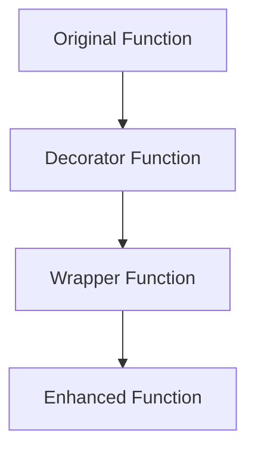

# Lesson 2: Decorators and Metaprogramming

## 🎯 What You'll Learn
- Create and use function decorators
- Implement class decorators
- Understand and use metaclasses
- Create decorators with arguments
- Use decorators for logging, caching, and validation
- Apply metaprogramming techniques for dynamic code generation
- Understand the descriptor protocol
- Create context managers using decorators

## ⏱️ Duration
**2.5-3.5 hours** (reading + practice)

## 📋 Prerequisites
- Python functions and classes
- Understanding of closures
- Basic knowledge of Python's object model

---

## 📖 Chapter 1: Introduction & Context

### The Story Behind Decorators

Imagine you're a chef preparing a meal. You have your basic recipe (a function), but you want to add some extra steps: maybe garnish the plate, add a side dish, or check the temperature. Instead of rewriting the entire recipe each time, you could have a "wrapper" that adds these steps around your original recipe.

That's exactly what decorators do in Python—they're **wrappers** that add functionality to your existing code without modifying it.

### Why This Matters

Decorators and metaprogramming are essential tools for:

1. **Code Reusability**: Write once, use everywhere
2. **Separation of Concerns**: Keep core logic separate from cross-cutting concerns
3. **Cleaner Code**: Avoid repetitive boilerplate
4. **Framework Building**: Create powerful APIs (like Flask, Django, FastAPI)
5. **Dynamic Code Generation**: Build flexible, adaptable systems

### Mental Model

> 💡 Think of **decorators** like **gift wrapping**. The gift inside (your function) stays the same, but the wrapper adds presentation and presentation effects. You can even stack multiple wrappers for different occasions!

### What You Already Know

From previous lessons, you've learned:
- How to define and call functions
- How to create classes and objects
- How to use inheritance and polymorphism

Now we'll learn how to **modify behavior at runtime** without changing the original code.

---

## 📖 Chapter 2: Understanding Decorators & Metaprogramming

### The Basics: Function Decorators

A decorator is a function that takes another function as input and returns a new function with enhanced behavior.



### How It Works: The @ Syntax

```python
# Without decorator syntax
def greet(name):
    return f"Hello, {name}!"

def simple_decorator(func):
    def wrapper(*args, **kwargs):
        print(f"Calling function '{func.__name__}'")
        result = func(*args, **kwargs)
        print(f"Function '{func.__name__}' finished")
        return result
    return wrapper

# Manual decoration
greet = simple_decorator(greet)

# With decorator syntax (equivalent)
@simple_decorator
def greet(name):
    return f"Hello, {name}!"
```

**What happens when you call `greet("Alice")`?**
1. Python calls `wrapper("Alice")`
2. `wrapper` prints "Calling function 'greet'"
3. `wrapper` calls the original `greet("Alice")`
4. Original `greet` returns "Hello, Alice!"
5. `wrapper` prints "Function 'greet' finished"
6. `wrapper` returns "Hello, Alice!"

### Common Misconceptions

> ⚠️ **Don't be fooled!** Many people think decorators modify the original function. Actually, they **replace** it with a new function (the wrapper) that calls the original.

### Knowledge Check

> 🤔 **Quick Question:** What's the difference between `@decorator` and `decorator(func)`?
> 
> <details>
> <summary>Click for answer</summary>
> They're identical! `@decorator` is just syntactic sugar for `func = decorator(func)`.
> </details>

---

## 📖 Chapter 3: Hands-On Tutorial

### Setting Up

Create a new Python file called `decorators_tutorial.py`:

```python
# decorators_tutorial.py
import time
import functools
from typing import Any, Callable, Dict
```

### Step 1: Create a Simple Decorator

```python
def simple_decorator(func):
    """A simple decorator that logs function calls."""
    def wrapper(*args, **kwargs):
        print(f"🚀 Calling function '{func.__name__}'")
        print(f"   Arguments: args={args}, kwargs={kwargs}")
        
        result = func(*args, **kwargs)
        
        print(f"✅ Function '{func.__name__}' returned: {result}")
        return result
    
    return wrapper

@simple_decorator
def add(a: int, b: int) -> int:
    """Add two numbers."""
    return a + b

# Test it
result = add(5, 3)
```

**Line-by-line breakdown:**
- Line 3: `*args` and `**kwargs` allow the wrapper to accept any arguments
- Line 6: Call the original function with the same arguments
- Line 13: The `@` syntax applies the decorator

### Step 2: Create Decorators with Arguments

```python
def repeat(times: int):
    """Decorator that repeats function execution."""
    def decorator(func):
        @functools.wraps(func)  # Preserves original function's metadata
        def wrapper(*args, **kwargs):
            for i in range(times):
                print(f"🔁 Execution {i + 1}/{times}")
                result = func(*args, **kwargs)
            return result
        return wrapper
    return decorator

@repeat(3)
def say_hello(name: str):
    """Say hello to someone."""
    print(f"Hello, {name}!")
    return f"Greeted {name}"

# Test it
say_hello("Alice")
```

**Key insight:** Decorators with arguments are **triple-nested functions**:
1. Outer function takes arguments and returns decorator
2. Middle function takes the function and returns wrapper
3. Inner function does the actual work

### 🛑 Try It Yourself

> **Challenge:** Create a decorator `validate_types` that checks argument types before calling the function.
> 
> <details>
> <summary>Stuck? Click for hint</summary>
> Your decorator should take type hints as arguments and use `isinstance()` to validate each argument.
> </details>

### Step 3: Create Class Decorators

```python
def add_repr(cls):
    """Add a __repr__ method to a class."""
    def __repr__(self):
        class_name = self.__class__.__name__
        attributes = ', '.join(f'{k}={v!r}' for k, v in self.__dict__.items())
        return f"{class_name}({attributes})"
    
    cls.__repr__ = __repr__
    return cls

@add_repr
class Person:
    def __init__(self, name: str, age: int):
        self.name = name
        self.age = age

# Test it
person = Person("Alice", 30)
print(person)  # Person(name='Alice', age=30)
```

---

## 📖 Chapter 4: Code Examples Explained

### Example 1: The Simplest Case

**Context:** Timing function execution for performance monitoring.

```python
def timing_decorator(func):
    """Measure function execution time."""
    @functools.wraps(func)
    def wrapper(*args, **kwargs):
        start_time = time.perf_counter()
        result = func(*args, **kwargs)
        end_time = time.perf_counter()
        
        elapsed = end_time - start_time
        print(f"⏱️ {func.__name__} took {elapsed:.4f} seconds")
        
        return result
    return wrapper

@timing_decorator
def compute_heavy_task(n: int) -> int:
    """Compute sum of squares."""
    result = 0
    for i in range(n):
        result += i ** 2
    return result

# Test it
compute_heavy_task(1_000_000)
```

**Line-by-line breakdown:**
- Line 3: `@functools.wraps(func)` preserves the original function's name and docstring
- Line 4: `time.perf_counter()` provides high-resolution timing
- Line 9: Format and display the elapsed time

### Example 2: A Realistic Scenario

**Context:** Caching function results for improved performance.

```python
def cache_decorator(func):
    """Cache function results based on arguments."""
    cache: Dict[tuple, Any] = {}
    
    @functools.wraps(func)
    def wrapper(*args, **kwargs):
        # Create cache key from arguments
        key = (args, tuple(sorted(kwargs.items())))
        
        if key in cache:
            print(f"📦 Cache hit for {func.__name__}")
            return cache[key]
        
        print(f"🔍 Cache miss for {func.__name__}")
        result = func(*args, **kwargs)
        cache[key] = result
        return result
    
    # Add cache management methods
    wrapper.cache = cache
    wrapper.clear_cache = lambda: cache.clear()
    
    return wrapper

@cache_decorator
def fibonacci(n: int) -> int:
    """Calculate Fibonacci number (with caching)."""
    if n <= 1:
        return n
    return fibonacci(n - 1) + fibonacci(n - 2)

# Test it
print(fibonacci(30))  # Fast due to caching!
print(fibonacci.cache)  # View cache contents
```

**Key insights:**
- **Cache key**: Convert arguments to hashable tuple
- **Cache management**: Add methods to wrapper function
- **Performance**: Dramatic speedup for recursive functions

### Example 3: Production-Quality Code

**Context:** Validation decorator with detailed error messages.

```python
def validate_types(**type_hints):
    """Validate function argument types."""
    def decorator(func):
        @functools.wraps(func)
        def wrapper(*args, **kwargs):
            # Get function signature
            import inspect
            sig = inspect.signature(func)
            bound_args = sig.bind(*args, **kwargs)
            bound_args.apply_defaults()
            
            # Validate each argument
            for arg_name, expected_type in type_hints.items():
                if arg_name in bound_args.arguments:
                    value = bound_args.arguments[arg_name]
                    if not isinstance(value, expected_type):
                        raise TypeError(
                            f"Argument '{arg_name}' must be {expected_type.__name__}, "
                            f"got {type(value).__name__} instead. "
                            f"Value: {value!r}"
                        )
            
            return func(*args, **kwargs)
        return wrapper
    return decorator

@validate_types(a=int, b=int)
def divide(a: int, b: int) -> float:
    """Divide two numbers with type validation."""
    if b == 0:
        raise ValueError("Cannot divide by zero")
    return a / b

# Test it
try:
    divide("10", 2)  # Raises TypeError with helpful message
except TypeError as e:
    print(f"Error: {e}")
```

**Best practices demonstrated:**
- **`inspect.signature`** for accurate argument binding
- **Detailed error messages** with context
- **Type checking** using `isinstance()`
- **Clear documentation** and type hints

### Edge Cases & Gotchas

```python
# Problem: Decorator doesn't preserve function metadata
def bad_decorator(func):
    def wrapper(*args, **kwargs):
        return func(*args, **kwargs)
    return wrapper

@bad_decorator
def example_function():
    """This is an example function."""
    pass

print(example_function.__name__)  # 'wrapper' (wrong!)
print(example_function.__doc__)   # None (wrong!)

# Solution: Use functools.wraps
import functools

def good_decorator(func):
    @functools.wraps(func)
    def wrapper(*args, **kwargs):
        return func(*args, **kwargs)
    return wrapper

@good_decorator
def example_function():
    """This is an example function."""
    pass

print(example_function.__name__)  # 'example_function' (correct!)
print(example_function.__doc__)   # 'This is an example function.' (correct!)
```

> ⚠️ **Watch out!** Always use `@functools.wraps(func)` to preserve function metadata.

---

## 📖 Chapter 5: Real-World Applications

### Case Study: Flask Route Decorators

Flask uses decorators to define routes:

```python
from flask import Flask

app = Flask(__name__)

@app.route('/')
def home():
    return "Welcome to the home page!"

@app.route('/about')
def about():
    return "About us page"

@app.route('/user/<username>')
def user_profile(username):
    return f"Profile page for {username}"
```

**How it works:**
1. `@app.route('/')` registers the function as a route handler
2. Flask stores the mapping: `{'/': home, '/about': about, ...}`
3. When a request comes in, Flask calls the appropriate function

### Industry Patterns

- **Authentication**: `@login_required` decorator checks if user is logged in
- **Authorization**: `@has_permission('admin')` checks user permissions
- **Rate Limiting**: `@rate_limit(100, per_minute=60)` limits API calls
- **Logging**: `@log_calls` logs function entry/exit for debugging
- **Retry Logic**: `@retry(max_attempts=3)` retries on failure
- **Caching**: `@cache(timeout=300)` caches results for 5 minutes

### Performance Considerations

1. **Decorator overhead**: Minimal (function call + wrapper execution)
2. **Stacking decorators**: Each adds a layer of function calls
3. **Caching decorators**: Can dramatically improve performance
4. **Memory usage**: Cache decorators consume memory for stored results

---

## 📖 Chapter 6: Reference Material

### Quick Reference Cheat Sheet

```
┌─────────────────────────────────────────────────────────┐
│ DECORATOR CHEAT SHEET                                  │
├─────────────────────────────────────────────────────────┤
│ Basic Decorator:      @decorator                       │
│ With Arguments:       @decorator(args)                 │
│ Preserve Metadata:    @functools.wraps(func)           │
│ Class Decorator:      def decorator(cls): ...          │
│ Method Decorator:     def decorator(method): ...       │
│ Property Decorator:   @property                        │
│ Static Method:        @staticmethod                    │
│ Class Method:         @classmethod                     │
└─────────────────────────────────────────────────────────┘
```

### Glossary

| Term | Definition |
|------|------------|
| **Decorator** | A function that modifies another function or class |
| **Wrapper** | The inner function returned by a decorator |
| **Syntactic Sugar** | Shorthand notation that makes code easier to write |
| **Metaclass** | A class whose instances are classes |
| **Descriptor** | An object that defines how attribute access is handled |
| **Metaprogramming** | Writing code that generates or manipulates code |

### Common Patterns Library

```python
# Pattern 1: Retry on Failure
def retry(max_attempts: int = 3, delay: float = 1.0):
    def decorator(func):
        @functools.wraps(func)
        def wrapper(*args, **kwargs):
            for attempt in range(max_attempts):
                try:
                    return func(*args, **kwargs)
                except Exception as e:
                    if attempt == max_attempts - 1:
                        raise
                    print(f"Attempt {attempt + 1} failed: {e}")
                    time.sleep(delay)
        return wrapper
    return decorator

# Pattern 2: Rate Limiting
def rate_limit(max_calls: int, period: float):
    calls = []
    
    def decorator(func):
        @functools.wraps(func)
        def wrapper(*args, **kwargs):
            now = time.time()
            calls_in_period = [t for t in calls if now - t < period]
            
            if len(calls_in_period) >= max_calls:
                raise Exception(f"Rate limit exceeded: {max_calls} calls per {period}s")
            
            calls.append(now)
            return func(*args, **kwargs)
        return wrapper
    return decorator

# Pattern 3: Logging
def log_calls(logger=None):
    if logger is None:
        import logging
        logger = logging.getLogger(__name__)
    
    def decorator(func):
        @functools.wraps(func)
        def wrapper(*args, **kwargs):
            logger.info(f"Calling {func.__name__} with args={args}, kwargs={kwargs}")
            try:
                result = func(*args, **kwargs)
                logger.info(f"{func.__name__} returned {result}")
                return result
            except Exception as e:
                logger.error(f"{func.__name__} raised {e}")
                raise
        return wrapper
    return decorator
```

### Debugging Checklist

- [ ] Use `@functools.wraps(func)` to preserve metadata
- [ ] Test decorator with various argument types
- [ ] Check error handling and edge cases
- [ ] Verify decorator stacking order
- [ ] Measure performance impact
- [ ] Document decorator behavior clearly

---

## 📖 Chapter 7: Summary & Next Steps

### Key Takeaways

1. **Decorators** are functions that modify other functions
2. **`@decorator`** is syntactic sugar for `func = decorator(func)`
3. **`functools.wraps`** preserves original function metadata
4. **Decorators with arguments** require triple-nested functions
5. **Class decorators** modify class behavior at definition time

### Self-Assessment

> Can you:
> - [ ] Create a simple decorator that logs function calls?
> - [ ] Implement a decorator with arguments?
> - [ ] Use `functools.wraps` to preserve function metadata?
> - [ ] Create a class decorator that adds methods?
> - [ ] Explain the difference between decorators and metaclasses?

### What's Coming Next

**Lesson 3: Generators, Iterators & Functional Programming** will cover:
- Creating and using generators
- Building custom iterators
- Functional programming concepts in Python
- Using `itertools` and `functools`

---

## 📚 Sources & Further Reading

### Official Documentation
- [Python Decorators](https://docs.python.org/3/glossary.html#term-decorator)
- [functools.wraps](https://docs.python.org/3/library/functools.html#functools.wraps)
- [Python Descriptors](https://docs.python.org/3/howto/descriptor.html)

### Recommended Reading
- "Fluent Python" by Luciano Ramalho (Chapter 7: Function Decorators and Closures)
- "Python Cookbook" by David Beazley and Brian K. Jones (Chapter 9: Metaprogramming)
- "Effective Python" by Brett Slatkin (Item 26: Use @staticmethod and @classmethod)

### Video Tutorials
- [Corey Schafer: Python Decorators](https://www.youtube.com/watch?v=FsAPt_9Bf3U)
- [Real Python: Primer on Python Decorators](https://realpython.com/primer-on-python-decorators/)

### Community Resources
- [Stack Overflow: Python Decorators](https://stackoverflow.com/questions/tagged/python+decorator)
- [Python Decorator Library](https://wiki.python.org/moin/PythonDecoratorLibrary)

---

*This enriched lesson was generated following the Textbook Writer Agent specification. For the concise version, see [lesson-2-decorators-metaprogramming.md](../intermediate-python-3/lesson-2-decorators-metaprogramming.md).*