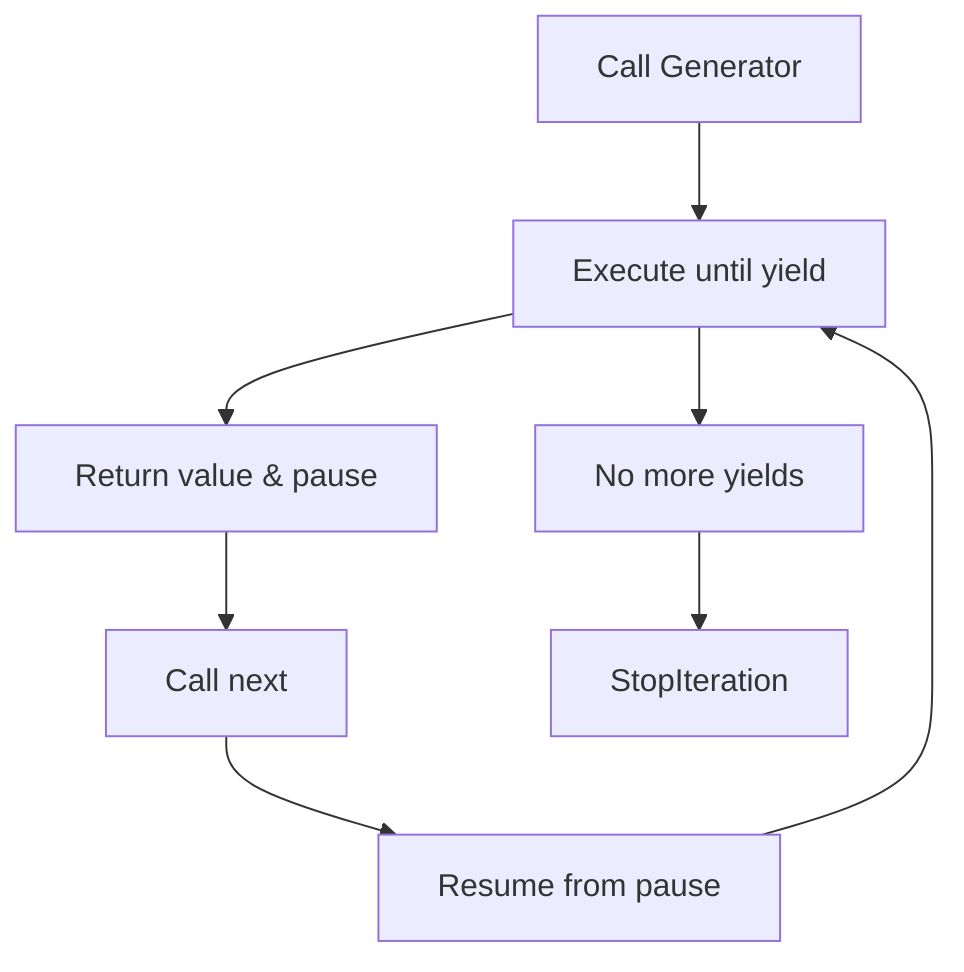

# Lesson 3: Generators, Iterators & Functional Programming

## 🎯 What You'll Learn
- Create and use generator functions for memory-efficient data processing
- Implement custom iterator classes following the iterator protocol
- Understand lazy evaluation and its benefits
- Use built-in iterator functions (map, filter, zip, etc.)
- Apply functional programming concepts with functools and itertools
- Create infinite sequences and data pipelines
- Use comprehensions effectively for concise code
- Implement coroutines for asynchronous data processing

## ⏱️ Duration
**2.5-3.5 hours** (reading + practice)

## 📋 Prerequisites
- Python functions and loops
- Understanding of Python data structures (lists, tuples, dictionaries)
- Basic knowledge of object-oriented programming

---

## 📖 Chapter 1: Introduction & Context

### The Story Behind Generators & Iterators

Imagine you're at a buffet. You could load your plate with everything at once (like loading a list into memory), or you could take one item at a time as you walk down the line (like using a generator). When the buffet is huge—thousands of dishes—you definitely don't want to carry everything at once!

That's the core idea behind generators and iterators: **process data one piece at a time**, without loading everything into memory.

### Why This Matters

In the real world, data is often too large to fit in memory:

1. **Log files**: Gigabytes of server logs
2. **Database results**: Millions of records
3. **Data streams**: Real-time sensor data
4. **File processing**: Large CSV/JSON files

Generators and iterators let you:
- **Save memory**: Process data lazily (only when needed)
- **Improve performance**: Start processing immediately
- **Create pipelines**: Chain operations together
- **Handle infinite sequences**: Work with data that never ends

### Mental Model

> 💡 Think of **generators** like a **water faucet**. You don't store all the water you'll ever need in a bucket (list). Instead, you turn on the faucet (call the generator) and get water (values) one glass at a time, only when you're thirsty (need the value).

### What You Already Know

From previous lessons, you've learned:
- How to create and use functions
- How to work with loops and iteration
- How to use classes and objects

Now we'll learn how to **create custom iteration behavior** and **process data efficiently**.

---

## 📖 Chapter 2: Understanding Generators & Iterators

### The Basics: Generator Functions

A generator function looks like a regular function but uses `yield` instead of `return`. Each time `yield` is encountered, the function **pauses** and returns a value. When called again, it **resumes** right where it left off.



### How It Works: yield vs return

```python
# Regular function - returns once
def regular_function():
    return 1
    return 2  # Never reached!
    return 3  # Never reached!

# Generator function - yields multiple times
def generator_function():
    yield 1
    yield 2
    yield 3

# Usage comparison
regular = regular_function()
print(regular)  # 1 (only first return)

gen = generator_function()
print(next(gen))  # 1
print(next(gen))  # 2
print(next(gen))  # 3
# print(next(gen))  # StopIteration!
```

**Key insight:** Generators maintain **state** between calls. They remember where they paused!

### Common Misconceptions

> ⚠️ **Don't be fooled!** Many people think generators are just "slow lists." Actually, they're **memory-efficient streams** that can process infinite data!

### Knowledge Check

> 🤔 **Quick Question:** What happens when you call a generator function?
> 
> <details>
> <summary>Click for answer</summary>
> You get a **generator object**, not the first value! You must call `next()` on it or use it in a loop to get values.
> </details>

---

## 📖 Chapter 3: Hands-On Tutorial

### Setting Up

Create a new Python file called `generators_tutorial.py`:

```python
# generators_tutorial.py
from itertools import islice, chain, groupby
from functools import lru_cache, reduce
from typing import Generator, Iterator, List, Tuple
```

### Step 1: Create a Simple Generator

```python
def count_up_to(n: int) -> Generator[int, None, None]:
    """Generator that counts from 1 to n."""
    print("Starting generator...")
    for i in range(1, n + 1):
        print(f"About to yield {i}")
        yield i
        print(f"Resumed after yielding {i}")
    print("Generator finished!")

# Test it
gen = count_up_to(3)
print(f"Generator object: {gen}")
print(f"Type: {type(gen)}")

# Get values one by one
print(f"\nFirst value: {next(gen)}")
print(f"Second value: {next(gen)}")
print(f"Third value: {next(gen)}")
# print(next(gen))  # StopIteration!
```

**Line-by-line breakdown:**
- Line 1: `Generator[int, None, None]` is a type hint for generators
- Line 4: `yield` pauses execution and returns a value
- Line 6: Execution resumes here on the next `next()` call
- Line 14: `next(gen)` gets the next value from the generator

### Step 2: Create an Infinite Generator

```python
def infinite_counter(start: int = 1) -> Generator[int, None, None]:
    """Infinite counter generator."""
    i = start
    while True:
        yield i
        i += 1

# Test it with islice to limit output
counter = infinite_counter()
first_five = list(islice(counter, 5))
print(f"First five numbers: {first_five}")

# Fibonacci generator
def fibonacci() -> Generator[int, None, None]:
    """Infinite Fibonacci sequence generator."""
    a, b = 0, 1
    while True:
        yield a
        a, b = b, a + b

# Get first 10 Fibonacci numbers
fib = fibonacci()
first_ten_fib = list(islice(fib, 10))
print(f"First 10 Fibonacci numbers: {first_ten_fib}")
```

**Key insight:** Infinite generators are safe because they only produce values when asked!

### 🛑 Try It Yourself

> **Challenge:** Create a generator that yields prime numbers indefinitely.
> 
> <details>
> <summary>Stuck? Click for hint</summary>
> Start with 2, then check each odd number. Use a helper function to check if a number is prime by testing divisibility up to its square root.
> </details>

### Step 3: Create a Custom Iterator Class

```python
class Countdown:
    """Iterator that counts down from a given number."""
    
    def __init__(self, start: int):
        self.start = start
        self.current = start
    
    def __iter__(self) -> Iterator[int]:
        """Return the iterator object (self)."""
        return self
    
    def __next__(self) -> int:
        """Return the next value."""
        if self.current <= 0:
            raise StopIteration
        
        result = self.current
        self.current -= 1
        return result

# Test it
countdown = Countdown(5)
print("Countdown:")
for num in countdown:
    print(num, end=" ")
print()

# Multiple iterations reset the counter
countdown = Countdown(3)
print("\nFirst iteration:", list(countdown))
print("Second iteration:", list(countdown))  # Empty! Already exhausted
```

---

## 📖 Chapter 4: Code Examples Explained

### Example 1: The Simplest Case

**Context:** Processing a large dataset without loading it all into memory.

```python
def process_large_file(filename: str) -> Generator[str, None, None]:
    """Process a large file line by line."""
    with open(filename, 'r') as file:
        for line in file:
            # Remove trailing newline and process
            processed_line = line.strip().upper()
            yield processed_line

# Usage
# for line in process_large_file('huge_log.txt'):
#     if 'ERROR' in line:
#         print(line)
```

**Line-by-line breakdown:**
- Line 3: Open file without loading entire contents into memory
- Line 4: Iterate over file line by line (file is already a generator!)
- Line 6: Process each line
- Line 7: Yield the processed line

### Example 2: A Realistic Scenario

**Context:** Building a data processing pipeline.

```python
def read_data(data: List[int]) -> Generator[int, None, None]:
    """Source: Generate data."""
    for item in data:
        yield item

def filter_even(source: Generator[int, None, None]) -> Generator[int, None, None]:
    """Filter: Keep only even numbers."""
    for item in source:
        if item % 2 == 0:
            yield item

def square_values(source: Generator[int, None, None]) -> Generator[int, None, None]:
    """Transform: Square each value."""
    for item in source:
        yield item ** 2

# Build the pipeline
data = [1, 2, 3, 4, 5, 6, 7, 8, 9, 10]
source = read_data(data)
filtered = filter_even(source)
squared = square_values(filtered)

# Process the pipeline
result = list(squared)
print(f"Pipeline result: {result}")  # [4, 16, 36, 64, 100]
```

**Key insights:**
- **Lazy evaluation**: Nothing happens until you consume the pipeline
- **Memory efficient**: Each item flows through one at a time
- **Composable**: Easy to add/remove processing steps

### Example 3: Production-Quality Code

**Context:** Using functools.lru_cache for memoization.

```python
from functools import lru_cache
import time

@lru_cache(maxsize=128)
def fibonacci_cached(n: int) -> int:
    """Calculate Fibonacci number with caching."""
    if n < 2:
        return n
    return fibonacci_cached(n - 1) + fibonacci_cached(n - 2)

# Performance comparison
start = time.perf_counter()
result1 = fibonacci_cached(100)
time1 = time.perf_counter() - start

start = time.perf_counter()
result2 = fibonacci_cached(100)  # Cache hit!
time2 = time.perf_counter() - start

print(f"First call: {result1} in {time1:.6f} seconds")
print(f"Second call: {result2} in {time2:.6f} seconds")
print(f"Speedup: {time1/time2:.0f}x")

# Cache statistics
print(f"\nCache info: {fibonacci_cached.cache_info()}")
```

**Best practices demonstrated:**
- **`@lru_cache`**: Automatic memoization
- **`maxsize`**: Limit cache size to prevent memory issues
- **Cache statistics**: Monitor cache performance
- **Type hints**: Clear function signatures

### Edge Cases & Gotchas

```python
# Problem: Generator exhaustion
def simple_generator():
    yield 1
    yield 2
    yield 3

gen = simple_generator()
print(list(gen))  # [1, 2, 3]
print(list(gen))  # [] - Generator is exhausted!

# Solution: Create new generator each time
def get_generator():
    return simple_generator()

print(list(get_generator()))  # [1, 2, 3]
print(list(get_generator()))  # [1, 2, 3]

# Problem: Side effects in generators
def bad_generator():
    print("Starting...")
    yield 1
    print("Middle...")
    yield 2
    print("Ending...")
    yield 3

# Side effects happen when values are consumed, not when generator is created!
gen = bad_generator()  # No output yet
print(next(gen))  # "Starting..." then 1
print(next(gen))  # "Middle..." then 2
```

> ⚠️ **Watch out!** Generators are **single-use**. Once exhausted, you need to create a new one.

---

## 📖 Chapter 5: Real-World Applications

### Case Study: Django QuerySets

Django QuerySets are lazy iterators:

```python
# This doesn't hit the database yet
users = User.objects.filter(is_active=True)

# This executes the query and iterates results
for user in users:
    print(user.username)

# This creates a list (loads all into memory)
user_list = list(users)
```

**How it works:**
1. QuerySet builds SQL query lazily
2. Iteration executes query and fetches results one by one
3. Caching prevents duplicate queries

### Industry Patterns

- **ETL Pipelines**: Extract, Transform, Load data efficiently
- **Log Processing**: Analyze gigabytes of logs without memory issues
- **Data Streaming**: Process real-time data from sensors/APIs
- **File Processing**: Handle large CSV/JSON files line by line
- **API Pagination**: Fetch paginated results lazily
- **Machine Learning**: Process training data in batches

### Performance Considerations

1. **Memory usage**: Generators use O(1) memory vs O(n) for lists
2. **Startup time**: Generators start immediately (no waiting for full dataset)
3. **CPU usage**: Processing happens on-demand
4. **Caching**: Use `lru_cache` for expensive computations
5. **Profiling**: Use `time.perf_counter()` to measure performance

---

## 📖 Chapter 6: Reference Material

### Quick Reference Cheat Sheet

```
┌─────────────────────────────────────────────────────────┐
│ GENERATOR CHEAT SHEET                                  │
├─────────────────────────────────────────────────────────┤
│ Create Generator:   def gen(): yield value             │
│ Get Next Value:     value = next(generator)            │
│ Loop Over:          for value in generator:            │
│ List Conversion:    values = list(generator)           │
│ Infinite Generator: while True: yield value            │
│ Generator Expr:     gen = (x**2 for x in range(10))    │
│ Cache Results:      @lru_cache(maxsize=128)            │
│ Chain Iterables:    chain(iter1, iter2, iter3)         │
│ Slice Iterator:     islice(iterable, start, stop)      │
└─────────────────────────────────────────────────────────┘
```

### Glossary

| Term | Definition |
|------|------------|
| **Generator** | A function that yields values one at a time, maintaining state between calls |
| **Iterator** | An object that implements `__iter__()` and `__next__()` methods |
| **Lazy Evaluation** | Computing values only when needed, not in advance |
| **Memoization** | Caching function results to avoid redundant computation |
| **Coroutine** | A generator that can receive values via `send()` |
| **Comprehension** | Concise syntax for creating sequences |

### Common Patterns Library

```python
# Pattern 1: Chunked Processing
def chunks(iterable, size):
    """Yield successive chunks from iterable."""
    iterator = iter(iterable)
    while True:
        chunk = list(islice(iterator, size))
        if not chunk:
            break
        yield chunk

# Process large file in chunks
# for chunk in chunks(large_file, 1000):
#     process_chunk(chunk)

# Pattern 2: Sliding Window
def sliding_window(iterable, size):
    """Yield sliding windows of given size."""
    iterator = iter(iterable)
    window = list(islice(iterator, size))
    if len(window) == size:
        yield tuple(window)
    
    for item in iterator:
        window = window[1:] + [item]
        yield tuple(window)

# Pattern 3: Pipeline Composition
def pipeline(*functions):
    """Compose functions into a pipeline."""
    def composed(data):
        result = data
        for func in functions:
            result = func(result)
        return result
    return composed

# Usage
process = pipeline(
    lambda x: x.strip(),
    lambda x: x.upper(),
    lambda x: x.replace(' ', '_')
)
```

### Debugging Checklist

- [ ] Verify generator isn't exhausted before use
- [ ] Check for unintended side effects in generators
- [ ] Use `list()` to inspect generator output
- [ ] Monitor memory usage with large datasets
- [ ] Profile performance with `time.perf_counter()`
- [ ] Test edge cases (empty input, single item, etc.)

---

## 📖 Chapter 7: Summary & Next Steps

### Key Takeaways

1. **Generators** use `yield` to produce values lazily
2. **Iterators** implement `__iter__()` and `__next__()` protocols
3. **Lazy evaluation** saves memory and improves performance
4. **`lru_cache`** memoizes expensive function calls
5. **`itertools`** provides powerful iterator tools
6. **Comprehensions** offer concise sequence creation

### Self-Assessment

> Can you:
> - [ ] Create a generator function that yields values?
> - [ ] Implement a custom iterator class?
> - [ ] Use `itertools` functions like `islice` and `chain`?
> - [ ] Apply `@lru_cache` for memoization?
> - [ ] Build a data processing pipeline with generators?
> - [ ] Explain the difference between eager and lazy evaluation?

### What's Coming Next

**Lesson 4: Context Managers & Exception Handling** will cover:
- Creating and using context managers
- The `with` statement and context manager protocol
- Exception handling best practices
- Custom exception classes
- Resource management patterns

---

## 📚 Sources & Further Reading

### Official Documentation
- [Python Generators](https://docs.python.org/3/howto/functional.html#generators)
- [Python Iterators](https://docs.python.org/3/tutorial/classes.html#iterators)
- [itertools module](https://docs.python.org/3/library/itertools.html)
- [functools module](https://docs.python.org/3/library/functools.html)

### Recommended Reading
- "Fluent Python" by Luciano Ramalho (Chapters 14-16)
- "Python Cookbook" by David Beazley and Brian K. Jones (Chapter 4)
- "Effective Python" by Brett Slatkin (Item 30: Consider Generators)

### Video Tutorials
- [Corey Schafer: Generators](https://www.youtube.com/watch?v=bD05uGo_sVI)
- [Real Python: Python Generators](https://realpython.com/introduction-to-python-generators/)

### Community Resources
- [Stack Overflow: Python Generators](https://stackoverflow.com/questions/tagged/python+generator)
- [Python itertools recipes](https://docs.python.org/3/library/itertools.html#itertools-recipes)

---

*This enriched lesson was generated following the Textbook Writer Agent specification. For the concise version, see [lesson-3-generators-iterators-functional.md](../intermediate-python-3/lesson-3-generators-iterators-functional.md).*