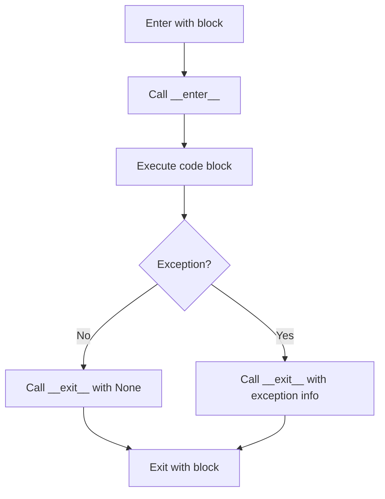

# Lesson 4: Context Managers and Exception Handling

## 🎯 What You'll Learn
- Create custom context managers using class-based and decorator approaches
- Use the `with` statement for automatic resource management
- Implement comprehensive exception handling strategies
- Create custom exception hierarchies for robust error handling
- Use context managers for database connections, file operations, and network resources
- Implement retry logic and timeout handling
- Use context managers for transaction management
- Apply best practices for error handling and logging

## ⏱️ Duration
**2.5-3.5 hours** (reading + practice)

## 📋 Prerequisites
- Python functions and classes
- Understanding of try/except blocks
- Basic file I/O operations
- Familiarity with database concepts

---

## 📖 Chapter 1: Introduction & Context

### The Story Behind Context Managers

Imagine you're cooking in a professional kitchen. You take out expensive ingredients, use them, and then... what? Just leave them on the counter to spoil? No! A professional chef always **cleans up and puts things away** after using them.

Context managers are Python's way of ensuring cleanup happens **automatically**. They guarantee that resources (files, database connections, network sockets) are properly released, even if errors occur.

### Why This Matters

In the real world, resource management failures cause serious problems:

1. **Memory leaks**: Programs that consume more and more memory
2. **File locks**: Files that can't be accessed because they weren't properly closed
3. **Database exhaustion**: Connection pools that run out of connections
4. **Network timeouts**: Sockets that remain open indefinitely

Context managers solve these problems by:
- **Automatic cleanup**: Resources are always released
- **Exception safety**: Cleanup happens even when errors occur
- **Cleaner code**: No more forgetting to close files
- **Better readability**: Clear scope for resource usage

### Mental Model

> 💡 Think of **context managers** like a **library book checkout system**. When you check out a book (acquire resource), the library knows you have it. When you return it (cleanup), the library marks it available again. Even if you forget to return it, the library has policies (due dates, fines) to ensure books eventually come back!

### What You Already Know

From previous lessons, you've learned:
- How to open and close files manually
- How to handle exceptions with try/except
- How to create classes with `__init__` and other methods

Now we'll learn how to **automate resource management** and **handle errors professionally**.

---

## 📖 Chapter 2: Understanding Context Managers & Exception Handling

### The Basics: The `with` Statement

The `with` statement ensures that cleanup code runs, no matter what happens inside the block:



### How It Works: Context Manager Protocol

```python
# Manual resource management (error-prone)
file = open('data.txt', 'r')
try:
    data = file.read()
    process(data)
finally:
    file.close()  # Must remember to close!

# Context manager (automatic and safe)
with open('data.txt', 'r') as file:
    data = file.read()
    process(data)
# File is automatically closed here!
```

**Key insight:** The `with` statement calls `__enter__` when entering the block and `__exit__` when leaving, regardless of whether an exception occurred.

### Common Misconceptions

> ⚠️ **Don't be fooled!** Many people think context managers are only for files. Actually, they're useful for **any resource** that needs cleanup: database connections, network sockets, locks, temporary directories, and more!

### Knowledge Check

> 🤔 **Quick Question:** What happens if an exception occurs inside a `with` block?
> 
> <details>
> <summary>Click for answer</summary>
> The `__exit__` method is still called with exception information. You can choose to suppress the exception by returning `True` from `__exit__`, or let it propagate by returning `False`.
> </details>

---

## 📖 Chapter 3: Hands-On Tutorial

### Setting Up

Create a new Python file called `context_managers_tutorial.py`:

```python
# context_managers_tutorial.py
import sqlite3
import time
import logging
from contextlib import contextmanager
from typing import Optional, Tuple, Any
```

### Step 1: Create a Simple Context Manager

```python
class Timer:
    """Context manager that measures execution time."""
    
    def __init__(self, description: str = "Operation"):
        self.description = description
        self.start_time = None
        self.end_time = None
    
    def __enter__(self) -> 'Timer':
        """Start timing when entering the context."""
        print(f"⏱️ Starting: {self.description}")
        self.start_time = time.perf_counter()
        return self
    
    def __exit__(self, exc_type, exc_val, exc_tb) -> bool:
        """Stop timing when exiting the context."""
        self.end_time = time.perf_counter()
        elapsed = self.end_time - self.start_time
        
        if exc_type is not None:
            print(f"❌ {self.description} failed after {elapsed:.4f} seconds")
            return False  # Don't suppress exception
        else:
            print(f"✅ {self.description} completed in {elapsed:.4f} seconds")
            return True

# Test it
with Timer("Data processing") as timer:
    # Simulate work
    time.sleep(1)
    result = sum(range(1_000_000))

print(f"Result: {result}")
```

**Line-by-line breakdown:**
- Line 10: `__enter__` is called when entering the `with` block
- Line 16: `__exit__` is called when leaving the `with` block
- Line 20: Return `False` to propagate exceptions, `True` to suppress them
- Line 27: The timer object is available as `timer` inside the block

### Step 2: Create a Database Context Manager

```python
class DatabaseConnection:
    """Context manager for SQLite database connections."""
    
    def __init__(self, db_path: str):
        self.db_path = db_path
        self.connection = None
        self.cursor = None
    
    def __enter__(self) -> sqlite3.Cursor:
        """Open database connection and return cursor."""
        print(f"📂 Connecting to database: {self.db_path}")
        self.connection = sqlite3.connect(self.db_path)
        self.cursor = self.connection.cursor()
        return self.cursor
    
    def __exit__(self, exc_type, exc_val, exc_tb) -> bool:
        """Close database connection."""
        if exc_type is not None:
            print(f"⚠️ Rolling back transaction due to error: {exc_val}")
            self.connection.rollback()
        else:
            print("💾 Committing transaction")
            self.connection.commit()
        
        if self.cursor:
            self.cursor.close()
        if self.connection:
            self.connection.close()
            print("🔒 Database connection closed")
        
        return False  # Don't suppress exceptions

# Test it
with DatabaseConnection(':memory:') as cursor:
    cursor.execute('CREATE TABLE users (id INTEGER PRIMARY KEY, name TEXT)')
    cursor.execute('INSERT INTO users (name) VALUES (?)', ('Alice',))
    cursor.execute('INSERT INTO users (name) VALUES (?)', ('Bob',))
    
    cursor.execute('SELECT * FROM users')
    users = cursor.fetchall()
    print(f"Users: {users}")
```

### 🛑 Try It Yourself

> **Challenge:** Create a context manager that manages a temporary directory and automatically deletes it when done.
> 
> <details>
> <summary>Stuck? Click for hint</summary>
> Use `tempfile.mkdtemp()` to create the directory and `shutil.rmtree()` to delete it in `__exit__`.
> </details>

### Step 3: Create a Decorator-based Context Manager

```python
@contextmanager
def database_transaction(db_path: str):
    """Context manager for database transactions using decorator."""
    connection = None
    try:
        # Setup
        connection = sqlite3.connect(db_path)
        cursor = connection.cursor()
        print("📂 Transaction started")
        
        yield cursor
        
        # Cleanup on success
        connection.commit()
        print("💾 Transaction committed")
    except Exception as e:
        # Cleanup on error
        if connection:
            connection.rollback()
            print(f"⚠️ Transaction rolled back: {e}")
        raise
    finally:
        # Always cleanup
        if connection:
            connection.close()
            print("🔒 Connection closed")

# Test it
with database_transaction(':memory:') as cursor:
    cursor.execute('CREATE TABLE products (id INTEGER PRIMARY KEY, name TEXT, price REAL)')
    cursor.execute('INSERT INTO products (name, price) VALUES (?, ?)', ('Laptop', 999.99))
    cursor.execute('INSERT INTO products (name, price) VALUES (?, ?)', ('Mouse', 29.99))
    
    cursor.execute('SELECT * FROM products')
    products = cursor.fetchall()
    print(f"Products: {products}")
```

---

## 📖 Chapter 4: Code Examples Explained

### Example 1: The Simplest Case

**Context:** Ensuring a file is always closed, even if errors occur.

```python
def read_config_file(filepath: str) -> dict:
    """Read configuration from file with proper error handling."""
    config = {}
    
    with open(filepath, 'r') as file:
        for line_num, line in enumerate(file, 1):
            line = line.strip()
            if not line or line.startswith('#'):
                continue  # Skip empty lines and comments
            
            if '=' not in line:
                raise ValueError(f"Invalid config format at line {line_num}: {line}")
            
            key, value = line.split('=', 1)
            config[key.strip()] = value.strip()
    
    return config

# Usage
try:
    config = read_config_file('config.txt')
    print(f"Config loaded: {config}")
except FileNotFoundError:
    print("Config file not found, using defaults")
except ValueError as e:
    print(f"Config error: {e}")
```

**Line-by-line breakdown:**
- Line 6: `with` ensures file is closed when block exits
- Line 14: Exception is raised if format is invalid
- Line 18: File is still closed even if exception occurs

### Example 2: A Realistic Scenario

**Context:** Managing a connection pool with context managers.

```python
class ConnectionPool:
    """Simple connection pool with context manager support."""
    
    def __init__(self, max_connections: int = 5):
        self.max_connections = max_connections
        self.available = list(range(max_connections))
        self.in_use = set()
    
    @contextmanager
    def get_connection(self):
        """Get a connection from the pool."""
        if not self.available:
            raise RuntimeError("No connections available")
        
        conn_id = self.available.pop()
        self.in_use.add(conn_id)
        print(f"🔌 Connection {conn_id} acquired ({len(self.available)} available)")
        
        try:
            yield conn_id
        finally:
            self.in_use.remove(conn_id)
            self.available.append(conn_id)
            print(f"🔌 Connection {conn_id} released ({len(self.available)} available)")

# Test it
pool = ConnectionPool(max_connections=3)

# Use connections
with pool.get_connection() as conn1:
    print(f"Using connection {conn1}")
    with pool.get_connection() as conn2:
        print(f"Using connection {conn2}")
        # conn1 is still in use here

# Connections are automatically released
```

**Key insights:**
- **Resource pooling**: Reuse expensive resources
- **Automatic cleanup**: Connections always returned to pool
- **Exception safety**: Cleanup happens even if errors occur

### Example 3: Production-Quality Code

**Context:** Comprehensive exception handling with logging and monitoring.

```python
import logging
from enum import Enum

class ErrorSeverity(Enum):
    """Error severity levels."""
    LOW = "low"
    MEDIUM = "medium"
    HIGH = "high"
    CRITICAL = "critical"

class ApplicationError(Exception):
    """Base application error with severity and context."""
    
    def __init__(self, message: str, severity: ErrorSeverity = ErrorSeverity.MEDIUM, 
                 context: dict = None):
        super().__init__(message)
        self.severity = severity
        self.context = context or {}
    
    def __str__(self):
        return f"[{self.severity.value.upper()}] {super().__str__()}"

class ValidationError(ApplicationError):
    """Validation error with field information."""
    def __init__(self, message: str, field: str = None):
        super().__init__(message, severity=ErrorSeverity.LOW)
        self.field = field

class DatabaseError(ApplicationError):
    """Database error with operation context."""
    def __init__(self, message: str, operation: str = None):
        super().__init__(message, severity=ErrorSeverity.HIGH)
        self.operation = operation

class ErrorHandler:
    """Centralized error handling with context manager."""
    
    def __init__(self, logger: logging.Logger = None):
        self.logger = logger or logging.getLogger(__name__)
    
    @contextmanager
    def handle_errors(self, operation_name: str):
        """Context manager for comprehensive error handling."""
        self.logger.info(f"Starting operation: {operation_name}")
        
        try:
            yield
            self.logger.info(f"Operation completed: {operation_name}")
        except ValidationError as e:
            self.logger.warning(f"Validation error in {operation_name}: {e}")
            if e.field:
                self.logger.warning(f"Field: {e.field}")
            raise
        except DatabaseError as e:
            self.logger.error(f"Database error in {operation_name}: {e}")
            self.logger.error(f"Operation: {e.operation}")
            # In production: send to monitoring service
            raise
        except ApplicationError as e:
            self.logger.error(f"Application error in {operation_name}: {e}")
            self.logger.error(f"Severity: {e.severity.value}")
            raise
        except Exception as e:
            self.logger.critical(f"Unexpected error in {operation_name}: {e}")
            # In production: alert operations team
            raise ApplicationError(f"Unexpected error: {e}", 
                                   severity=ErrorSeverity.CRITICAL)

# Usage
logger = logging.getLogger(__name__)
handler = ErrorHandler(logger)

def process_user_data(user_data: dict):
    """Process user data with comprehensive error handling."""
    with handler.handle_errors("User data processing"):
        # Validation
        if 'email' not in user_data:
            raise ValidationError("Email is required", field="email")
        
        if '@' not in user_data['email']:
            raise ValidationError("Invalid email format", field="email")
        
        # Database operation
        try:
            # Simulate database save
            if user_data.get('username') == 'admin':
                raise sqlite3.IntegrityError("Username already exists")
        except sqlite3.IntegrityError as e:
            raise DatabaseError(f"Failed to save user: {e}", 
                               operation="INSERT users")
        
        return {"status": "success", "user_id": 123}
```

**Best practices demonstrated:**
- **Custom exception hierarchy** with severity levels
- **Centralized error handling** with context managers
- **Logging integration** for debugging and monitoring
- **Context preservation** in exceptions

### Edge Cases & Gotchas

```python
# Problem: Exception suppression
class SuppressErrors:
    def __enter__(self):
        return self
    
    def __exit__(self, exc_type, exc_val, exc_tb):
        # Suppress ALL exceptions (dangerous!)
        return True

# This hides errors!
with SuppressErrors():
    raise RuntimeError("This error is hidden!")
    print("This line runs even after exception!")

# Solution: Only suppress specific exceptions
class SafeContext:
    def __enter__(self):
        return self
    
    def __exit__(self, exc_type, exc_val, exc_tb):
        if exc_type is ValueError:
            print(f"Suppressed ValueError: {exc_val}")
            return True  # Suppress only ValueError
        return False  # Let other exceptions propagate

# This is safer
with SafeContext():
    raise ValueError("This is suppressed")  # OK
    # raise RuntimeError("This would propagate")  # Would crash
```

> ⚠️ **Watch out!** Suppressing all exceptions with `return True` is dangerous. Only suppress exceptions you can safely handle.

---

## 📖 Chapter 5: Real-World Applications

### Case Study: Django Database Transactions

Django uses context managers for database transactions:

```python
from django.db import transaction

# Automatic transaction management
with transaction.atomic():
    # All database operations in this block
    # are committed together or rolled back together
    user = User.objects.create(username='alice')
    profile = Profile.objects.create(user=user)
    
    # If any exception occurs, both are rolled back
    if some_condition:
        raise Exception("Something went wrong")
    # Both user and profile are saved together
```

**How it works:**
1. `transaction.atomic()` starts a database transaction
2. All operations within the block are executed
3. If no exception: transaction is committed
4. If exception: transaction is rolled back

### Industry Patterns

- **Database Transactions**: Atomic operations with automatic rollback
- **File Processing**: Safe file handling with automatic cleanup
- **Network Connections**: Connection pooling and automatic release
- **Lock Management**: Thread-safe resource locking
- **Temporary Resources**: Automatic cleanup of temporary files/directories
- **API Rate Limiting**: Context managers for rate limit enforcement

### Performance Considerations

1. **Overhead**: Context managers add minimal overhead (one function call)
2. **Resource efficiency**: Proper cleanup prevents resource leaks
3. **Connection pooling**: Reuse expensive resources like database connections
4. **Lock granularity**: Fine-grained locking improves concurrency
5. **Error recovery**: Graceful degradation maintains system availability

---

## 📖 Chapter 6: Reference Material

### Quick Reference Cheat Sheet

```
┌─────────────────────────────────────────────────────────┐
│ CONTEXT MANAGER CHEAT SHEET                            │
├─────────────────────────────────────────────────────────┤
│ Class-based:        class CM: __enter__ __exit__       │
│ Decorator-based:    @contextmanager                     │
│ Enter block:        with CM() as value:                │
│ Suppress exception: __exit__ returns True              │
│ Propagate exception: __exit__ returns False            │
│ File handling:      with open('f') as file:            │
│ Transaction:        with transaction.atomic():         │
│ Timing:             with Timer() as t:                 │
└─────────────────────────────────────────────────────────┘
```

### Glossary

| Term | Definition |
|------|------------|
| **Context Manager** | An object that defines `__enter__` and `__exit__` methods for resource management |
| **`with` Statement** | Syntax for using context managers |
| **`__enter__`** | Method called when entering the `with` block |
| **`__exit__`** | Method called when exiting the `with` block |
| **Resource Leak** | Failure to release resources, causing memory/connection exhaustion |
| **Transaction** | A sequence of operations that either all succeed or all fail |

### Common Patterns Library

```python
# Pattern 1: File Processing Pipeline
@contextmanager
def file_pipeline(input_path: str, output_path: str):
    """Process files with proper resource management."""
    input_file = open(input_path, 'r')
    output_file = open(output_path, 'w')
    
    try:
        yield input_file, output_file
    finally:
        input_file.close()
        output_file.close()

# Pattern 2: Temporary Environment
@contextmanager
def temporary_environment(**settings):
    """Temporarily change environment settings."""
    import os
    original = {}
    
    # Save original settings
    for key, value in settings.items():
        original[key] = os.environ.get(key)
        os.environ[key] = str(value)
    
    try:
        yield
    finally:
        # Restore original settings
        for key, value in original.items():
            if value is None:
                os.environ.pop(key, None)
            else:
                os.environ[key] = value

# Pattern 3: Retry Context Manager
@contextmanager
def retry_on_failure(max_attempts: int = 3, delay: float = 1.0):
    """Retry operations within context."""
    for attempt in range(max_attempts):
        try:
            yield
            break  # Success, exit retry loop
        except Exception as e:
            if attempt == max_attempts - 1:
                raise  # Last attempt, propagate exception
            
            print(f"Attempt {attempt + 1} failed: {e}")
            time.sleep(delay)
```

### Debugging Checklist

- [ ] Verify `__exit__` is called even on exceptions
- [ ] Check for resource leaks (files, connections, locks)
- [ ] Test exception handling paths
- [ ] Verify cleanup happens in correct order
- [ ] Monitor resource usage over time
- [ ] Test with concurrent access patterns

---

## 📖 Chapter 7: Summary & Next Steps

### Key Takeaways

1. **Context managers** ensure automatic resource cleanup
2. **`__enter__`** acquires resources, **`__exit__`** releases them
3. **`with` statement** provides clean syntax for context managers
4. **Exception handling** should be comprehensive and hierarchical
5. **Custom exceptions** provide better error context and handling
6. **Logging** is essential for debugging and monitoring

### Self-Assessment

> Can you:
> - [ ] Create a class-based context manager?
> - [ ] Use `@contextmanager` decorator?
> - [ ] Handle exceptions properly in `__exit__`?
> - [ ] Design a custom exception hierarchy?
> - [ ] Implement retry logic for unreliable operations?
> - [ ] Use context managers for database transactions?

### What's Coming Next

**Lesson 5: Type Hints & Static Typing** will cover:
- Python type hints and annotations
- Using mypy for static type checking
- Generic types and type variables
- Advanced typing patterns
- Type hints for better code documentation

---

## 📚 Sources & Further Reading

### Official Documentation
- [Python Context Managers](https://docs.python.org/3/reference/datamodel.html#context-managers)
- [contextlib module](https://docs.python.org/3/library/contextlib.html)
- [Python Exceptions](https://docs.python.org/3/library/exceptions.html)

### Recommended Reading
- "Fluent Python" by Luciano Ramalho (Chapter 15: Context Managers)
- "Python Cookbook" by David Beazley and Brian K. Jones (Chapter 8)
- "Effective Python" by Brett Slatkin (Item 43: Consider contextlib)

### Video Tutorials
- [Corey Schafer: Context Managers](https://www.youtube.com/watch?v=-aKFBoZpiqA)
- [Real Python: Python Context Managers](https://realpython.com/python-with-statement/)

### Community Resources
- [Stack Overflow: Python Context Managers](https://stackoverflow.com/questions/tagged/python+context-manager)
- [Python contextlib recipes](https://docs.python.org/3/library/contextlib.html#contextlib.contextmanager)

---

*This enriched lesson was generated following the Textbook Writer Agent specification. For the concise version, see [lesson-4-context-managers-exceptions.md](../intermediate-python-3/lesson-4-context-managers-exceptions.md).*