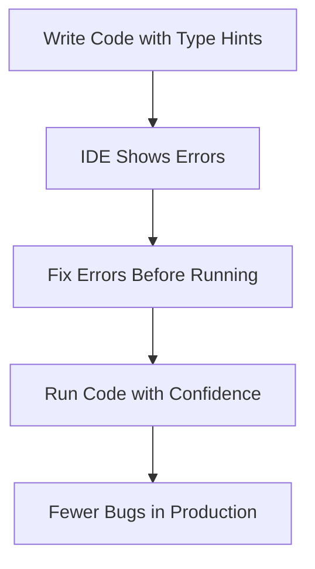

# Lesson 5: Type Hints and Static Typing

## 🎯 What You'll Learn
- Add type hints to functions and variables for better code documentation
- Use basic and advanced type annotations including generics and unions
- Understand the benefits of static typing for large codebases
- Use type checking tools like mypy to catch errors before runtime
- Work with generic types and type variables for reusable code
- Handle optional and union types safely
- Create type aliases for complex types
- Use protocols for structural subtyping
- Apply type hints in real-world scenarios

## ⏱️ Duration
**2-3 hours** (reading + practice)

## 📋 Prerequisites
- Python functions and classes
- Understanding of Python data types
- Basic knowledge of object-oriented programming

---

## 📖 Chapter 1: Introduction & Context

### The Story Behind Type Hints

Imagine you're building a house. Without blueprints (type hints), workers might use the wrong materials—putting a window where a door should be, or using plumbing pipes for electrical wiring. The house might look okay at first, but problems emerge later.

Type hints are Python's **blueprints**. They tell developers (and tools) what type of data to expect, catching mistakes **before** they become bugs.

### Why This Matters

In the real world, type-related bugs are expensive:

1. **Runtime crashes**: `TypeError: 'int' object is not subscriptable`
2. **Silent bugs**: Wrong data types causing incorrect calculations
3. **Maintenance nightmares**: No idea what a function expects or returns
4. **Poor IDE support**: No autocompletion or error detection

Type hints solve these problems by:
- **Self-documenting code**: Clear function signatures
- **Early error detection**: Catch bugs before running code
- **Better IDE support**: Autocompletion and refactoring
- **Easier onboarding**: New developers understand code faster

### Mental Model

> 💡 Think of **type hints** like **ingredients labels on food packages**. Without labels, you might accidentally use salt instead of sugar! With clear labels (type hints), you know exactly what you're getting and can avoid mistakes.

### What You Already Know

From previous lessons, you've learned:
- How to define functions and classes
- How to work with different data types
- How to use decorators and context managers

Now we'll learn how to **make our code more reliable and maintainable** with type hints.

---

## 📖 Chapter 2: Understanding Type Hints

### The Basics: What Are Type Hints?

Type hints are **annotations** that indicate what type of value a variable, parameter, or return value should be. They don't affect runtime behavior but help tools and developers.



### How It Works: Type Annotations

```python
# Without type hints (ambiguous)
def process_data(data):
    return data.upper()  # What if data is an int?

# With type hints (clear)
def process_data(data: str) -> str:
    return data.upper()  # Type checker knows data is str

# Type checker catches errors
process_data(123)  # Error: Expected str, got int
```

**Key insight:** Type hints are **optional** and **ignored at runtime**. They're for developers and tools, not the Python interpreter.

### Common Misconceptions

> ⚠️ **Don't be fooled!** Many people think type hints make Python "statically typed" like Java. Actually, Python remains **dynamically typed**—type hints are just annotations that help catch errors early.

### Knowledge Check

> 🤔 **Quick Question:** Do type hints affect how Python runs your code?
> 
> <details>
> <summary>Click for answer</summary>
> No! Type hints are ignored at runtime. They're only used by type checkers (like mypy) and IDEs to help catch errors before running the code.
> </details>

---

## 📖 Chapter 3: Hands-On Tutorial

### Setting Up

Create a new Python file called `type_hints_tutorial.py`:

```python
# type_hints_tutorial.py
from typing import List, Dict, Tuple, Optional, Union, Any, Callable, TypeVar, Generic
```

### Step 1: Basic Type Hints

```python
def greet(name: str) -> str:
    """Greet a person by name."""
    return f"Hello, {name}!"

def add(a: int, b: int) -> int:
    """Add two numbers."""
    return a + b

def calculate_average(numbers: List[float]) -> float:
    """Calculate average of a list of numbers."""
    if not numbers:
        return 0.0
    return sum(numbers) / len(numbers)

# Variable type hints
age: int = 25
name: str = "Alice"
is_active: bool = True

# Type hints with initialization
scores: List[int] = [95, 87, 92]
user_data: Dict[str, Any] = {"name": "Bob", "age": 30}

# Test it
print(greet("World"))
print(add(5, 3))
print(calculate_average([1.0, 2.0, 3.0, 4.0]))
```

**Line-by-line breakdown:**
- Line 1: `name: str` indicates `name` should be a string
- Line 1: `-> str` indicates the function returns a string
- Line 9: `List[float]` indicates a list of floating-point numbers
- Line 15: `List[int]` indicates a list of integers

### Step 2: Optional and Union Types

```python
def find_user(user_id: int) -> Optional[Dict[str, Any]]:
    """Find user by ID, returns None if not found."""
    users = {
        1: {"name": "Alice", "email": "alice@example.com"},
        2: {"name": "Bob", "email": "bob@example.com"},
    }
    return users.get(user_id)

def process_value(value: Union[int, float, str]) -> str:
    """Process a value that can be int, float, or str."""
    if isinstance(value, (int, float)):
        return f"Number: {value}"
    return f"String: {value}"

# Test Optional
user = find_user(1)
if user is not None:
    print(f"Found user: {user['name']}")

# Test Union
print(process_value(42))
print(process_value(3.14))
print(process_value("hello"))
```

### 🛑 Try It Yourself

> **Challenge:** Create a function that takes a `Union[List[int], List[str]]` and returns the length of the list. Add proper type hints.
> 
> <details>
> <summary>Stuck? Click for hint</summary>
> Use `Union` to accept either list type, and `int` for the return type. The function body can simply return `len(data)`.
> </details>

### Step 3: Generic Types

```python
T = TypeVar('T')

class Stack(Generic[T]):
    """A generic stack data structure."""
    
    def __init__(self) -> None:
        self._items: List[T] = []
    
    def push(self, item: T) -> None:
        """Push an item onto the stack."""
        self._items.append(item)
    
    def pop(self) -> T:
        """Pop an item from the stack."""
        if not self._items:
            raise IndexError("pop from empty stack")
        return self._items.pop()
    
    def is_empty(self) -> bool:
        """Check if stack is empty."""
        return len(self._items) == 0
    
    def size(self) -> int:
        """Get stack size."""
        return len(self._items)

# Test generic stack
int_stack: Stack[int] = Stack()
int_stack.push(1)
int_stack.push(2)
print(f"Popped: {int_stack.pop()}")  # 2

str_stack: Stack[str] = Stack()
str_stack.push("hello")
str_stack.push("world")
print(f"Popped: {str_stack.pop()}")  # world
```

---

## 📖 Chapter 4: Code Examples Explained

### Example 1: The Simplest Case

**Context:** A simple function with clear type hints.

```python
def calculate_tip(bill_amount: float, tip_percentage: float = 0.15) -> float:
    """Calculate tip amount.
    
    Args:
        bill_amount: The total bill amount
        tip_percentage: The tip percentage (default 15%)
    
    Returns:
        The tip amount
    """
    return bill_amount * tip_percentage

# Usage
tip = calculate_tip(50.0, 0.20)
print(f"Tip: ${tip:.2f}")
```

**Line-by-line breakdown:**
- Line 1: `bill_amount: float` indicates a floating-point number
- Line 1: `tip_percentage: float = 0.15` has a default value
- Line 1: `-> float` indicates the function returns a float
- Line 5: Docstring explains parameters and return value

### Example 2: A Realistic Scenario

**Context:** A data processing function with comprehensive type hints.

```python
from typing import List, Dict, Optional, Tuple

def analyze_sales_data(
    sales: List[Dict[str, Union[str, float, int]]],
    target_revenue: float
) -> Tuple[float, float, Optional[str]]:
    """Analyze sales data and return summary statistics.
    
    Args:
        sales: List of sales records with keys: 'product', 'quantity', 'price'
        target_revenue: Target revenue to achieve
    
    Returns:
        Tuple of (total_revenue, average_sale, best_product)
    """
    total_revenue: float = 0.0
    product_revenue: Dict[str, float] = {}
    
    for sale in sales:
        quantity: int = sale['quantity']
        price: float = sale['price']
        product: str = sale['product']
        
        sale_total: float = quantity * price
        total_revenue += sale_total
        
        if product in product_revenue:
            product_revenue[product] += sale_total
        else:
            product_revenue[product] = sale_total
    
    average_sale: float = total_revenue / len(sales) if sales else 0.0
    
    # Find best-selling product
    best_product: Optional[str] = None
    if product_revenue:
        best_product = max(product_revenue, key=product_revenue.get)
    
    return total_revenue, average_sale, best_product

# Test it
sales_data = [
    {"product": "Widget", "quantity": 10, "price": 5.0},
    {"product": "Gadget", "quantity": 5, "price": 20.0},
    {"product": "Widget", "quantity": 8, "price": 5.0},
]

total, avg, best = analyze_sales_data(sales_data, 100.0)
print(f"Total: ${total:.2f}, Average: ${avg:.2f}, Best: {best}")
```

**Key insights:**
- **Complex types**: `List[Dict[str, Union[str, float, int]]]`
- **Tuple return**: Returns multiple values with clear types
- **Optional**: Best product might be `None` if no sales

### Example 3: Production-Quality Code

**Context:** Using protocols for structural subtyping.

```python
from typing import Protocol, List

class Drawable(Protocol):
    """Protocol for objects that can be drawn."""
    def draw(self) -> None:
        """Draw the object."""
        ...

class Circle:
    def __init__(self, radius: float):
        self.radius = radius
    
    def draw(self) -> None:
        print(f"Drawing circle with radius {self.radius}")

class Rectangle:
    def __init__(self, width: float, height: float):
        self.width = width
        self.height = height
    
    def draw(self) -> None:
        print(f"Drawing rectangle {self.width}x{self.height}")

def render_scene(objects: List[Drawable]) -> None:
    """Render a list of drawable objects."""
    for obj in objects:
        obj.draw()

# Usage - both classes work without inheriting from Drawable
circle = Circle(5.0)
rectangle = Rectangle(10.0, 20.0)

render_scene([circle, rectangle])  # Both work!
```

**Best practices demonstrated:**
- **Protocols** define interfaces without inheritance
- **Structural subtyping**: Any class with `draw()` method works
- **Flexible design**: Easy to add new drawable objects

### Edge Cases & Gotchas

```python
# Problem: Type hints don't enforce types at runtime
def add_numbers(a: int, b: int) -> int:
    return a + b

# This runs without error (type hints are ignored!)
result = add_numbers("hello", "world")  # Returns "helloworld"

# Solution: Use type checkers like mypy
# Run: mypy your_file.py
# mypy will catch: error: Argument 1 to "add_numbers" has incompatible type "str"; expected "int"

# Problem: Circular imports with type hints
# from module_a import ClassA  # Circular import!

# Solution: Use string literals for forward references
from typing import TYPE_CHECKING

if TYPE_CHECKING:
    from module_a import ClassA

def process(obj: 'ClassA') -> None:  # String literal
    pass
```

> ⚠️ **Watch out!** Type hints are **not enforced at runtime**. Always use a type checker like mypy to catch errors.

---

## 📖 Chapter 5: Real-World Applications

### Case Study: FastAPI Type Hints

FastAPI uses type hints for automatic API documentation and validation:

```python
from fastapi import FastAPI
from pydantic import BaseModel

app = FastAPI()

class User(BaseModel):
    name: str
    email: str
    age: int

@app.post("/users/")
def create_user(user: User) -> User:
    """Create a new user."""
    # FastAPI automatically validates input using type hints
    return user

# FastAPI generates OpenAPI docs from type hints!
```

**How it works:**
1. Type hints define the API contract
2. FastAPI validates incoming requests automatically
3. Documentation is generated from type hints
4. IDEs provide autocompletion for API calls

### Industry Patterns

- **API Development**: FastAPI, Django REST Framework use type hints
- **Data Science**: pandas, numpy use type hints for better IDE support
- **Web Development**: Flask, Django use type hints for request/response
- **Testing**: pytest uses type hints for test fixtures
- **Configuration**: Type hints for config file parsing
- **Serialization**: JSON/YAML parsing with type validation

### Performance Considerations

1. **Runtime overhead**: None (type hints are ignored)
2. **Development speed**: Faster with better IDE support
3. **Bug detection**: Catch errors before runtime
4. **Refactoring**: Safer code changes with type checking
5. **Documentation**: Self-documenting code reduces maintenance

---

## 📖 Chapter 6: Reference Material

### Quick Reference Cheat Sheet

```
┌─────────────────────────────────────────────────────────┐
│ TYPE HINTS CHEAT SHEET                                 │
├─────────────────────────────────────────────────────────┤
│ Basic:           def func(x: int) -> str:             │
│ Optional:        Optional[int] (int or None)           │
│ Union:           Union[int, str] (either type)         │
│ List:            List[int]                             │
│ Dict:            Dict[str, int]                        │
│ Tuple:           Tuple[int, str, float]                │
│ Any:             Any (any type)                        │
│ Callable:        Callable[[int, str], bool]            │
│ TypeVar:         T = TypeVar('T')                      │
│ Generic:         class Stack(Generic[T]):              │
│ Protocol:        class Proto(Protocol):                │
└─────────────────────────────────────────────────────────┘
```

### Glossary

| Term | Definition |
|------|------------|
| **Type Hint** | Annotation indicating the expected type of a value |
| **Static Type Checking** | Analyzing code without running it to find type errors |
| **mypy** | Popular static type checker for Python |
| **Generic** | A type that works with multiple types (e.g., `List[T]`) |
| **Protocol** | Interface defined by structure, not inheritance |
| **Union** | A type that can be one of several types |
| **Optional** | A type that can be a value or `None` |

### Common Patterns Library

```python
# Pattern 1: Type-safe configuration
from typing import TypedDict

class Config(TypedDict):
    host: str
    port: int
    debug: bool

def load_config() -> Config:
    return {
        "host": "localhost",
        "port": 8000,
        "debug": True
    }

# Pattern 2: Type-safe callbacks
from typing import Callable, TypeVar

T = TypeVar('T')
R = TypeVar('R')

def apply_callback(value: T, callback: Callable[[T], R]) -> R:
    """Apply a callback to a value."""
    return callback(value)

# Pattern 3: Type-safe factories
from typing import Type, Dict, Any

class Factory:
    _registry: Dict[str, Type[Any]] = {}
    
    @classmethod
    def register(cls, name: str, klass: Type[Any]) -> None:
        cls._registry[name] = klass
    
    @classmethod
    def create(cls, name: str, **kwargs: Any) -> Any:
        if name not in cls._registry:
            raise ValueError(f"Unknown type: {name}")
        return cls._registry[name](**kwargs)
```

### Debugging Checklist

- [ ] Run `mypy --strict` on your code
- [ ] Check for `Any` types (avoid if possible)
- [ ] Verify all function signatures have type hints
- [ ] Test with invalid types to ensure proper handling
- [ ] Use `reveal_type()` to check inferred types
- [ ] Review type checker warnings and errors

---

## 📖 Chapter 7: Summary & Next Steps

### Key Takeaways

1. **Type hints** improve code documentation and catch errors early
2. **Static type checkers** like mypy analyze code without running it
3. **Generic types** enable reusable, type-safe data structures
4. **Protocols** provide flexible interfaces without inheritance
5. **Optional and Union** types handle multiple possible types
6. **Type hints are optional** but highly recommended for large projects

### Self-Assessment

> Can you:
> - [ ] Add type hints to functions and variables?
> - [ ] Use `Optional` and `Union` types?
> - [ ] Create generic classes with `TypeVar`?
> - [ ] Define protocols for structural subtyping?
> - [ ] Run mypy to check for type errors?
> - [ ] Explain the benefits of type hints?

### What's Coming Next

**Lesson 6: Functional Programming Tools** will cover:
- Lambda functions and closures
- Higher-order functions
- Map, filter, and reduce patterns
- Functional programming best practices
- Composing functions for complex operations

---

## 📚 Sources & Further Reading

### Official Documentation
- [Python Type Hints](https://docs.python.org/3/library/typing.html)
- [mypy Documentation](https://mypy.readthedocs.io/)
- [PEP 484 – Type Hints](https://peps.python.org/pep-0484/)

### Recommended Reading
- "Fluent Python" by Luciano Ramalho (Chapter 8: Type Hints)
- "Python Cookbook" by David Beazley and Brian K. Jones (Chapter 9)
- "Effective Python" by Brett Slatkin (Item 90: Use Type Hints)

### Video Tutorials
- [Corey Schafer: Python Type Hints](https://www.youtube.com/watch?v=QORvB-_mbZM)
- [Real Python: Python Type Checking](https://realpython.com/python-type-checking/)

### Community Resources
- [Stack Overflow: Python Type Hints](https://stackoverflow.com/questions/tagged/python+type-hints)
- [mypy Playground](https://mypy-play.net/)

---

*This enriched lesson was generated following the Textbook Writer Agent specification. For the concise version, see [lesson-5-type-hints-static-typing.md](../intermediate-python-3/lesson-5-type-hints-static-typing.md).*