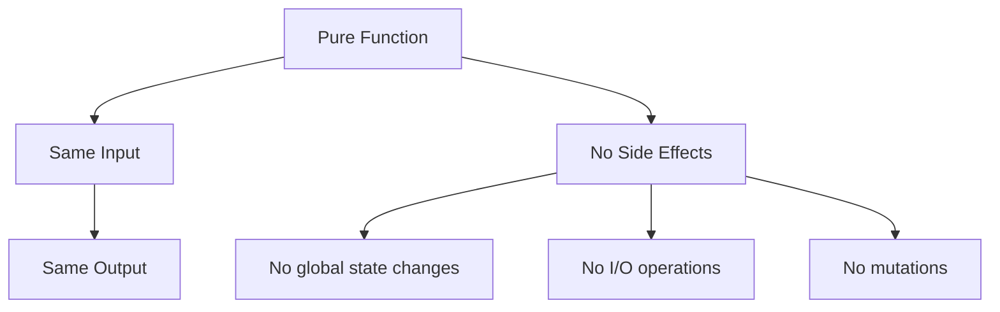

# Lesson 6: Functional Programming Tools

## 🎯 What You'll Learn
- Use functional programming tools (map, filter, reduce, etc.) for elegant data processing
- Work with lambda functions effectively for concise operations
- Apply higher-order functions that accept or return functions
- Use the functools module for advanced functional patterns
- Implement lazy evaluation with iterators and generator expressions
- Use list comprehensions and dictionary comprehensions
- Apply functional patterns to real-world data processing problems
- Understand the benefits and limitations of functional programming in Python

## ⏱️ Duration
**2-3 hours** (reading + practice)

## 📋 Prerequisites
- Python functions and loops
- Understanding of lists, dictionaries, and tuples
- Basic knowledge of lambda functions

---

## 📖 Chapter 1: Introduction & Context

### The Story Behind Functional Programming

Imagine you're a chef preparing a meal. In **imperative programming** (what you've mostly done so far), you'd give step-by-step instructions: "First, chop the onions. Then, heat the pan. Then, add oil. Then, add onions." You're telling the computer **how** to do everything.

In **functional programming**, you'd say: "Take these ingredients, apply these transformations, and combine the results." You're telling the computer **what** to do, not **how** to do it.

This shift in thinking leads to:
- **Cleaner code**: Less boilerplate, more intent
- **Fewer bugs**: No mutable state to track
- **Easier testing**: Pure functions are predictable
- **Better parallelization**: No shared state to coordinate

### Why This Matters

In the real world, functional programming shines for:

1. **Data processing**: Transforming large datasets
2. **Event handling**: Processing streams of events
3. **Configuration**: Building complex configs from simple parts
4. **Mathematical operations**: Composing functions for complex calculations

### Mental Model

> 💡 Think of **functional programming** like an **assembly line**. Each station (function) does one thing: wash, peel, chop, cook. You can rearrange stations, add new ones, or remove old ones without breaking the whole system. Data flows through, getting transformed at each step.

### What You Already Know

From previous lessons, you've learned:
- How to define and call functions
- How to use loops and conditionals
- How to work with data structures

Now we'll learn how to **process data more elegantly** using functional tools.

---

## 📖 Chapter 2: Understanding Functional Programming

### The Basics: Pure Functions

A **pure function** always produces the same output for the same input and has no side effects:



### How It Works: map, filter, reduce

```python
# Imperative approach (step-by-step)
numbers = [1, 2, 3, 4, 5]
squared = []
for n in numbers:
    squared.append(n ** 2)

# Functional approach (what to do)
numbers = [1, 2, 3, 4, 5]
squared = list(map(lambda x: x ** 2, numbers))
```

**Key insight:** Functional tools let you express **what** you want to do, not **how** to do it.

### Common Misconceptions

> ⚠️ **Don't be fooled!** Many people think functional programming means "no loops." Actually, functional tools **replace** loops with more expressive operations like `map` and `filter`.

### Knowledge Check

> 🤔 **Quick Question:** What's the difference between `map` and a list comprehension?
> 
> <details>
> <summary>Click for answer</summary>
> Both transform data, but `map` is a function that returns an iterator, while list comprehensions are expressions that create lists directly. List comprehensions are generally more Pythonic and readable.
> </details>

---

## 📖 Chapter 3: Hands-On Tutorial

### Setting Up

Create a new Python file called `functional_tools_tutorial.py`:

```python
# functional_tools_tutorial.py
from functools import reduce, partial, lru_cache
from typing import List, Callable, Any, Tuple
```

### Step 1: Using map, filter, and reduce

```python
# Map: Apply function to each item
numbers = [1, 2, 3, 4, 5]

def square(x: int) -> int:
    """Square a number."""
    return x ** 2

squared = list(map(square, numbers))
print(f"Squared: {squared}")  # [1, 4, 9, 16, 25]

# Filter: Select items based on condition
def is_even(x: int) -> bool:
    """Check if number is even."""
    return x % 2 == 0

even_numbers = list(filter(is_even, numbers))
print(f"Even numbers: {even_numbers}")  # [2, 4]

# Reduce: Combine items into single value
def add(x: int, y: int) -> int:
    """Add two numbers."""
    return x + y

total = reduce(add, numbers, 0)
print(f"Total: {total}")  # 15

# Using lambda for concise operations
squared_lambda = list(map(lambda x: x ** 2, numbers))
print(f"Squared (lambda): {squared_lambda}")
```

**Line-by-line breakdown:**
- Line 5: `map(square, numbers)` applies `square` to each item
- Line 12: `filter(is_even, numbers)` keeps items where `is_even` returns True
- Line 19: `reduce(add, numbers, 0)` combines all items using `add`
- Line 23: Lambda functions provide concise inline definitions

### Step 2: Working with Lambda Functions

```python
# Lambda functions for sorting
students = [
    {'name': 'Alice', 'grade': 85},
    {'name': 'Bob', 'grade': 92},
    {'name': 'Charlie', 'grade': 78}
]

# Sort by grade using lambda
sorted_by_grade = sorted(students, key=lambda s: s['grade'], reverse=True)
print("Sorted by grade:")
for student in sorted_by_grade:
    print(f"  {student['name']}: {student['grade']}")

# Find best student using lambda
best_student = max(students, key=lambda s: s['grade'])
print(f"\nBest student: {best_student['name']}")

# Transform data using lambda
names_upper = list(map(lambda s: s['name'].upper(), students))
print(f"Names (uppercase): {names_upper}")
```

### 🛑 Try It Yourself

> **Challenge:** Create a list of dictionaries representing products with 'name' and 'price'. Use `filter` to find products under $20, then use `map` to create a list of just the product names.
> 
> <details>
> <summary>Stuck? Click for hint</summary>
> Define your products list, then chain: `list(map(lambda p: p['name'], filter(lambda p: p['price'] < 20, products)))`
> </details>

### Step 3: Using functools for Advanced Patterns

```python
# Partial functions
def power(base: float, exponent: float) -> float:
    """Calculate base raised to exponent."""
    return base ** exponent

# Create specialized functions
square = partial(power, exponent=2)
cube = partial(power, exponent=3)

print(f"Square of 5: {square(5)}")  # 25
print(f"Cube of 3: {cube(3)}")      # 27

# Memoization with lru_cache
@lru_cache(maxsize=128)
def fibonacci(n: int) -> int:
    """Calculate Fibonacci number (cached)."""
    if n < 2:
        return n
    return fibonacci(n - 1) + fibonacci(n - 2)

print(f"Fibonacci(10): {fibonacci(10)}")  # 55
print(f"Cache info: {fibonacci.cache_info()}")
```

---

## 📖 Chapter 4: Code Examples Explained

### Example 1: The Simplest Case

**Context:** Processing a list of numbers to calculate statistics.

```python
from functools import reduce
from typing import List, Tuple

def calculate_stats(numbers: List[float]) -> Tuple[float, float, float]:
    """Calculate min, max, and average using functional tools."""
    if not numbers:
        return (0.0, 0.0, 0.0)
    
    minimum = reduce(min, numbers)
    maximum = reduce(max, numbers)
    total = reduce(lambda x, y: x + y, numbers, 0.0)
    average = total / len(numbers)
    
    return (minimum, maximum, average)

# Usage
data = [23.5, 18.2, 31.7, 25.0, 19.8]
min_val, max_val, avg_val = calculate_stats(data)
print(f"Min: {min_val}, Max: {max_val}, Average: {avg_val:.2f}")
```

**Line-by-line breakdown:**
- Line 8: `reduce(min, numbers)` finds minimum value
- Line 9: `reduce(max, numbers)` finds maximum value
- Line 10: `reduce(lambda x, y: x + y, numbers, 0.0)` calculates sum
- Line 11: Divide sum by count for average

### Example 2: A Realistic Scenario

**Context:** Processing sales data to generate reports.

```python
from functools import reduce
from typing import List, Dict

def process_sales_data(sales: List[Dict[str, Any]]) -> Dict[str, Any]:
    """Process sales data and generate summary report."""
    # Filter valid sales (amount > 0)
    valid_sales = list(filter(lambda s: s['amount'] > 0, sales))
    
    # Calculate total revenue
    total_revenue = reduce(
        lambda total, sale: total + sale['amount'],
        valid_sales,
        0.0
    )
    
    # Group sales by product
    product_sales: Dict[str, float] = {}
    for sale in valid_sales:
        product = sale['product']
        amount = sale['amount']
        product_sales[product] = product_sales.get(product, 0.0) + amount
    
    # Find best-selling product
    best_product = max(product_sales.items(), key=lambda x: x[1])
    
    return {
        'total_sales': len(valid_sales),
        'total_revenue': total_revenue,
        'product_breakdown': product_sales,
        'best_product': best_product[0],
        'best_product_revenue': best_product[1]
    }

# Usage
sales_data = [
    {'product': 'Widget', 'amount': 25.0},
    {'product': 'Gadget', 'amount': 0.0},  # Invalid
    {'product': 'Widget', 'amount': 30.0},
    {'product': 'Gadget', 'amount': 45.0},
    {'product': 'Widget', 'amount': 20.0},
]

report = process_sales_data(sales_data)
print(f"Total revenue: ${report['total_revenue']:.2f}")
print(f"Best product: {report['best_product']}")
```

**Key insights:**
- **Filter** removes invalid data
- **Reduce** accumulates totals
- **Dictionary comprehension** groups data
- **Lambda** provides concise comparison logic

### Example 3: Production-Quality Code

**Context:** Building a data processing pipeline.

```python
from typing import List, Callable, Any, TypeVar
from functools import reduce

T = TypeVar('T')

def pipeline(*functions: Callable[[Any], Any]) -> Callable[[Any], Any]:
    """Create a processing pipeline from multiple functions."""
    def process(data: Any) -> Any:
        result = data
        for func in functions:
            result = func(result)
        return result
    return process

# Data processing functions
def filter_positive(numbers: List[int]) -> List[int]:
    """Keep only positive numbers."""
    return [x for x in numbers if x > 0]

def double(numbers: List[int]) -> List[int]:
    """Double each number."""
    return [x * 2 for x in numbers]

def sum_all(numbers: List[int]) -> int:
    """Sum all numbers."""
    return reduce(lambda x, y: x + y, numbers, 0)

# Create and use pipeline
process_numbers = pipeline(
    filter_positive,
    double,
    sum_all
)

data = [-5, 10, -3, 8, -1, 15]
result = process_numbers(data)
print(f"Pipeline result: {result}")  # (10 + 8 + 15) * 2 = 66

# Pipeline with different operations
def to_uppercase(strings: List[str]) -> List[str]:
    """Convert strings to uppercase."""
    return [s.upper() for s in strings]

def join_with_comma(strings: List[str]) -> str:
    """Join strings with comma."""
    return ', '.join(strings)

process_strings = pipeline(
    to_uppercase,
    join_with_comma
)

words = ['hello', 'world', 'python']
result = process_strings(words)
print(f"String pipeline: {result}")  # "HELLO, WORLD, PYTHON"
```

**Best practices demonstrated:**
- **Type hints** for clarity
- **Pipeline pattern** for composable operations
- **Pure functions** for predictability
- **Clear naming** for readability

### Edge Cases & Gotchas

```python
# Problem: map returns iterator, not list
numbers = [1, 2, 3, 4, 5]
squared = map(lambda x: x ** 2, numbers)
print(squared)  # <map object at 0x...>

# Solution: Convert to list
squared_list = list(map(lambda x: x ** 2, numbers))
print(squared_list)  # [1, 4, 9, 16, 25]

# Problem: reduce with empty sequence
from functools import reduce
empty_list: List[int] = []
# result = reduce(lambda x, y: x + y, empty_list)  # ValueError!

# Solution: Provide initial value
result = reduce(lambda x, y: x + y, empty_list, 0)
print(result)  # 0

# Problem: Lambda readability
# Hard to understand
data = sorted(users, key=lambda u: (u['last_name'], u['first_name']))

# Better: Named function
def user_sort_key(user: dict) -> tuple:
    """Sort key for users by last name, then first name."""
    return (user['last_name'], user['first_name'])

data = sorted(users, key=user_sort_key)
```

> ⚠️ **Watch out!** Lambda functions should be simple. If you need complex logic, use a named function for better readability.

---

## 📖 Chapter 5: Real-World Applications

### Case Study: pandas Data Processing

pandas uses functional-style operations for data analysis:

```python
import pandas as pd

# Functional-style data processing
result = (
    pd.DataFrame(sales_data)
    .query('amount > 0')                    # Filter
    .groupby('product')                     # Group
    .agg({'amount': 'sum'})                 # Aggregate
    .sort_values('amount', ascending=False) # Sort
    .head(5)                                # Limit
)
```

**How it works:**
1. Each operation returns a new DataFrame
2. Methods can be chained for readability
3. Operations are lazy (executed when needed)

### Industry Patterns

- **Data Processing**: ETL pipelines using map/filter/reduce
- **Event Systems**: Processing streams of events functionally
- **Configuration**: Building configs from composable functions
- **Testing**: Pure functions are easy to test
- **Caching**: Memoization with `lru_cache`
- **API Design**: Higher-order functions for middleware

### Performance Considerations

1. **Memory**: Generator expressions save memory vs lists
2. **Speed**: Built-in functions (`map`, `filter`) are optimized
3. **Caching**: `lru_cache` improves recursive function performance
4. **Parallelization**: Pure functions can be parallelized safely
5. **Readability**: Functional code is often more concise

---

## 📖 Chapter 6: Reference Material

### Quick Reference Cheat Sheet

```
┌─────────────────────────────────────────────────────────┐
│ FUNCTIONAL PROGRAMMING CHEAT SHEET                     │
├─────────────────────────────────────────────────────────┤
│ map:       list(map(func, iterable))                   │
│ filter:    list(filter(func, iterable))                │
│ reduce:    reduce(func, iterable, initial)             │
│ lambda:    lambda x: x ** 2                            │
│ partial:   partial(func, arg=value)                    │
│ lru_cache: @lru_cache(maxsize=128)                     │
│ pipeline:  compose functions with pipeline()           │
│ Generator: (x for x in iterable if condition)          │
│ List comp: [x for x in iterable if condition]          │
│ Dict comp: {k: v for k, v in iterable}                 │
└─────────────────────────────────────────────────────────┘
```

### Glossary

| Term | Definition |
|------|------------|
| **Pure Function** | Function with no side effects, same input always gives same output |
| **Higher-Order Function** | Function that takes or returns another function |
| **Lambda** | Anonymous inline function |
| **Memoization** | Caching function results to avoid recomputation |
| **Currying** | Transforming multi-argument function into single-argument chain |
| **Pipeline** | Sequence of functions where output of one is input of next |

### Common Patterns Library

```python
# Pattern 1: Chained transformations
def transform_data(data, *operations):
    """Apply multiple operations to data."""
    result = data
    for op in operations:
        result = op(result)
    return result

# Pattern 2: Conditional mapping
def map_conditional(items, condition, transform):
    """Apply transform only to items matching condition."""
    return [
        transform(item) if condition(item) else item
        for item in items
    ]

# Pattern 3: Group and aggregate
def group_by(items, key_func):
    """Group items by key function result."""
    groups = {}
    for item in items:
        key = key_func(item)
        groups.setdefault(key, []).append(item)
    return groups
```

### Debugging Checklist

- [ ] Verify pure functions have no side effects
- [ ] Check `map`/`filter` results are converted to lists if needed
- [ ] Provide initial value to `reduce` for empty sequences
- [ ] Keep lambda functions simple and readable
- [ ] Test edge cases (empty lists, None values)
- [ ] Profile performance for large datasets

---

## 📖 Chapter 7: Summary & Next Steps

### Key Takeaways

1. **Functional tools** (`map`, `filter`, `reduce`) provide elegant data processing
2. **Lambda functions** offer concise inline operations
3. **Higher-order functions** enable flexible, composable code
4. **`functools`** provides advanced patterns like memoization
5. **Comprehensions** are often more Pythonic than `map`/`filter`
6. **Pure functions** are easier to test and parallelize

### Self-Assessment

> Can you:
> - [ ] Use `map`, `filter`, and `reduce` to process data?
> - [ ] Write lambda functions for simple operations?
> - [ ] Create higher-order functions?
> - [ ] Use `lru_cache` for memoization?
> - [ ] Build data processing pipelines?
> - [ ] Explain when to use functional vs imperative style?

### What's Coming Next

**Lesson 7: File I/O & Serialization** will cover:
- Reading and writing files
- Working with JSON, CSV, and YAML
- File system operations
- Data serialization and deserialization
- Context managers for file handling

---

## 📚 Sources & Further Reading

### Official Documentation
- [Python Functional Programming HOWTO](https://docs.python.org/3/howto/functional.html)
- [functools module](https://docs.python.org/3/library/functools.html)
- [itertools module](https://docs.python.org/3/library/itertools.html)

### Recommended Reading
- "Fluent Python" by Luciano Ramalho (Chapters 7, 10)
- "Python Cookbook" by David Beazley and Brian K. Jones (Chapter 1)
- "Functional Python Programming" by Steven Lott

### Video Tutorials
- [Corey Schafer: Functional Programming](https://www.youtube.com/watch?v=ThS4juptJjQ)
- [Real Python: Functional Programming](https://realpython.com/python-functional-programming/)

### Community Resources
- [Stack Overflow: Functional Programming](https://stackoverflow.com/questions/tagged/python+functional-programming)
- [Python Functional Programming Patterns](https://github.com/sfermigier/awesome-functional-python)

---

*This enriched lesson was generated following the Textbook Writer Agent specification. For the concise version, see [lesson-6-functional-programming-tools.md](../intermediate-python-3/lesson-6-functional-programming-tools.md).*