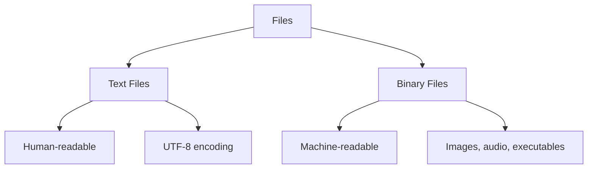

# Lesson 7: File I/O and Serialization

## 🎯 What You'll Learn
- Read from and write to text files with proper encoding handling
- Work with binary files for images, audio, and other non-text data
- Use JSON for data serialization and configuration
- Work with CSV files for tabular data
- Use pickle for Python object serialization
- Handle file paths and directories with pathlib
- Implement file compression with gzip and zip
- Work with configuration files (INI, JSON, YAML)
- Handle file errors and exceptions gracefully

## ⏱️ Duration
**2.5-3.5 hours** (reading + practice)

## 📋 Prerequisites
- Python functions and classes
- Understanding of data structures (lists, dictionaries)
- Basic knowledge of exception handling

---

## 📖 Chapter 1: Introduction & Context

### The Story Behind File I/O

Imagine you're a librarian. Books (data) are stored on shelves (files). To read a book, you need to:
1. **Find** the book (locate the file)
2. **Open** it (open the file)
3. **Read** the contents (read from file)
4. **Close** it when done (close the file)

If you just leave books open everywhere, the library becomes chaotic! Similarly, programs need to properly manage files to avoid data corruption and resource leaks.

### Why This Matters

In the real world, file I/O is essential for:

1. **Data persistence**: Save user data between sessions
2. **Configuration**: Store application settings
3. **Data exchange**: Share data between systems
4. **Logging**: Record application activity
5. **Backup**: Protect important information

### Mental Model

> 💡 Think of **file I/O** like **postal mail**. To send a letter (write data), you put it in an envelope (format), address it (file path), and drop it in the mailbox (file system). To receive mail (read data), you check your mailbox (open file), read the letter (read contents), and throw away the envelope (close file).

### What You Already Know

From previous lessons, you've learned:
- How to use context managers (`with` statement)
- How to handle exceptions with `try`/`except`
- How to work with strings and data structures

Now we'll learn how to **save and load data** from files.

---

## 📖 Chapter 2: Understanding File I/O & Serialization

### The Basics: Text vs Binary Files

Files come in two flavors:



### How It Works: File Operations

```python
# Writing to a text file
with open('example.txt', 'w', encoding='utf-8') as file:
    file.write('Hello, World!')

# Reading from a text file
with open('example.txt', 'r', encoding='utf-8') as file:
    content = file.read()
    print(content)  # Hello, World!
```

**Key insight:** The `with` statement ensures the file is properly closed, even if errors occur.

### Common Misconceptions

> ⚠️ **Don't be fooled!** Many people forget to specify encoding. Without `encoding='utf-8'`, Python uses the system default, which can cause errors with special characters.

### Knowledge Check

> 🤔 **Quick Question:** What's the difference between `'w'` and `'a'` modes?
> 
> <details>
> <summary>Click for answer</summary>
> `'w'` (write) creates a new file or overwrites existing content. `'a'` (append) adds to the end of an existing file or creates a new file if it doesn't exist.
> </details>

---

## 📖 Chapter 3: Hands-On Tutorial

### Setting Up

Create a new Python file called `file_io_tutorial.py`:

```python
# file_io_tutorial.py
import json
import csv
import pickle
import gzip
import zipfile
from pathlib import Path
from typing import Any, List, Dict, Optional
```

### Step 1: Basic Text File Operations

```python
def write_text_file(file_path: str, content: str) -> None:
    """Write text to a file."""
    with open(file_path, 'w', encoding='utf-8') as file:
        file.write(content)
    print(f"✅ Written to {file_path}")

def read_text_file(file_path: str) -> Optional[str]:
    """Read text from a file."""
    try:
        with open(file_path, 'r', encoding='utf-8') as file:
            content = file.read()
        print(f"✅ Read from {file_path}")
        return content
    except FileNotFoundError:
        print(f"❌ File not found: {file_path}")
        return None

def append_to_file(file_path: str, content: str) -> None:
    """Append text to a file."""
    with open(file_path, 'a', encoding='utf-8') as file:
        file.write(content + '\n')
    print(f"✅ Appended to {file_path}")

# Test it
write_text_file('hello.txt', 'Hello, World!')
content = read_text_file('hello.txt')
print(f"Content: {content}")

append_to_file('hello.txt', 'This is a new line.')
content = read_text_file('hello.txt')
print(f"Updated content:\n{content}")
```

**Line-by-line breakdown:**
- Line 4: `'w'` mode creates/overwrites file
- Line 9: `'r'` mode reads file
- Line 15: `'a'` mode appends to file
- Line 22: `encoding='utf-8'` handles special characters

### Step 2: JSON Serialization

```python
def save_json(file_path: str, data: Any) -> None:
    """Save Python object to JSON file."""
    with open(file_path, 'w', encoding='utf-8') as file:
        json.dump(data, file, indent=2, ensure_ascii=False)
    print(f"✅ Saved JSON to {file_path}")

def load_json(file_path: str) -> Optional[Any]:
    """Load Python object from JSON file."""
    try:
        with open(file_path, 'r', encoding='utf-8') as file:
            data = json.load(file)
        print(f"✅ Loaded JSON from {file_path}")
        return data
    except FileNotFoundError:
        print(f"❌ File not found: {file_path}")
        return None
    except json.JSONDecodeError as e:
        print(f"❌ Invalid JSON in {file_path}: {e}")
        return None

# Test it
user_data = {
    'name': 'Alice',
    'age': 30,
    'hobbies': ['reading', 'hiking', 'coding'],
    'address': {
        'street': '123 Main St',
        'city': 'Anytown'
    }
}

save_json('user.json', user_data)
loaded_data = load_json('user.json')
print(f"Loaded data: {loaded_data}")
```

### 🛑 Try It Yourself

> **Challenge:** Create a function that saves a list of student records to JSON, then loads them back. Each student should have 'name', 'grade', and 'courses' fields.
> 
> <details>
> <summary>Stuck? Click for hint</summary>
> Create a list of dictionaries, use `save_json` to write it, then `load_json` to read it back.
> </details>

### Step 3: CSV File Operations

```python
def save_csv(file_path: str, data: List[Dict[str, Any]]) -> None:
    """Save list of dictionaries to CSV file."""
    if not data:
        print("❌ No data to save")
        return
    
    headers = data[0].keys()
    
    with open(file_path, 'w', encoding='utf-8', newline='') as file:
        writer = csv.DictWriter(file, fieldnames=headers)
        writer.writeheader()
        writer.writerows(data)
    
    print(f"✅ Saved CSV to {file_path}")

def load_csv(file_path: str) -> List[Dict[str, Any]]:
    """Load CSV file as list of dictionaries."""
    try:
        with open(file_path, 'r', encoding='utf-8') as file:
            reader = csv.DictReader(file)
            data = list(reader)
        print(f"✅ Loaded CSV from {file_path}")
        return data
    except FileNotFoundError:
        print(f"❌ File not found: {file_path}")
        return []

# Test it
students = [
    {'name': 'Alice', 'grade': 85, 'courses': 'Math, Physics'},
    {'name': 'Bob', 'grade': 92, 'courses': 'English, History'},
    {'name': 'Charlie', 'grade': 78, 'courses': 'Chemistry, Biology'}
]

save_csv('students.csv', students)
loaded_students = load_csv('students.csv')
print(f"Loaded students: {loaded_students}")
```

---

## 📖 Chapter 4: Code Examples Explained

### Example 1: The Simplest Case

**Context:** Saving and loading application settings.

```python
import json
from pathlib import Path

class Settings:
    """Application settings manager."""
    
    def __init__(self, config_file: str = 'settings.json'):
        self.config_file = Path(config_file)
        self.settings: Dict[str, Any] = {}
        self.load()
    
    def load(self) -> None:
        """Load settings from file."""
        if self.config_file.exists():
            with open(self.config_file, 'r', encoding='utf-8') as file:
                self.settings = json.load(file)
        else:
            self.settings = self.default_settings()
            self.save()
    
    def save(self) -> None:
        """Save settings to file."""
        with open(self.config_file, 'w', encoding='utf-8') as file:
            json.dump(self.settings, file, indent=2)
    
    def default_settings(self) -> Dict[str, Any]:
        """Return default settings."""
        return {
            'theme': 'light',
            'language': 'en',
            'notifications': True,
            'font_size': 14
        }
    
    def get(self, key: str, default: Any = None) -> Any:
        """Get setting value."""
        return self.settings.get(key, default)
    
    def set(self, key: str, value: Any) -> None:
        """Set setting value and save."""
        self.settings[key] = value
        self.save()

# Usage
settings = Settings()
print(f"Theme: {settings.get('theme')}")

settings.set('theme', 'dark')
print(f"Updated theme: {settings.get('theme')}")
```

**Line-by-line breakdown:**
- Line 12: Check if config file exists
- Line 18: Create default settings if file doesn't exist
- Line 22: Save settings to file
- Line 32: Get setting with default value
- Line 37: Set setting and auto-save

### Example 2: A Realistic Scenario

**Context:** Processing log files to generate reports.

```python
from pathlib import Path
from datetime import datetime
from typing import List, Dict
import json

class LogAnalyzer:
    """Analyze application log files."""
    
    def __init__(self, log_dir: str = 'logs'):
        self.log_dir = Path(log_dir)
        self.log_dir.mkdir(exist_ok=True)
    
    def write_log(self, message: str, level: str = 'INFO') -> None:
        """Write log entry to file."""
        timestamp = datetime.now().isoformat()
        log_entry = {
            'timestamp': timestamp,
            'level': level,
            'message': message
        }
        
        log_file = self.log_dir / f"{datetime.now().date()}.log"
        
        with open(log_file, 'a', encoding='utf-8') as file:
            file.write(json.dumps(log_entry) + '\n')
    
    def read_logs(self, date: str = None) -> List[Dict[str, Any]]:
        """Read logs for a specific date."""
        if date is None:
            date = str(datetime.now().date())
        
        log_file = self.log_dir / f"{date}.log"
        
        if not log_file.exists():
            return []
        
        logs = []
        with open(log_file, 'r', encoding='utf-8') as file:
            for line in file:
                if line.strip():
                    logs.append(json.loads(line))
        
        return logs
    
    def generate_report(self, date: str = None) -> Dict[str, Any]:
        """Generate summary report from logs."""
        logs = self.read_logs(date)
        
        if not logs:
            return {'error': 'No logs found'}
        
        # Count by level
        level_counts = {}
        for log in logs:
            level = log['level']
            level_counts[level] = level_counts.get(level, 0) + 1
        
        return {
            'date': date or str(datetime.now().date()),
            'total_entries': len(logs),
            'level_breakdown': level_counts,
            'first_entry': logs[0]['timestamp'],
            'last_entry': logs[-1]['timestamp']
        }

# Usage
analyzer = LogAnalyzer()
analyzer.write_log('Application started')
analyzer.write_log('User logged in', 'INFO')
analyzer.write_log('Database connection failed', 'ERROR')
analyzer.write_log('Retrying connection', 'WARNING')

report = analyzer.generate_report()
print(f"Log report: {json.dumps(report, indent=2)}")
```

**Key insights:**
- **Pathlib** for file path management
- **JSON lines** format for log entries (one JSON object per line)
- **Auto-creation** of log directory
- **Structured logging** for easy analysis

### Example 3: Production-Quality Code

**Context:** Configuration management with multiple formats.

```python
from pathlib import Path
from typing import Any, Dict
import json
import configparser
import yaml

class ConfigManager:
    """Manage configuration in multiple formats."""
    
    def __init__(self, config_dir: str = 'config'):
        self.config_dir = Path(config_dir)
        self.config_dir.mkdir(exist_ok=True)
    
    def load_json(self, filename: str) -> Dict[str, Any]:
        """Load JSON configuration."""
        filepath = self.config_dir / f"{filename}.json"
        if not filepath.exists():
            return {}
        
        with open(filepath, 'r', encoding='utf-8') as file:
            return json.load(file)
    
    def save_json(self, filename: str, data: Dict[str, Any]) -> None:
        """Save configuration as JSON."""
        filepath = self.config_dir / f"{filename}.json"
        with open(filepath, 'w', encoding='utf-8') as file:
            json.dump(data, file, indent=2)
    
    def load_ini(self, filename: str) -> configparser.ConfigParser:
        """Load INI configuration."""
        filepath = self.config_dir / f"{filename}.ini"
        config = configparser.ConfigParser()
        config.read(filepath, encoding='utf-8')
        return config
    
    def save_ini(self, filename: str, config: configparser.ConfigParser) -> None:
        """Save configuration as INI."""
        filepath = self.config_dir / f"{filename}.ini"
        with open(filepath, 'w', encoding='utf-8') as file:
            config.write(file)
    
    def load_yaml(self, filename: str) -> Dict[str, Any]:
        """Load YAML configuration."""
        filepath = self.config_dir / f"{filename}.yaml"
        if not filepath.exists():
            return {}
        
        with open(filepath, 'r', encoding='utf-8') as file:
            return yaml.safe_load(file)
    
    def save_yaml(self, filename: str, data: Dict[str, Any]) -> None:
        """Save configuration as YAML."""
        filepath = self.config_dir / f"{filename}.yaml"
        with open(filepath, 'w', encoding='utf-8') as file:
            yaml.safe_dump(data, file, default_flow_style=False)
    
    def merge_configs(self, *configs: Dict[str, Any]) -> Dict[str, Any]:
        """Merge multiple configuration dictionaries."""
        merged = {}
        for config in configs:
            merged.update(config)
        return merged

# Usage
config_mgr = ConfigManager()

# JSON config
database_config = {
    'host': 'localhost',
    'port': 5432,
    'name': 'myapp'
}
config_mgr.save_json('database', database_config)

# YAML config
app_config = {
    'app': {
        'name': 'MyApp',
        'version': '1.0.0',
        'debug': True
    },
    'logging': {
        'level': 'INFO',
        'file': 'app.log'
    }
}
config_mgr.save_yaml('app', app_config)

# Load and merge
db_config = config_mgr.load_json('database')
app_settings = config_mgr.load_yaml('app')
merged = config_mgr.merge_configs(db_config, app_settings)
print(f"Merged config: {json.dumps(merged, indent=2)}")
```

**Best practices demonstrated:**
- **Multiple format support** (JSON, INI, YAML)
- **Pathlib** for cross-platform paths
- **Error handling** for missing files
- **Configuration merging** for layered configs

### Edge Cases & Gotchas

```python
# Problem: Encoding issues
with open('file.txt', 'r') as file:  # Missing encoding!
    content = file.read()  # May fail with special characters

# Solution: Always specify encoding
with open('file.txt', 'r', encoding='utf-8') as file:
    content = file.read()  # Works with all characters

# Problem: Large files consume memory
with open('huge_file.txt', 'r') as file:
    content = file.read()  # Loads entire file into memory!

# Solution: Process line by line
with open('huge_file.txt', 'r') as file:
    for line in file:  # Each line is loaded one at a time
        process(line)

# Problem: File not closed on error
file = open('data.txt', 'r')
data = file.read()
# If error occurs here, file is never closed!
file.close()

# Solution: Use context manager
with open('data.txt', 'r') as file:
    data = file.read()
# File is automatically closed here
```

> ⚠️ **Watch out!** Always specify encoding for text files. Without it, Python uses the system default, which may not handle special characters correctly.

---

## 📖 Chapter 5: Real-World Applications

### Case Study: Django Settings

Django uses file I/O for configuration:

```python
# settings.py
import os
from pathlib import Path

BASE_DIR = Path(__file__).resolve().parent.parent

# Database configuration
DATABASES = {
    'default': {
        'ENGINE': 'django.db.backends.postgresql',
        'NAME': os.environ.get('DB_NAME', 'mydb'),
        'USER': os.environ.get('DB_USER', 'postgres'),
        'PASSWORD': os.environ.get('DB_PASSWORD', ''),
        'HOST': os.environ.get('DB_HOST', 'localhost'),
        'PORT': os.environ.get('DB_PORT', '5432'),
    }
}

# Static files
STATIC_URL = '/static/'
STATIC_ROOT = BASE_DIR / 'staticfiles'
```

**How it works:**
1. `Path(__file__).resolve().parent.parent` gets project root
2. `os.environ.get()` reads environment variables
3. Configuration is loaded from Python file

### Industry Patterns

- **Configuration Management**: JSON, YAML, INI files for app settings
- **Data Persistence**: Save user data, preferences, and state
- **Log Analysis**: Process log files for debugging and monitoring
- **Data Exchange**: CSV, JSON for importing/exporting data
- **Backup Systems**: Compress and archive important files
- **Cache Management**: Store temporary data for performance

### Performance Considerations

1. **Buffering**: Python automatically buffers file writes
2. **Memory**: Use generators for large files
3. **Compression**: gzip reduces file size by 60-90%
4. **Caching**: `@lru_cache` for frequently read files
5. **Async I/O**: Use `aiofiles` for non-blocking file operations

---

## 📖 Chapter 6: Reference Material

### Quick Reference Cheat Sheet

```
┌─────────────────────────────────────────────────────────┐
│ FILE I/O CHEAT SHEET                                   │
├─────────────────────────────────────────────────────────┤
│ Open file:    with open('f', 'r', encoding='utf-8')    │
│ Read text:    content = file.read()                     │
│ Read lines:   lines = file.readlines()                  │
│ Write text:   file.write('text')                        │
│ JSON load:    data = json.load(file)                    │
│ JSON dump:    json.dump(data, file, indent=2)           │
│ CSV read:     csv.DictReader(file)                      │
│ CSV write:    csv.DictWriter(file, fieldnames)          │
│ Path exists:  Path('f').exists()                        │
│ Path mkdir:   Path('dir').mkdir(parents=True)           │
│ Compress:     gzip.open('f.gz', 'wb')                   │
│ Zip create:   zipfile.ZipFile('f.zip', 'w')             │
└─────────────────────────────────────────────────────────┘
```

### Glossary

| Term | Definition |
|------|------------|
| **File I/O** | Reading from and writing to files |
| **Serialization** | Converting Python objects to storable format |
| **Encoding** | Character representation (UTF-8, ASCII, etc.) |
| **JSON** | JavaScript Object Notation, human-readable format |
| **CSV** | Comma-Separated Values, tabular data format |
| **Pickle** | Python-specific binary serialization |
| **Pathlib** | Object-oriented file path manipulation |

### Common Patterns Library

```python
# Pattern 1: Safe file reading
def safe_read(file_path: str) -> Optional[str]:
    try:
        with open(file_path, 'r', encoding='utf-8') as file:
            return file.read()
    except (FileNotFoundError, PermissionError):
        return None

# Pattern 2: Atomic write (write to temp, then rename)
def atomic_write(file_path: str, content: str) -> None:
    temp_path = f"{file_path}.tmp"
    with open(temp_path, 'w', encoding='utf-8') as file:
        file.write(content)
    Path(temp_path).rename(file_path)

# Pattern 3: File rotation (keep N most recent)
def rotate_files(file_path: str, keep: int = 5) -> None:
    path = Path(file_path)
    if not path.exists():
        return
    
    # Rename existing files
    for i in range(keep - 1, 0, -1):
        old = path.with_suffix(f'.{i}{path.suffix}')
        new = path.with_suffix(f'.{i+1}{path.suffix}')
        if old.exists():
            old.rename(new)
    
    # Rename current file
    path.rename(path.with_suffix(f'.1{path.suffix}'))
```

### Debugging Checklist

- [ ] Verify file exists before reading
- [ ] Check file permissions
- [ ] Specify encoding for text files
- [ ] Use context managers for automatic cleanup
- [ ] Handle JSON decode errors
- [ ] Test with large files for memory usage
- [ ] Verify file paths are correct

---

## 📖 Chapter 7: Summary & Next Steps

### Key Takeaways

1. **Context managers** (`with` statement) ensure files are properly closed
2. **Encoding** (`utf-8`) is essential for text files with special characters
3. **JSON** is ideal for configuration and data exchange
4. **CSV** is perfect for tabular data
5. **Pathlib** provides cross-platform file path handling
6. **Error handling** prevents crashes from missing files

### Self-Assessment

> Can you:
> - [ ] Read and write text files with proper encoding?
> - [ ] Use JSON to save and load Python objects?
> - [ ] Work with CSV files for tabular data?
> - [ ] Handle file paths with pathlib?
> - [ ] Compress files with gzip or zip?
> - [ ] Handle file errors gracefully?

### What's Coming Next

**Lesson 8: Testing with pytest** will cover:
- Writing unit tests with pytest
- Test fixtures and parameterization
- Mocking and patching
- Test coverage analysis
- Testing best practices

---

## 📚 Sources & Further Reading

### Official Documentation
- [Python File I/O](https://docs.python.org/3/tutorial/inputoutput.html#reading-and-writing-files)
- [json module](https://docs.python.org/3/library/json.html)
- [csv module](https://docs.python.org/3/library/csv.html)
- [pathlib module](https://docs.python.org/3/library/pathlib.html)

### Recommended Reading
- "Fluent Python" by Luciano Ramalho (Chapter 4)
- "Python Cookbook" by David Beazley and Brian K. Jones (Chapter 5)
- "Effective Python" by Brett Slatkin (Item 42: Use pathlib)

### Video Tutorials
- [Corey Schafer: File Objects](https://www.youtube.com/watch?v=Uh2ebFW8OYM)
- [Real Python: Reading and Writing Files](https://realpython.com/read-write-files-python/)

### Community Resources
- [Stack Overflow: Python File I/O](https://stackoverflow.com/questions/tagged/python+file-io)
- [pathlib documentation](https://docs.python.org/3/library/pathlib.html)

---

*This enriched lesson was generated following the Textbook Writer Agent specification. For the concise version, see [lesson-7-file-io-serialization.md](../intermediate-python-3/lesson-7-file-io-serialization.md).*