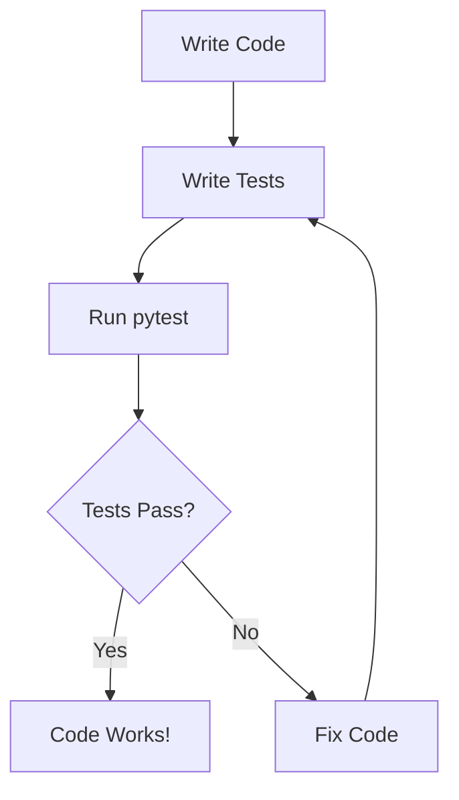

# Lesson 8: Testing with Pytest

## 🎯 What You'll Learn
- Write basic unit tests with pytest for reliable code
- Use test fixtures for setup and teardown
- Create parameterized tests to test multiple scenarios
- Use assertions effectively to verify behavior
- Organize tests in test modules for maintainability
- Mock external dependencies for isolated testing
- Measure test coverage to ensure comprehensive testing
- Write integration tests to verify component interactions
- Use pytest plugins and advanced features
- Apply testing best practices for professional development

## ⏱️ Duration
**2.5-3.5 hours** (reading + practice)

## 📋 Prerequisites
- Python functions and classes
- Understanding of exception handling
- Basic knowledge of command line usage

---

## 📖 Chapter 1: Introduction & Context

### The Story Behind Testing

Imagine you're building a bridge. Would you drive cars across it without testing if it can hold weight? Of not! Software is the same—**testing** ensures your code works correctly before users encounter problems.

Without testing:
- **Bugs slip through**: Users find errors you missed
- **Regressions**: Fixing one thing breaks another
- **Fear of changes**: You're afraid to improve code
- **Documentation gaps**: No clear specification of behavior

With testing:
- **Confidence**: Code works as expected
- **Safety net**: Catch regressions early
- **Documentation**: Tests show how to use code
- **Better design**: Testable code is better designed

### Why This Matters

In the real world, testing prevents disasters:

1. **Software failures**: Bugs cause crashes, data loss, security breaches
2. **Business costs**: Fixing bugs in production is 10-100x more expensive
3. **Reputation damage**: Users lose trust in buggy software
4. **Legal liability**: Bugs can cause real-world harm

### Mental Model

> 💡 Think of **testing** like **quality control in manufacturing**. Each test checks one aspect of your code—like checking if a bolt fits, if paint is dry, if electronics work. Together, tests ensure the final product meets specifications.

### What You Already Know

From previous lessons, you've learned:
- How to define functions and classes
- How to handle exceptions
- How to structure Python modules

Now we'll learn how to **verify our code works correctly** through automated testing.

---

## 📖 Chapter 2: Understanding Testing with pytest

### The Basics: What is pytest?

pytest is Python's most popular testing framework. It makes writing tests simple and provides powerful features:



### How It Works: Test Discovery

pytest automatically finds and runs tests:
- Files named `test_*.py` or `*_test.py`
- Functions named `test_*`
- Classes named `Test*`

```python
# test_example.py
def test_addition():
    """Test that 2 + 2 equals 4."""
    assert 2 + 2 == 4

def test_subtraction():
    """Test that 5 - 3 equals 2."""
    assert 5 - 3 == 2
```

Run with: `pytest test_example.py`

### Common Misconceptions

> ⚠️ **Don't be fooled!** Many people think testing is "extra work." Actually, testing **saves time** by catching bugs early and making refactoring safer.

### Knowledge Check

> 🤔 **Quick Question:** What happens if a test assertion fails?
> 
> <details>
> <summary>Click for answer</summary>
> pytest reports the failure, shows which assertion failed, and continues running other tests. This helps you see all failures at once.
> </details>

---

## 📖 Chapter 3: Hands-On Tutorial

### Setting Up

Create a new Python project with this structure:

```
my_project/
├── calculator.py
├── test_calculator.py
└── requirements.txt
```

**requirements.txt:**
```
pytest>=7.0.0
pytest-cov>=4.0.0
```

### Step 1: Write Your First Test

```python
# calculator.py
def add(a: int, b: int) -> int:
    """Add two numbers."""
    return a + b

def subtract(a: int, b: int) -> int:
    """Subtract b from a."""
    return a - b

def multiply(a: int, b: int) -> int:
    """Multiply two numbers."""
    return a * b

def divide(a: int, b: int) -> float:
    """Divide a by b."""
    if b == 0:
        raise ValueError("Cannot divide by zero")
    return a / b
```

```python
# test_calculator.py
import pytest
from calculator import add, subtract, multiply, divide

def test_add():
    """Test addition function."""
    assert add(2, 3) == 5
    assert add(-1, 1) == 0
    assert add(0, 0) == 0

def test_subtract():
    """Test subtraction function."""
    assert subtract(5, 3) == 2
    assert subtract(3, 5) == -2
    assert subtract(0, 0) == 0

def test_multiply():
    """Test multiplication function."""
    assert multiply(3, 4) == 12
    assert multiply(-2, 3) == -6
    assert multiply(0, 5) == 0

def test_divide():
    """Test division function."""
    assert divide(10, 2) == 5.0
    assert divide(7, 2) == 3.5

def test_divide_by_zero():
    """Test division by zero raises error."""
    with pytest.raises(ValueError):
        divide(10, 0)
```

**Run the tests:**
```bash
pytest test_calculator.py -v
```

**Line-by-line breakdown:**
- Line 4: `assert` checks if condition is True
- Line 13: `pytest.raises` verifies exception is raised
- Line 14: Code inside `with` block should raise `ValueError`

### Step 2: Use Test Fixtures

```python
# test_calculator_advanced.py
import pytest
from calculator import Calculator

@pytest.fixture
def calculator():
    """Fixture that creates a Calculator instance."""
    return Calculator()

@pytest.fixture
def sample_numbers():
    """Fixture that provides sample test data."""
    return {
        'a': 10,
        'b': 5,
        'expected_add': 15,
        'expected_subtract': 5,
        'expected_multiply': 50,
        'expected_divide': 2.0
    }

def test_add_with_fixture(calculator, sample_numbers):
    """Test addition using fixtures."""
    result = calculator.add(sample_numbers['a'], sample_numbers['b'])
    assert result == sample_numbers['expected_add']

def test_subtract_with_fixture(calculator, sample_numbers):
    """Test subtraction using fixtures."""
    result = calculator.subtract(sample_numbers['a'], sample_numbers['b'])
    assert result == sample_numbers['expected_subtract']
```

### 🛑 Try It Yourself

> **Challenge:** Create a test for a `power(base, exponent)` function. Test with positive numbers, zero, and negative exponents.
> 
> <details>
> <summary>Stuck? Click for hint</summary>
> Define `power` function, then write tests: `assert power(2, 3) == 8`, `assert power(5, 0) == 1`, etc.
> </details>

### Step 3: Parameterized Tests

```python
# test_calculator_parametrized.py
import pytest
from calculator import add, divide

@pytest.mark.parametrize(
    "a, b, expected",
    [
        (2, 3, 5),
        (0, 0, 0),
        (-1, 1, 0),
        (100, 200, 300),
        (0, 5, 5)
    ],
    ids=["positive", "zero", "negative", "large", "zero_first"]
)
def test_add_parametrized(a, b, expected):
    """Test addition with multiple parameter sets."""
    assert add(a, b) == expected

@pytest.mark.parametrize(
    "a, b, expected",
    [
        (10, 2, 5.0),
        (7, 2, 3.5),
        (0, 5, 0.0)
    ],
    ids=["even", "odd", "zero_numerator"]
)
def test_divide_parametrized(a, b, expected):
    """Test division with multiple parameter sets."""
    assert divide(a, b) == expected

@pytest.mark.parametrize("divisor", [0, -1, 1, 2])
def test_divide_by_various(divisor):
    """Test division by various divisors."""
    if divisor == 0:
        with pytest.raises(ValueError):
            divide(10, divisor)
    else:
        result = divide(10, divisor)
        assert isinstance(result, float)
```

---

## 📖 Chapter 4: Code Examples Explained

### Example 1: The Simplest Case

**Context:** Testing a user validation function.

```python
# user_validator.py
def validate_email(email: str) -> bool:
    """Validate email format."""
    if not email:
        return False
    if '@' not in email:
        return False
    if '.' not in email.split('@')[-1]:
        return False
    return True

# test_user_validator.py
import pytest
from user_validator import validate_email

def test_validate_email_valid():
    """Test valid email addresses."""
    assert validate_email('user@example.com') is True
    assert validate_email('test.user@domain.org') is True
    assert validate_email('user+tag@example.co.uk') is True

def test_validate_email_invalid():
    """Test invalid email addresses."""
    assert validate_email('') is False
    assert validate_email('plaintext') is False
    assert validate_email('@nodomain.com') is False
    assert validate_email('user@') is False
    assert validate_email('user@nodot') is False
```

**Line-by-line breakdown:**
- Line 12: Test happy path (valid emails)
- Line 18: Test error cases (invalid emails)
- Each assertion checks one specific behavior

### Example 2: A Realistic Scenario

**Context:** Testing a shopping cart with fixtures.

```python
# shopping_cart.py
class ShoppingCart:
    """Shopping cart for e-commerce."""
    
    def __init__(self):
        self.items = []
    
    def add_item(self, name: str, price: float, quantity: int = 1):
        """Add item to cart."""
        self.items.append({
            'name': name,
            'price': price,
            'quantity': quantity
        })
    
    def remove_item(self, name: str):
        """Remove item from cart."""
        self.items = [item for item in self.items if item['name'] != name]
    
    def get_total(self) -> float:
        """Calculate total price."""
        return sum(item['price'] * item['quantity'] for item in self.items)
    
    def get_item_count(self) -> int:
        """Get number of items in cart."""
        return sum(item['quantity'] for item in self.items)

# test_shopping_cart.py
import pytest
from shopping_cart import ShoppingCart

@pytest.fixture
def empty_cart():
    """Fixture for empty cart."""
    return ShoppingCart()

@pytest.fixture
def cart_with_items():
    """Fixture for cart with items."""
    cart = ShoppingCart()
    cart.add_item('Apple', 1.50, 3)
    cart.add_item('Banana', 0.75, 5)
    cart.add_item('Orange', 2.00, 2)
    return cart

def test_empty_cart(empty_cart):
    """Test empty cart."""
    assert empty_cart.get_total() == 0.0
    assert empty_cart.get_item_count() == 0

def test_add_item(empty_cart):
    """Test adding item to cart."""
    empty_cart.add_item('Apple', 1.50, 3)
    assert empty_cart.get_total() == 4.50
    assert empty_cart.get_item_count() == 3

def test_remove_item(cart_with_items):
    """Test removing item from cart."""
    cart_with_items.remove_item('Banana')
    assert cart_with_items.get_total() == 8.50  # (1.50*3) + (2.00*2)
    assert cart_with_items.get_item_count() == 5

def test_get_total(cart_with_items):
    """Test total calculation."""
    expected = (1.50 * 3) + (0.75 * 5) + (2.00 * 2)
    assert cart_with_items.get_total() == expected
```

**Key insights:**
- **Fixtures** provide reusable test setup
- **Multiple assertions** verify different aspects
- **Descriptive names** explain what each test checks

### Example 3: Production-Quality Code

**Context:** Testing with mocking for external API calls.

```python
# api_client.py
import requests
from typing import Optional, Dict, Any

class APIClient:
    """Client for external API."""
    
    def __init__(self, base_url: str):
        self.base_url = base_url
    
    def get_user(self, user_id: int) -> Optional[Dict[str, Any]]:
        """Get user by ID."""
        try:
            response = requests.get(f"{self.base_url}/users/{user_id}")
            response.raise_for_status()
            return response.json()
        except requests.RequestException:
            return None
    
    def create_user(self, user_data: Dict[str, Any]) -> bool:
        """Create new user."""
        try:
            response = requests.post(
                f"{self.base_url}/users",
                json=user_data
            )
            response.raise_for_status()
            return True
        except requests.RequestException:
            return False

# test_api_client.py
import pytest
from unittest.mock import Mock, patch
from api_client import APIClient

@pytest.fixture
def api_client():
    """Fixture for API client."""
    return APIClient('https://api.example.com')

def test_get_user_success(api_client, monkeypatch):
    """Test successful user retrieval."""
    # Mock the requests.get function
    mock_response = Mock()
    mock_response.json.return_value = {'id': 1, 'name': 'Alice'}
    mock_response.raise_for_status.return_value = None
    
    def mock_get(url):
        return mock_response
    
    monkeypatch.setattr('requests.get', mock_get)
    
    user = api_client.get_user(1)
    assert user == {'id': 1, 'name': 'Alice'}

def test_get_user_failure(api_client, monkeypatch):
    """Test failed user retrieval."""
    def mock_get(url):
        raise requests.RequestException("Network error")
    
    monkeypatch.setattr('requests.get', mock_get)
    
    user = api_client.get_user(1)
    assert user is None

def test_create_user_success(api_client, monkeypatch):
    """Test successful user creation."""
    mock_response = Mock()
    mock_response.raise_for_status.return_value = None
    
    def mock_post(url, json=None):
        return mock_response
    
    monkeypatch.setattr('requests.post', mock_post)
    
    result = api_client.create_user({'name': 'Bob'})
    assert result is True
```

**Best practices demonstrated:**
- **Mocking** isolates tests from external dependencies
- **monkeypatch** replaces real functions with test doubles
- **Error handling** tests both success and failure cases

### Edge Cases & Gotchas

```python
# Problem: Tests depend on external state
def test_bad_example():
    """This test is unreliable."""
    import os
    # Test depends on environment variable
    if os.getenv('ENV') == 'production':
        assert True
    else:
        assert False  # Fails in development!

# Solution: Use fixtures and mocking
@pytest.fixture
def mock_env(monkeypatch):
    """Mock environment variable."""
    monkeypatch.setenv('ENV', 'test')
    return 'test'

def test_good_example(mock_env):
    """This test is reliable."""
    import os
    assert os.getenv('ENV') == 'test'

# Problem: Tests are too slow
def test_slow_example():
    """This test takes too long."""
    import time
    time.sleep(5)  # Simulating slow operation
    assert True

# Solution: Mock slow operations
def test_fast_example(monkeypatch):
    """This test is fast."""
    def mock_sleep(seconds):
        pass  # Do nothing
    
    monkeypatch.setattr('time.sleep', mock_sleep)
    
    import time
    time.sleep(5)  # Doesn't actually sleep
    assert True
```

> ⚠️ **Watch out!** Tests should be **fast**, **reliable**, and **independent**. Avoid dependencies on external state or slow operations.

---

## 📖 Chapter 5: Real-World Applications

### Case Study: Django Testing

Django uses pytest-style testing:

```python
# tests/test_models.py
import pytest
from django.test import TestCase
from myapp.models import User

class TestUser(TestCase):
    """Test User model."""
    
    def test_create_user(self):
        """Test user creation."""
        user = User.objects.create_user(
            username='alice',
            email='alice@example.com',
            password='testpass123'
        )
        assert user.username == 'alice'
        assert user.email == 'alice@example.com'
        assert user.check_password('testpass123')
    
    def test_user_str(self):
        """Test user string representation."""
        user = User.objects.create_user(
            username='bob',
            email='bob@example.com'
        )
        assert str(user) == 'bob'
```

**How it works:**
1. Django provides `TestCase` with database fixtures
2. Each test gets a clean database
3. Tests can create and query models

### Industry Patterns

- **Unit Tests**: Test individual functions/methods
- **Integration Tests**: Test component interactions
- **End-to-End Tests**: Test complete user workflows
- **Performance Tests**: Test speed and resource usage
- **Security Tests**: Test for vulnerabilities
- **Regression Tests**: Ensure bugs don't return

### Performance Considerations

1. **Test speed**: Tests should run in seconds, not minutes
2. **Parallel execution**: pytest-xdist runs tests in parallel
3. **Database isolation**: Each test gets clean database state
4. **Mocking**: Avoid real network/database calls in unit tests
5. **Coverage**: Aim for 80-90% code coverage

---

## 📖 Chapter 6: Reference Material

### Quick Reference Cheat Sheet

```
┌─────────────────────────────────────────────────────────┐
│ PYTEST CHEAT SHEET                                     │
├─────────────────────────────────────────────────────────┤
│ Run tests:      pytest test_file.py                    │
│ Verbose:        pytest -v                              │
│ Specific test:  pytest test_file.py::test_name         │
│ Stop on fail:   pytest -x                              │
│ Show coverage:  pytest --cov=my_module                 │
│ Fixture:        @pytest.fixture                        │
│ Parameterize:   @pytest.mark.parametrize(...)          │
│ Skip test:      @pytest.mark.skip                      │
│ Expected fail:  @pytest.mark.xfail                     │
│ Assert raises:  with pytest.raises(Exception):         │
│ Approximate:    assert 0.1 + 0.2 == pytest.approx(0.3) │
└─────────────────────────────────────────────────────────┘
```

### Glossary

| Term | Definition |
|------|------------|
| **Unit Test** | Test that verifies a single function or method |
| **Integration Test** | Test that verifies multiple components work together |
| **Fixture** | Reusable setup/teardown code for tests |
| **Assertion** | Statement that checks if condition is True |
| **Mock** | Fake object that replaces real dependency |
| **Coverage** | Percentage of code executed by tests |
| **Regression** | Bug that returns after being fixed |

### Common Patterns Library

```python
# Pattern 1: Test data factory
@pytest.fixture
def user_factory():
    """Factory for creating test users."""
    def create_user(name="Test User", email="test@example.com"):
        return {'name': name, 'email': email}
    return create_user

def test_user_operations(user_factory):
    user = user_factory(name="Alice")
    assert user['name'] == 'Alice'

# Pattern 2: Temporary directory
@pytest.fixture
def temp_dir(tmp_path):
    """Fixture providing temporary directory."""
    return tmp_path

def test_file_operations(temp_dir):
    file_path = temp_dir / "test.txt"
    file_path.write_text("Hello")
    assert file_path.read_text() == "Hello"

# Pattern 3: Database transaction
@pytest.fixture
def db_transaction(db):
    """Fixture that wraps test in database transaction."""
    with db.transaction():
        yield db
    # Transaction rolls back after test
```

### Debugging Checklist

- [ ] Run tests with `-v` for verbose output
- [ ] Use `pytest.set_trace()` for debugging
- [ ] Check fixture setup/teardown order
- [ ] Verify mock configurations
- [ ] Review test isolation (no shared state)
- [ ] Measure test coverage
- [ ] Run tests in random order

---

## 📖 Chapter 7: Summary & Next Steps

### Key Takeaways

1. **pytest** makes writing tests simple and powerful
2. **Fixtures** provide reusable test setup
3. **Parameterized tests** reduce code duplication
4. **Mocking** isolates tests from external dependencies
5. **Coverage** measures how much code is tested
6. **Best practices** ensure reliable, maintainable tests

### Self-Assessment

> Can you:
> - [ ] Write basic unit tests with pytest?
> - [ ] Use fixtures for test setup/teardown?
> - [ ] Create parameterized tests?
> - [ ] Mock external dependencies?
> - [ ] Measure test coverage?
> - [ ] Organize tests in modules?

### What's Coming Next

**Lesson 9: Performance Optimization** will cover:
- Profiling Python code
- Optimizing algorithms
- Memory management
- Caching strategies
- Concurrent execution

---

## 📚 Sources & Further Reading

### Official Documentation
- [pytest Documentation](https://docs.pytest.org/)
- [pytest fixtures](https://docs.pytest.org/en/6.2.x/fixture.html)
- [pytest parametrize](https://docs.pytest.org/en/6.2.x/parametrize.html)

### Recommended Reading
- "Python Testing with pytest" by Brian Okken
- "Fluent Python" by Luciano Ramalho (Chapter 9)
- "Effective Python" by Brett Slatkin (Item 68: Test Everything)

### Video Tutorials
- [Corey Schafer: pytest Tutorial](https://www.youtube.com/watch?v=ULxMQ57engo)
- [Real Python: Getting Started with pytest](https://realpython.com/pytest-python-testing/)

### Community Resources
- [Stack Overflow: pytest](https://stackoverflow.com/questions/tagged/pytest)
- [pytest GitHub](https://github.com/pytest-dev/pytest)

---

*This enriched lesson was generated following the Textbook Writer Agent specification. For the concise version, see [lesson-8-testing-with-pytest.md](../intermediate-python-3/lesson-8-testing-with-pytest.md).*