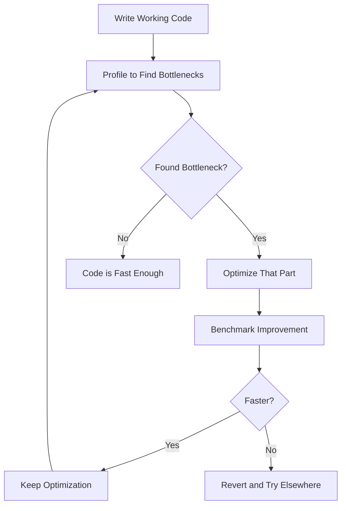

# Lesson 9: Performance Optimization

## 🎯 What You'll Learn
- Profile Python code to identify bottlenecks and slow sections
- Use benchmarking tools to measure and compare performance
- Apply optimization techniques for better algorithmic efficiency
- Understand time and space complexity (Big O notation)
- Use appropriate data structures for optimal performance
- Optimize I/O operations for faster file and network access
- Implement caching strategies to avoid redundant computations
- Use concurrency and parallelism effectively for I/O-bound and CPU-bound tasks
- Apply best practices for performance optimization
- Debug and diagnose performance issues systematically

## ⏱️ Duration
**3-4 hours** (reading + practice)

## 📋 Prerequisites
- Python functions and classes
- Understanding of data structures (lists, dictionaries, sets)
- Basic knowledge of algorithms
- Familiarity with exception handling

---

## 📖 Chapter 1: Introduction & Context

### The Story Behind Performance Optimization

Imagine you're driving a car. You could drive at 30 mph everywhere—safe and predictable. But if you need to get somewhere fast, you need to **optimize** your route, avoid traffic, and maybe take the highway.

Software is the same. Code that works correctly might be **too slow** for real-world use. Performance optimization is about finding the **fastest route** to your destination without sacrificing reliability.

### Why This Matters

In the real world, performance directly impacts:

1. **User experience**: Slow applications frustrate users
2. **Business costs**: More servers needed for slow code
3. **Competitive advantage**: Faster products win customers
4. **Resource efficiency**: Optimized code uses less memory and CPU

### Mental Model

> 💡 Think of **performance optimization** like **tuning a race car**. You start with a working car (code that works), then you:
> 1. **Measure** where you're slow (profiling)
> 2. **Identify** the bottleneck (slowest part)
> 3. **Optimize** that specific part (not everything)
> 4. **Verify** you actually improved (benchmarking)

### What You Already Know

From previous lessons, you've learned:
- How to write functions and classes
- How to work with data structures
- How to handle files and I/O

Now we'll learn how to **make our code faster and more efficient**.

---

## 📖 Chapter 2: Understanding Performance Optimization

### The Basics: Measure First!

The first rule of optimization: **Don't guess, measure!**



### How It Works: Profiling

Profiling shows you **where your code spends time**:

```python
import cProfile
import pstats

def slow_function():
    total = 0
    for i in range(1000):
        for j in range(1000):
            total += i * j
    return total

# Profile the function
cProfile.run('slow_function()', 'profile_stats')

# Analyze results
stats = pstats.Stats('profile_stats')
stats.sort_stats('cumulative')
stats.print_stats(10)  # Show top 10 functions
```

**Key insight:** Profiling shows which functions take the most time, so you know where to focus optimization efforts.

### Common Misconceptions

> ⚠️ **Don't be fooled!** Many people think "Python is slow, so optimization doesn't matter." Actually, **algorithm choice** matters more than language. A good algorithm in Python beats a bad algorithm in C.

### Knowledge Check

> 🤔 **Quick Question:** Should you optimize every function in your code?
> 
> <details>
> <summary>Click for answer</summary>
> No! Focus on the **bottlenecks**—the 10% of code that takes 90% of the time. Optimizing rarely-used code wastes effort.
> </details>

---

## 📖 Chapter 3: Hands-On Tutorial

### Setting Up

Create a new Python file called `optimization_tutorial.py`:

```python
# optimization_tutorial.py
import time
import timeit
import cProfile
from functools import lru_cache
from typing import List, Dict, Any
```

### Step 1: Profiling Your Code

```python
def profile_function(func):
    """Decorator to profile a function."""
    def wrapper(*args, **kwargs):
        profiler = cProfile.Profile()
        profiler.enable()
        
        result = func(*args, **kwargs)
        
        profiler.disable()
        
        # Print statistics
        import pstats
        import io
        
        stream = io.StringIO()
        stats = pstats.Stats(profiler, stream=stream)
        stats.sort_stats('cumulative')
        stats.print_stats(10)
        
        print(stream.getvalue())
        return result
    
    return wrapper

@profile_function
def slow_function():
    """A function with performance issues."""
    total = 0
    for i in range(100):
        for j in range(100):
            for k in range(10):
                total += i * j * k
    return total

# Run it
slow_function()
```

**Line-by-line breakdown:**
- Line 4: `cProfile.Profile()` creates a profiler
- Line 5: `profiler.enable()` starts profiling
- Line 9: `profiler.disable()` stops profiling
- Line 16: `stats.print_stats(10)` shows top 10 functions

### Step 2: Benchmarking Different Approaches

```python
def benchmark_list_vs_set():
    """Compare list vs set membership testing."""
    import random
    
    # Create test data
    data_list = list(range(10000))
    data_set = set(range(10000))
    
    # Benchmark list
    list_time = timeit.timeit(
        'random.choice(data_list) in data_list',
        globals={'random': random, 'data_list': data_list},
        number=1000
    )
    
    # Benchmark set
    set_time = timeit.timeit(
        'random.choice(list(data_set)) in data_set',
        globals={'random': random, 'data_set': data_set},
        number=1000
    )
    
    print(f"List membership: {list_time:.6f} seconds")
    print(f"Set membership: {set_time:.6f} seconds")
    print(f"Set is {list_time/set_time:.1f}x faster")

benchmark_list_vs_set()
```

### 🛑 Try It Yourself

> **Challenge:** Benchmark three ways to create a list of squares: (1) for loop with append, (2) list comprehension, (3) map with lambda. Which is fastest?
> 
> <details>
> <summary>Stuck? Click for hint</summary>
> Use `timeit.timeit()` for each approach. List comprehension is usually fastest!
> </details>

### Step 3: Using Caching

```python
# Without caching (slow)
def fibonacci_slow(n: int) -> int:
    """Calculate Fibonacci number (slow recursive)."""
    if n <= 1:
        return n
    return fibonacci_slow(n - 1) + fibonacci_slow(n - 2)

# With caching (fast)
@lru_cache(maxsize=None)
def fibonacci_fast(n: int) -> int:
    """Calculate Fibonacci number (cached)."""
    if n <= 1:
        return n
    return fibonacci_fast(n - 1) + fibonacci_fast(n - 2)

# Compare performance
import time

start = time.time()
result1 = fibonacci_slow(30)
time1 = time.time() - start

start = time.time()
result2 = fibonacci_fast(30)
time2 = time.time() - start

print(f"Slow: {time1:.4f} seconds")
print(f"Fast: {time2:.6f} seconds")
print(f"Speedup: {time1/time2:.0f}x")
```

---

## 📖 Chapter 4: Code Examples Explained

### Example 1: The Simplest Case

**Context:** Optimizing a simple search function.

```python
def search_list_slow(data: List[int], target: int) -> bool:
    """Search for target in list (slow)."""
    for item in data:
        if item == target:
            return True
    return False

def search_set_fast(data: List[int], target: int) -> bool:
    """Search for target using set (fast)."""
    return target in set(data)

# Benchmark
import timeit

data = list(range(10000))
target = 5000

slow_time = timeit.timeit(
    lambda: search_list_slow(data, target),
    number=1000
)

fast_time = timeit.timeit(
    lambda: search_set_fast(data, target),
    number=1000
)

print(f"List search: {slow_time:.6f} seconds")
print(f"Set search: {fast_time:.6f} seconds")
print(f"Speedup: {slow_time/fast_time:.1f}x")
```

**Line-by-line breakdown:**
- Line 3: Linear search O(n) - checks every element
- Line 9: Set lookup O(1) - direct access
- Line 17: Benchmark shows the difference

### Example 2: A Realistic Scenario

**Context:** Optimizing data processing pipeline.

```python
from typing import List, Dict

def process_data_slow(data: List[Dict[str, Any]]) -> List[Dict[str, Any]]:
    """Process data (slow version)."""
    results = []
    
    for record in data:
        # Multiple passes through data
        if record.get('active'):
            processed = {
                'id': record['id'],
                'name': record['name'].upper(),
                'score': record['score'] * 1.1
            }
            results.append(processed)
    
    # Sort results
    results.sort(key=lambda x: x['score'], reverse=True)
    
    # Take top 10
    return results[:10]

def process_data_fast(data: List[Dict[str, Any]]) -> List[Dict[str, Any]]:
    """Process data (fast version)."""
    # Use list comprehension
    results = [
        {
            'id': record['id'],
            'name': record['name'].upper(),
            'score': record['score'] * 1.1
        }
        for record in data
        if record.get('active')
    ]
    
    # Use heapq for top-N (more efficient than full sort)
    import heapq
    return heapq.nlargest(10, results, key=lambda x: x['score'])

# Benchmark
import timeit

test_data = [
    {'id': i, 'name': f'User {i}', 'score': i * 10, 'active': i % 2 == 0}
    for i in range(1000)
]

slow_time = timeit.timeit(
    lambda: process_data_slow(test_data),
    number=100
)

fast_time = timeit.timeit(
    lambda: process_data_fast(test_data),
    number=100
)

print(f"Slow version: {slow_time:.6f} seconds")
print(f"Fast version: {fast_time:.6f} seconds")
print(f"Speedup: {slow_time/fast_time:.1f}x")
```

**Key insights:**
- **List comprehension** is faster than explicit loops
- **heapq.nlgargest** is faster than sorting entire list
- **Single pass** through data is more efficient

### Example 3: Production-Quality Code

**Context:** Optimizing with caching and connection pooling.

```python
from functools import lru_cache
from typing import Optional
import time

class DatabaseConnectionPool:
    """Connection pool for database connections."""
    
    def __init__(self, max_connections: int = 10):
        self.max_connections = max_connections
        self.connections = []
        self.in_use = set()
    
    def get_connection(self):
        """Get a connection from the pool."""
        if self.connections:
            conn = self.connections.pop()
            self.in_use.add(conn)
            return conn
        
        if len(self.in_use) < self.max_connections:
            conn = self.create_connection()
            self.in_use.add(conn)
            return conn
        
        raise RuntimeError("No connections available")
    
    def release_connection(self, conn):
        """Release a connection back to the pool."""
        if conn in self.in_use:
            self.in_use.remove(conn)
            self.connections.append(conn)
    
    def create_connection(self):
        """Create a new database connection."""
        # Simulate connection creation
        return {'id': id(object()), 'created': time.time()}

class OptimizedDataAccess:
    """Data access layer with optimizations."""
    
    def __init__(self):
        self.pool = DatabaseConnectionPool()
        self.cache = {}
    
    @lru_cache(maxsize=1000)
    def get_user(self, user_id: int) -> Optional[dict]:
        """Get user by ID (cached)."""
        # Check cache first
        if user_id in self.cache:
            return self.cache[user_id]
        
        # Get from database
        conn = self.pool.get_connection()
        try:
            # Simulate database query
            user = {'id': user_id, 'name': f'User {user_id}'}
            self.cache[user_id] = user
            return user
        finally:
            self.pool.release_connection(conn)
    
    def get_users(self, user_ids: List[int]) -> List[dict]:
        """Get multiple users efficiently."""
        results = []
        missing_ids = []
        
        # Check cache for each user
        for user_id in user_ids:
            if user_id in self.cache:
                results.append(self.cache[user_id])
            else:
                missing_ids.append(user_id)
        
        # Batch fetch missing users
        if missing_ids:
            conn = self.pool.get_connection()
            try:
                # Simulate batch query
                for user_id in missing_ids:
                    user = {'id': user_id, 'name': f'User {user_id}'}
                    self.cache[user_id] = user
                    results.append(user)
            finally:
                self.pool.release_connection(conn)
        
        return results

# Usage
data_access = OptimizedDataAccess()

# First call (cache miss)
user1 = data_access.get_user(1)

# Second call (cache hit)
user2 = data_access.get_user(1)

# Batch fetch
users = data_access.get_users([2, 3, 4, 5])
```

**Best practices demonstrated:**
- **Connection pooling** reuses expensive resources
- **LRU cache** avoids redundant database queries
- **Batch operations** reduce round trips

### Edge Cases & Gotchas

```python
# Problem: Premature optimization
def avoid_premature_optimization():
    """Don't optimize before measuring."""
    # This looks slow but might be fast enough
    result = [x ** 2 for x in range(1000)]
    
    # Only optimize if profiling shows it's a bottleneck

# Problem: Optimizing the wrong thing
def optimize_correctly():
    """Focus on actual bottlenecks."""
    # Don't optimize this (rarely called)
    def rarely_used():
        return sum(range(1000))
    
    # Optimize this (called frequently)
    @lru_cache(maxsize=128)
    def frequently_used(x: int) -> int:
        return x ** 2 + x + 1

# Problem: Memory leaks in caching
def avoid_cache_bloat():
    """Limit cache size."""
    from functools import lru_cache
    
    @lru_cache(maxsize=100)  # Limit cache size
    def expensive_function(x: int) -> int:
        return x ** 2
```

> ⚠️ **Watch out!** Premature optimization wastes time. Always **profile first**, then optimize only the bottlenecks.

---

## 📖 Chapter 5: Real-World Applications

### Case Study: Instagram's Performance Optimization

Instagram reduced image loading time by 50% through:
1. **CDN caching**: Store images close to users
2. **Lazy loading**: Load images only when visible
3. **Image compression**: Reduce file sizes
4. **Connection pooling**: Reuse database connections

**How it works:**
1. User requests feed
2. CDN serves cached images (fast)
3. Database uses connection pool (efficient)
4. Images compressed for faster transfer

### Industry Patterns

- **Caching**: Redis, Memcached for frequently accessed data
- **Connection pooling**: Database connections, HTTP clients
- **Lazy loading**: Load data only when needed
- **Batch processing**: Process multiple items together
- **Compression**: Reduce data transfer size
- **CDN**: Serve content from edge locations

### Performance Considerations

1. **Profile first**: Don't guess where bottlenecks are
2. **Algorithm choice**: O(n log n) beats O(n²)
3. **Data structure**: Set for membership, dict for lookups
4. **Caching**: Avoid redundant computations
5. **I/O optimization**: Batch operations, use buffers
6. **Concurrency**: Parallelize independent operations

---

## 📖 Chapter 6: Reference Material

### Quick Reference Cheat Sheet

```
┌─────────────────────────────────────────────────────────┐
│ PERFORMANCE OPTIMIZATION CHEAT SHEET                   │
├─────────────────────────────────────────────────────────┤
│ Profile:        cProfile.run('func()')                 │
│ Benchmark:      timeit.timeit(stmt, number=1000)       │
│ Cache:          @lru_cache(maxsize=128)                │
│ List comp:      [x**2 for x in range(10)]             │
│ Set lookup:     item in set_data  # O(1)              │
│ Dict lookup:    data[key]  # O(1)                     │
│ heapq:          heapq.nlargest(n, iterable, key)      │
│ Threading:      ThreadPoolExecutor(max_workers=10)     │
│ Multiprocessing: ProcessPoolExecutor()                 │
│ Async:          asyncio.gather(*tasks)                 │
└─────────────────────────────────────────────────────────┘
```

### Glossary

| Term | Definition |
|------|------------|
| **Profiling** | Measuring where code spends time |
| **Benchmarking** | Comparing performance of different approaches |
| **Big O notation** | Describing algorithm complexity |
| **Caching** | Storing results to avoid recomputation |
| **Connection pooling** | Reusing expensive resources |
| **Lazy loading** | Deferring computation until needed |
| **Concurrency** | Running multiple tasks simultaneously |

### Common Patterns Library

```python
# Pattern 1: Memoization
def memoize(func):
    """Simple memoization decorator."""
    cache = {}
    def wrapper(*args):
        if args not in cache:
            cache[args] = func(*args)
        return cache[args]
    return wrapper

# Pattern 2: Batch processing
def batch_process(items, batch_size=100):
    """Process items in batches."""
    for i in range(0, len(items), batch_size):
        batch = items[i:i + batch_size]
        yield process_batch(batch)

# Pattern 3: Lazy evaluation
def lazy_property(func):
    """Lazy property decorator."""
    attr_name = f'_lazy_{func.__name__}'
    
    @property
    def wrapper(self):
        if not hasattr(self, attr_name):
            setattr(self, attr_name, func(self))
        return getattr(self, attr_name)
    
    return wrapper
```

### Debugging Checklist

- [ ] Profile to find actual bottlenecks
- [ ] Benchmark before and after optimization
- [ ] Check algorithm complexity (Big O)
- [ ] Verify data structure choices
- [ ] Test with realistic data sizes
- [ ] Monitor memory usage
- [ ] Measure end-to-end performance

---

## 📖 Chapter 7: Summary & Next Steps

### Key Takeaways

1. **Profile first**: Don't optimize blindly
2. **Algorithm matters**: Good algorithm beats micro-optimization
3. **Data structures**: Choose the right one for the job
4. **Caching**: Avoid redundant computations
5. **Concurrency**: Parallelize independent operations
6. **Measure results**: Verify optimizations actually help

### Self-Assessment

> Can you:
> - [ ] Profile Python code to find bottlenecks?
> - [ ] Benchmark different implementations?
> - [ ] Explain Big O notation?
> - [ ] Use caching effectively?
> - [ ] Choose appropriate data structures?
> - [ ] Apply concurrency for performance?

### What's Coming Next

**Lesson 10: CLI Tool Project** will cover:
- Building command-line interfaces
- Argument parsing with argparse
- Creating installable packages
- Real-world project implementation

---

## 📚 Sources & Further Reading

### Official Documentation
- [Python Profilers](https://docs.python.org/3/library/profile.html)
- [timeit module](https://docs.python.org/3/library/timeit.html)
- [functools.lru_cache](https://docs.python.org/3/library/functools.html#functools.lru_cache)

### Recommended Reading
- "High Performance Python" by Micha Gorelick and Ian Ozsvald
- "Fluent Python" by Luciano Ramalho (Chapter 2)
- "Effective Python" by Brett Slatkin (Item 41: Avoid Repeated Work)

### Video Tutorials
- [Raymond Hettinger: Modern Python Performance](https://www.youtube.com/watch?v=DJte4Fy4yAQ)
- [Real Python: Python Performance](https://realpython.com/python-performance/)

### Community Resources
- [Stack Overflow: Python Performance](https://stackoverflow.com/questions/tagged/python+performance)
- [Python Performance Tips](https://wiki.python.org/moin/PythonSpeed/PerformanceTips)

---

*This enriched lesson was generated following the Textbook Writer Agent specification. For the concise version, see [lesson-9-performance-optimization.md](../intermediate-python-3/lesson-9-performance-optimization.md).*